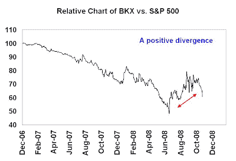
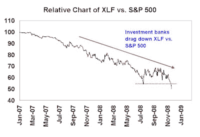

<!--yml
category: 未分类
date: 2024-05-18 01:02:27
-->

# Humble Student of the Markets: Some bullish divergences

> 来源：[https://humblestudentofthemarkets.blogspot.com/2008/11/some-bullish-divergences.html#0001-01-01](https://humblestudentofthemarkets.blogspot.com/2008/11/some-bullish-divergences.html#0001-01-01)

You know the psychology is really bad when the market breaks its October lows and the press is full of stories about the upcoming

[Great Depression II](http://www.marketwatch.com/news/story/Well-Great-Depression-2-2011/story.aspx?guid=%7BB28B49B5%2DEFD1%2D4941%2DB57E%2DA2BA1545BA09%7D)

and

[economic and social collapse](http://benbittrolff.blogspot.com/2008/11/five-stages-of-collapse-where-are-we.html)

. While this is undoubtedly a bear market, this is also a maximum frustration market where traders get whipsawed in their positions on a daily and hourly basis.

[Macro Man](http://macro-man.blogspot.com/2008/11/two-observations.html)

pointed out the one-day range for the S&P 500 on November 13 is roughly equivalent to the annual range for all of 2005.

What could cause such a whipsaw? I have identified a number of positive divergences that indicate the market is in the process of forming a bottom. These signs, however, are medium term indicators and will not prevent the market from going lower from current levels.

**It all started with real estate** 

This whole crisis began in the real estate sector. Excess homebuilding, overly aggressive lending practices – we all know the story. The chart below shows the relative returns of the homebuilders against the S&P 500\. An interesting thing happened in this latest downleg as the relative support levels seems to have held. The homebuilders are no longer leading the market down. This could be an early sign that the worst of the carnage may be over.

**The trouble with financials** 

As we all know, the excesses in the real estate market eventually showed up in the banking sector. A look at the relative chart of the KBW Bank Index (BKX) shows that the banks are outperforming the S&P 500 in this latest downleg. This is another positive divergence and indication that the market is trying to base and make a bottom at these levels.

Some investors may quarrel with my conclusions from reading the above chart. The financial services sector, not just the more narrowly defined banking group, continues to underperform the market.

The chart below shows the relative returns of the XLF to the S&P 500 and the XLF has broken down to new relative lows. The difference between the XLF and the BKX can be traced to the greater weights of the (former) investment banks and brokers in the XLF, which are dragging down returns. I interpret this as Mr. Market’s worries have shifted from the banking to derivatives and the worst of the storm may be over for pure banking, which represents some partial relief for the macro outlook.

**Other rays of hope for the bulls**

I pointed out in a

[past post](http://humblestudentofthemarkets.blogspot.com/2008/11/china-next-shoe-or-final-capitulation.html)

the positive divergence shown by the more constructive market action of the Shanghai Index. In addition,

[Todd Harrison](http://www.minyanville.com/articles/AAPL-GOOG-markets-TGT-HD-AMZN/index/a/20043)

at Minyanville also mentioned a number of catalysts that could result in a rally, which would likely be very sharp.

Also remember that there should be support coming in at the 770 level on the S&P 500, which was the 2002 low.