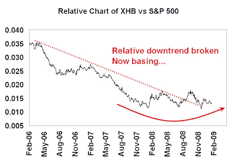

<!--yml
category: 未分类
date: 2024-05-18 00:59:37
-->

# Humble Student of the Markets: Some signs of spring for the homebuilders

> 来源：[https://humblestudentofthemarkets.blogspot.com/2009/01/some-signs-of-spring-for-homebuilders.html#0001-01-01](https://humblestudentofthemarkets.blogspot.com/2009/01/some-signs-of-spring-for-homebuilders.html#0001-01-01)

Remember housing? That’s where this crisis started. I have been

[waiting for stabilization from the Homebuilders](http://humblestudentofthemarkets.blogspot.com/2008/04/still-waiting-for-market-bottom.html)

for some time as a sign that this bear market may be at an end.

Now comes an

[article](http://www.marketwatch.com/news/story/Housing-appears-nearing-end/story.aspx?guid=%7B0D95CF6E%2D08AA%2D4E07%2D9A7F%2D301F44A7C2F0%7D)

by Irwin Kellner that housing valuations are becoming more reasonable. Scott Grannis at

[Calafia Beach Pundit](http://scottgrannis.blogspot.com/2009/01/housing-starts-are-still-falling-but.html)

largely agrees and is cautiously optimistic about the housing sector as well. Though these signs do not mean that housing prices don’t overshoot on the downside, it does portend some hope for the Homebuilders.

**Listen to the market**

Kellner's views are confirmed by the market action of the homebuilders. The chart below shows the relative returns of the Homebuilder SPDRs compared to the S&P 500\. The Homebuilders have broken out of a relative downtrend relative to the market and they are now in a basing period. I would expect the group to stay in this trading range some time before breaking out on the upside.

Watch this space for the upside breakout in the next 6-18 months as that could be another indicator the bull is ready for a sustainable run to the upside.