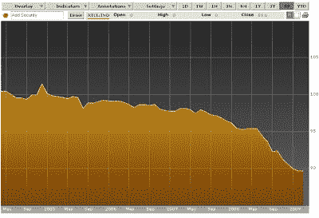
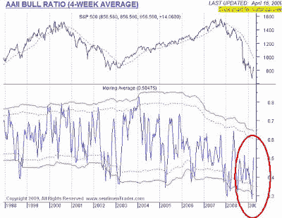

<!--yml
category: 未分类
date: 2024-05-18 00:54:44
-->

# Humble Student of the Markets: Stabilization is NOT recovery!

> 来源：[https://humblestudentofthemarkets.blogspot.com/2009/04/stabilization-is-not-recovery.html#0001-01-01](https://humblestudentofthemarkets.blogspot.com/2009/04/stabilization-is-not-recovery.html#0001-01-01)

I have written about seeing signs of stabilization for the last few months (see examples

[here](http://humblestudentofthemarkets.blogspot.com/2009/01/some-signs-of-spring-for-homebuilders.html)

and

[here](http://humblestudentofthemarkets.blogspot.com/2009/02/dont-panic-real-time-data-points-to.html)

) but my comments were met with great disbelief at the time. Others like Scott Grannis who blogs as

[Calafin Beach Pundit](http://scottgrannis.blogspot.com/)

have said the same thing for longer.

It is gratifying to see that the equity market has finally turned to the viewpoint that things aren’t getting worse and rallying as a result.

**Lots of stabilization, but no recovery in sight yet**

My reaction to the rally is - not so fast!

Just because things aren’t getting worse doesn’t mean that the economy is going to recover. One of the best indicators of the economy is the

[ratio of coincident to lagging indicators](http://www.bloomberg.com/apps/quote?ticker=rtcl%3Aind)

. I remember going “Uh-oh”, when this indicator started to turn south in late 2006:

**Ratio of Coincidental to Lagging Indicators**

Right now, the latest readings are stabilizing at very low levels, but they have not begun to improve. Looking at other “real-time” indicators like the

[Baltic Dry Index](http://investmenttools.com/futures/bdi_baltic_dry_index.htm)

and

[commodity prices](http://www.bloomberg.com/apps/cbuilder?ticker1=cci%3Aind)

, they have recovered from serious drubbings seen in the last year but have begun to retreat from their recent rallies and about half of the gains from the trough.

***These are not signs of a robust recovery.*****Equities are ahead of themselves**

The recent rally has brought out many bulls as they sounded the “all-clear” signal. With the financial leadership in this rally

[at extremely overbought levels](http://bespokeinvest.typepad.com/bespoke/2009/04/sp-500-financial-sector-overbought.html)

and

[signs](http://macro-man.blogspot.com/2009/04/short-covering-and-kubler-ross-cycle.html)

that bears are in the final stages of capitulation, investor sentiment is nearing bullish extremes. As the AAII sentiment survey shows, bullish sentiment are at levels consistent with the top of recent bear market rallies.

As

[John Hussman](http://www.hussmanfunds.com/wmc/wmc090420.htm)

very aptly put it in his weekly comment:

> At present, the advance we've seen over the past several weeks is looking increasingly speculative. We certainly cannot rule out a further advance, but the basis for expecting one is currently weak. Better internals, higher quality leadership, broader sponsorship, and needless to say, a credible foreclosure abatement plan, would all be helpful "legs" if this advance is to be durable. For now, we don't observe enough of that evidence.

I reiterate my belief that long-term investors should be dollar-averaging into equities over the next few months. For traders, I would be highly cautious about committing new funds to the long side over the short term.