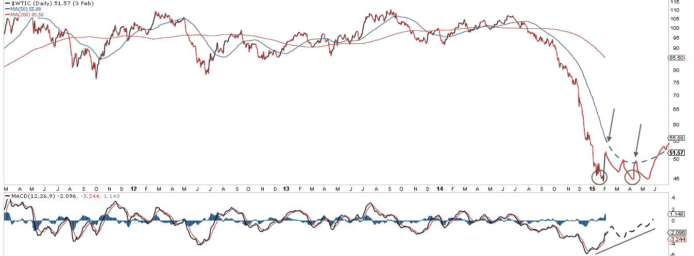

<!--yml
category: 未分类
date: 2024-05-18 03:25:45
-->

# Humble Student of the Markets: Still a range-bound market

> 来源：[https://humblestudentofthemarkets.blogspot.com/2015/02/still-range-bound-market.html#0001-01-01](https://humblestudentofthemarkets.blogspot.com/2015/02/still-range-bound-market.html#0001-01-01)

The Trend Model is an asset allocation model which applies trend following principles based on the inputs of global stock and commodity price. In essence, it seeks to answer the question, "Is the trend in the global economy expansion (bullish) or contraction (bearish)?"

My inner trader uses the trading model component of the Trend Model seeks to answer the question, "Is the trend getting better (bullish) or worse (bearish)?" The history of actual (not backtested) signals of the trading model are shown by the arrows in the chart below. In addition, I have a trading account which uses the signals of the Trend Model. The last report card of that account can be found 

 on weekends and tweet any changes during the week at @humblestudent.

The current environment has been very friendly to swing traders but highly frustrating for trend followers. The up-and-down market choppiness that last no more than a week have been profitable for the former and unprofitable for the latter group. Judging by the market action on Friday when the SPX failed to punch through a resistance level that defines the current trading range, it appears that the same choppy pattern is likely to continue, as per my

[tweet](https://twitter.com/HumbleStudent/status/563781652707434496/photo/1)

Friday:

**More uncertainty in Europe**

One of the concerns that I cited last week was the continuing levels of uncertainty in Europe. While I continue to believe that the Greek situation will eventually be resolved in a benign manner (see 

[Making sense of the latest Greek drama](http://humblestudentofthemarkets.blogspot.com/2015/02/making-sense-of-latest-greek-drama.html)

 and 

[The (European) parents fight and the kids hear everything](http://humblestudentofthemarkets.blogspot.com/2015/01/the-european-parents-fight-and-kids.html)

), we are only in Act II of a three act play and there is much more drama to come.

Consider the latest developments in the week that just past:

*   [Angela Merkel expects the negotiations to drag on for months](http://www.bloomberg.com/news/articles/2015-02-03/merkel-said-to-expect-greek-funding-talks-to-drag-on-for-months).
*   [The ECB has cut off acceptance of Greek bonds](http://mobile.reuters.com/article/idUSL6N0VE5IV20150205?irpc=932) in an effort to turn up the heat on Athens, though funding for Greek banks through ELA remains available.
*   The new Greek government is digging in its heels, as [Reuters](http://www.reuters.com/article/2015/02/08/us-eurozone-greece-idUSKBN0LC0E920150208) reports that new PM Tsipras is expected to address parliament and say that "Greece wants no more bailout money, plans to renegotiate its debt deal and wants a 'bridge agreement' to tide the country over until a new pact is sealed".
*   The Russia-Ukraine conflict is heating up again and Europeans are getting worried about war with Russia (via [The Guardian](http://www.theguardian.com/world/2015/feb/06/vladimir-putin-west-divisions-war-ukraine?CMP=share_btn_tw), emphasis added):

> > In Brussels and other European capitals, the fear of Vladimir Putin is becoming palpable. The mood has changed in a matter of weeks from one of handwringing impotence over Ukraine to one of foreboding.
> > 
> > The anxiety is encapsulated in the sudden rush to Moscow by Angela Merkel and François Hollande. To senior figures closely involved in the diplomacy and policymaking over Ukraine, the Franco-German peace bid is less a hopeful sign of a breakthrough than an act of despair.
> > 
> > “There’s nothing new in their plan, just an attempt to stop a massacre,” said one senior official.
> > 
> > ***Carl Bildt, the former Swedish foreign minister, said a war between Russia and the west was now quite conceivable.*** A senior diplomat in Brussels, echoing the broad EU view, said arming the Ukrainians would mean war with Russia, a war that Putin would win.

The situation in Europe remains highly uncertain with both Greece and Russia and anything can happen. I would expect Europe to be a source of event-driven volatility in the near future.

**Forward EPS getting "less bad"**

In the US, forward EPS continue to deteriorate, though the degree of deterioration is starting to stabilize. That is to say, things are getting "less bad". The following chart from

[John Butters of Factset](http://www.factset.com/websitefiles/PDFs/earningsinsight/earningsinsight_2.6.15)

shows that forward 12 month EPS has been deteriorating for the past few weeks and past periods of deterioration has seen either corrections or bear markets. In fact, the current episode of forward EPS weakness is the worse seen in the last 10 years, other than the bear market that began in 2007\. The good news is that the weakness is starting to stabilize (annotations in red are mine).

The latest Earnings Season results in the latest week continues to be disappointing. While the EPS beat rate of 78% is above average and the revenue beat rate of 59% is average, company guidance remains negative. For Q1 2015, 52 companies have issued negative guidance compared to 10 with positive guidance. Last week, the guidance score was 37-9\. This means that, in the past week, 15 companies had negative guidance compared to 1 with positive guidance.

Just as worrying is the YoY EPS growth rate. Factset reports that the Q1 2015 YoY EPS growth rate is -3.1%, compared to -1.6% last week, and the Q2 2015 growth rate is -0.4%, compared to +0.9% last week. The sales growth rate fared a bit better as the Q1 2015 YoY sales growth rate came in at -2.3% (vs. -2.4% last week) and Q2 2015 YoY sales growth rate at -2.6% (vs. -2.4% last week).

The chart below shows how top-down and bottom-up EPS estimates have evolved over time. Bottom-up FY 2015 EPS estimates are still falling, but the decline is starting to stabilize, though the bottom-up FY 2016 EPS estimates are still deteriorating at a rapid clip. Since forward 12 month EPS depend predominantly on 2015 estimates as we are still early in the calendar year, which is different from the fiscal year, the decline in 2016 estimates will have only a minor effect on forward 12 month estimates. In other words, things are still getting bad, only less bad.

In addition, the current episode is not just restricted to large cap stocks, which have a higher weighting in multi-national companies, which were hurt by USD strength, and energy stocks. Analysis from Ed Yardeni shows that the midcap SP 400, which broke out to new all-time highs last week and got a lot of technicians excited, are also seeing forward EPS fall.

Similarly, Yardeni`s analysis also shows that small cap stocks are also seeing falling forward EPS, though the degree of EPS weakness in small and mid cap have not been as strong as large caps.

**How does the stock market advance?**

I've said it before in these pages. In order for the stock market to advance, either the E in the PE ratio has to rise, which it isn't doing right now, or the PE ratio has to expand. Valuation levels are already elevated and the Fed is about to enter a tightening cycle this year. How do stock prices rise with these headwinds?

Indeed, the latest data from the

[WSJ](http://online.wsj.com/mdc/public/page/2_3021-peyield.html)

shows the SPX to be trading at 20x trailing EPS, which is not exactly cheap.

In addition, the

[Leuthold Group warned](https://twitter.com/LeutholdGroup/status/563353876003168258/photo/1)

that median PE and cash flow ratios are now higher than they were at the market peaks in 2000 and 2007:

With regards to the Fed's interest rate policy, the robustness of the January Jobs Report underscored the point that a rate hike in June is still on the table - and that's potentially negative for equities. 

[Jon Hilsenrath](http://blogs.wsj.com/economics/2015/02/06/strong-jobs-report-increases-odds-fed-will-alter-language-promising-to-be-patient-on-rates-hilsenrath/)

 interpreted the report this way:

> The strong January employment report keeps open the possibility the Federal Reserve could start raising short-term interest rates in June.
> 
> The report included whopping increases in payroll employment in recent months. Revisions showed employers added 423,000 jobs in November, the largest monthly private-sector increase since September 1997, and 329,000 in December, as well as 257,000 in January.
> 
> Importantly, the report also shows average hourly earnings of private sector workers rose 2.2% in January from a year earlier, a modest gain but better than the 1.7% increase in December. This supports the thesis that an improving job market is underpinning wages, though not yet pushing them up much.

So far, the market has been discounting a rate hike in late 2015\. Should the Fed signal a that liftoff is likely to be in June, it will be a shock and market expectations will have to adjust rapidly. We will get better clue on Fed thinking when Janet Yellen testifies before Congress February 24-25.

**Other bearish signals**

A number of other bearish signals have surfaced that are worrying. First, the latest data from Barrons shows corporate insiders turning heavily to the sell side. While this data series is noisy and highly volatile, it does raise another yellow flag for the bull camp. The volatility of the readings have likely been exacerbated by Earnings Season as insiders have a window around earnings announcements when they are precluded from trading. With 323 of the SP 500 companies having reported, those regulatory constraints are starting to abate.

In addition,

[Mark Hulbert](http://www.marketwatch.com/story/the-dow-theory-is-now-flashing-a-sell-signal-2015-02-03)

pointed out that the Dow Theory, which is the granddaddy of all trend following models, is now on a sell signal. First, the Dow Theory sell signal criteria is set out as follows:

> **Hurdle 1:** Both the Dow Jones Industrial Average and the Dow Jones Transportation Average must undergo a “significant” correction from new highs.
> **Hurdle 2:** In their subsequent “significant” rally attempt following that correction, either one or both must fail to rise above their pre-correction highs.
> **Hurdle 3:** Both averages must then drop below their respective correction lows.

Hulbert writes that two of the three Dow Theory newsletter writers have flashed a sell signal:

> In the opinion of two of the three Dow theorists monitored by the Hulbert Financial Digest, the first of these three hurdles was satisfied by the market’s decline from its late-December highs to mid-January lows — which took 4.1% off the Dow Industrials and 6.1% off the Dow Transports. Those two Dow theorists are Jack Schannep, editor of [TheDowTheory.Com](http://www.thedowtheory.com/), and Richard Moroney of [Dow Theory Forecasts](http://www.dowtheory.com/).
> 
> That set the Dow Theory clock running on the remaining of those hurdles. The second was met in the market’s rally that began from those mid-January lows, since neither index was able to surpass its late-December highs. And the final hurdle was cleared last week, with the Dow Industrials on Jan. 28 closing below their mid-January lows, and the Transports doing so two days later at Friday’s close.

I would also like to address the issue of the upside breakout of the mid-cap SP 400 to all time highs. I know that some technicians have gotten very excited about this event, like

[JC Parets](http://allstarcharts.com/mid-caps-look-ready-breakout/)

who wrote about the impending breakout and its possible consequence:

> This is a name we want to own above all of this resistance. Above the December highs and there is nothing but blue skies. Our target based on this potential breakout would be up near 285 based on the 161.8% Fibonacci extension of the September/October decline. This represents about 6% of upside from current levels. I think we get a breakout soon and we want to be all over it.

[Josh Brown](http://thereformedbroker.com/2015/02/08/why-midcaps-broke-out/)

 had a very good post analyzing the mid-cap breakout. Mid-cap strength was mainly driven by the lower weight in energy, which have tanked, and overweight in better performing sectors like financials. I would also add that the mid and small cap stocks are less sensitive to USD strength, which have hurt large cap multi-nationals the most. In light of the analysis from Ed Yardeni which I outlined above and the negatives posed by the Dow Theory sell signal, my conclusion is that while small and mid-cap are likely to outperform large caps, the upside breakout should not be taken as a bullish signal for all stocks.

**Rally last week due to oil and USD reversals**

A week ago, the SPX rested at its 150 day moving average support level as stock prices were weighed down by the bearish factors that I cited. In the five days that followed, the 150 dma proved to be a decisive support as the SPX rallied back to the top of its trading range for 2015.

I attribute the market rally to a reversal in oil and USD. Much of the bearish concerns over falling earnings estimates were from either weakening oil prices and the strong USD, which became a significant headwind for large cap multi-nationals in the SP 500\. Last week, oil rallied and the US Dollar, which is inversely correlated to oil and other commodities, pulled back.

Was that the bottom for oil (and a USD top)? In that case, the partial stabilization seen in forward EPS may reverse and start rising, which would spark further strength in US equity prices. Urban Carmel, writing at

[The Fat Pitch](http://fat-pitch.blogspot.com/2015/02/what-to-look-for-when-price-of-oil.html?spref=tw)

, studied past bottoms in crude oil and concluded that oil is not likely to rally very much further from current levels, at least in the short-term:

> Let's look at other drops in oil over the past 30 years. Below is a monthly chart of crude oil (WTIC). The yellow bars are the size and duration as the current fall in oil since June 2014\. Three other instances look similar in that the drop was swift and without a pause (marked with stars: 1986, 1990 and 2008). Two others took twice to four times as long to unfold (1997 and 2000).

Here is his most likely scenario for an oil price bottom:

> **Oil is not likely to "v-bottom"**: it will likely retest the low at least once if not twice or more. These retests could be higher or lower than the first low. They'll likely be spread over the next 2 to 4 months.
> 
> The point of these failed rallies and bottom retests is to **work off the downward momentum** in price. This is true of oil as well as any other traded good. That is why the slope of the 50-dma begins to flatten and the MACD shows a divergence near the low.
> 
> The first rallies will likely **fail near the 50-dma**. We are using a crayon, not a pencil, to mark these.
> 
> If past is prologue, there will be swings back and forth at the bottom, a change from the seven consecutive month fall in price so far. This will be a positive sign.
> 
> Drawing from the examples above, we have illustrated what might take place next in oil. Price will emphatically not bottom exactly like this. But if the current rally is the start of a bottoming process, this will be a general approximation of what to expect: (1) the 50-dma flattens (blue line); (2) multiple bottoms spread a few months apart (circles); (3) at least one failed test near the 50-dma (arrows); and (4) a positive divergence in the MACD (bottom panel).

If this analysis is correct, then oil strength (and USD weakness) is likely to either peter out soon or may have stalled out already. Currently, the 50 dma for oil is $55 and falling very fast - and that is likely to be a short-term ceiling for crude. Once oil starts to turn downwards, the equity bears will seize control of the stock market tape once more, as the bullish influence of higher oil prices and USD weakness on EPS estimates diminish.

Independent of the above analysis, 

[Marc Chandler](http://www.marctomarket.com/2015/02/dollar-bulls-reclaim-whip-hand.html)

provided some color on the technical picture on oil:

> The two-week advance in oil prices seems largely technical in nature. Production in the US, and globally remains strong, even if the rig count in the US continues to fall. Global output is thought to be moving toward two mln barrel a day in excess of demand. Inventories continue to rise. The technical indicators we use warn of some more upside risk in the days ahead. Basis, the March crude oil contract, the five day moving average has crossed above the 20-day average for the first time since last September. A move above $53.60 likely signals a move beyond the $54.25 high and toward what we expect to be a peak $56-$57.00.

Here are his observations on the USD, which is inversely correlated to oil and other commodities:

> The US dollar's consolidative phase appears to have ended with the January employment report. Employment growth accelerated, and average hourly earnings rebounded. There was a 10-11 bp increase in both short- and long-term interest rates.
> 
> The increase in the implied rates of the Fed funds and Eurodollar futures strip indicate that sentiment has swung back toward where we have steadfastly been, and that is to favor a mid-year Fed hike. We feel more confident that the Federal Reserve will modify its forward guidance at next month's meeting to dilute the idea that the first rate hike is at least two meetings away, which is how Yellen helped investors understand what the FOMC statement meant by "patience".

Putting these together, the most likely near term scenario is the oil rally starts to stall out soon and USD strength continues. Removed of the tailwinds that equities experienced last week, the most likely stock market implication is near-term weakness. The SPX failed at resistance near the 2015 highs on Friday and it is likely to work itself lower back down to the lower band at the 1980-1990 level. Should that happen, I would then re-evaluate the technical conditions of the market as they stand before making a further directional call. Despite my bearish tilt, this is still a range-bound market until it demonstrates otherwise.

In the meantime, my inner investor remains cautious, while my inner trader remains short equities.

**Disclosure:**

Long SPXU, SQQQ