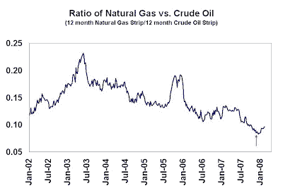
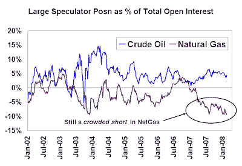

<!--yml
category: 未分类
date: 2024-05-18 01:13:21
-->

# Humble Student of the Markets: Still more upside potential in the NatGas vs. Oil trade

> 来源：[https://humblestudentofthemarkets.blogspot.com/2008/02/still-more-upside-potential-in-natgas.html#0001-01-01](https://humblestudentofthemarkets.blogspot.com/2008/02/still-more-upside-potential-in-natgas.html#0001-01-01)

Back in early December I

[posted](http://humblestudentofthemarkets.blogspot.com/2007/12/interesting-oil-and-natgas-divergence.html)

about the oil and natural gas divergence in price and sentiment. Natural gas initially declined against crude oil after that post but has since risen about 10% on a relative basis.

A update of the Commitment of Traders data from the

[CFTC](http://www.cftc.gov/marketreports/commitmentsoftraders/index.htm)

shows the relative bull case for natural gas vs. crude oil remains intact. The "fast money" large speculators continue to be have a crowded short in natural gas and giving a contrarian bullish signal. On the other hand, the signal from the COT data for crude oil is still neutral.