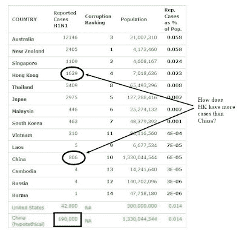

<!--yml
category: 未分类
date: 2024-05-18 00:49:06
-->

# Humble Student of the Markets: Swine flu a market killer?

> 来源：[https://humblestudentofthemarkets.blogspot.com/2009/08/swine-flu-market-killer.html#0001-01-01](https://humblestudentofthemarkets.blogspot.com/2009/08/swine-flu-market-killer.html#0001-01-01)

Remember SARS? SARS took 2-3% off GDP Asian growth. I don’t know how serious this outbreak of H1N1 swine flu is, but there are indications that Asia is under-reporting the incidence of swine flu.

Damjan DeNoble, who produced the table below,

[wrote](http://www.asiahealthcareblog.com/2009/07/18/dont-panic-but-asia-is-in-for-a-big-swine-flu-year/)

that “reported cases of H1N1 as a percentage of their populations correlate almost exactly with the corruption ranking of each country relative to its neighbors.” In other words, the heavier the level of corruption (I am shocked! shocked I say! that is

[corruption in China](http://www.atimes.com/atimes/China/KG26Ad01.html)

), the more likely it is that they are hiding or under-reporting swine flu cases:

**Incidence of Swine Flu by country**

Studying the table above, some questions pop to mind:

*   How does Hong Kong, which has 0.5% of the population of China, have more reported cases of swine flu than China?
*   If China actually experiences 190K cases (a conservative estimate), would the markets panic?

As the winter flu season approaches, this could mean trouble.