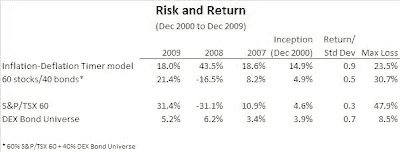
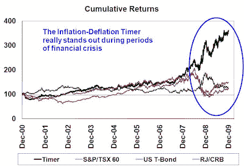
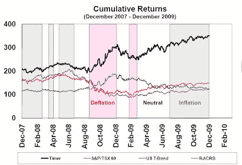

<!--yml
category: 未分类
date: 2024-05-18 00:40:11
-->

# Humble Student of the Markets: The 2009 Inflation-Deflation Timer model update

> 来源：[https://humblestudentofthemarkets.blogspot.com/2010/01/2009-inflation-deflation-timer-model.html#0001-01-01](https://humblestudentofthemarkets.blogspot.com/2010/01/2009-inflation-deflation-timer-model.html#0001-01-01)

As I went through the year-end discussions over the holiday season, it struck me that the inflation-deflation question remains stuck in a lot of peoples’ minds. As examples, Zero Hedge pointed out this

[paper by Brait Capital Management](http://www.zerohedge.com/sites/default/files/Brait%20Capital%20Hendry%20v%20Bond.pdf)

, and recent instances of the inflation vs. deflation debates continue

[here](//www.blogger.com/%E2%80%9Dhttp://www.ldsfreedomforum.com:80/viewtopic.php?f=1&p=107631%E2%80%9D)

and

[here](//www.blogger.com/%E2%80%9Dhttp://www.softpanorama.org:80/Skeptics/Financial_skeptic/inflation_vs_deflation.shtml%E2%80%9D)

.

In the meantime, my

[Inflation-Deflation Timer model](http://www.qwestfunds.com/publications/newsletters_pdf/newsletter_november_2009.pdf)

has remained at an inflation reading since July 2009\. The table below shows the returns of the Inflation-Deflation Timer model compared to other asset classes. All returns are denominated in Canadian Dollars.

(click for a bigger picture)

The returns for the Inflation-Deflation Timer model was a very respectable 18.1% in 2009, which is roughly in line with a 60/40 balanced fund benchmark during normal periods but it performed best during recent deflationary crisis periods.

**Model signals**
The chart below shows the returns and “signals” of the Inflation-Deflation Timer model of the last couple of years. The grey zones show periods when an "inflation" signal was in flashing, the pink zones indicate a "deflation" signal and the white zones indicate a neutral signal.

As the chart indicates, the Inflation-Deflation Timer model was able to successfully navigate through difficult asset deflation periods. The model protected earlier gains by switching to the default-free U.S. Treasury long bonds during the asset deflation periods. In 2009, when the model indicated inflation, the model moved to riskier assets, namely equities and commodities further advancing the model’s performance.

***Further reading***

1.  Inflation vs. deflation ([Calculated Risk, April 2009](//www.blogger.com/%E2%80%9Dhttp://www.calculatedriskblog.com:80/2009/04/inflation-vs-deflation.html%E2%80%9D))
2.  Inflation or deflation? The Fed could wind up with both ([Newsweek, June 2009](//www.blogger.com/%E2%80%9Dhttp://www.newsweek.com:80/id/200916%E2%80%9D))
3.  The inflation vs. deflation debate ([CNN Money, June 2009](//www.blogger.com/%E2%80%9Dhttp://money.cnn.com:80/2009/06/23/news/economy/inflation_deflation_debate/index.htm%E2%80%9D))
4.  What’s next? Inflation or deflation? ([Bill Fleckenstein, July 2009](//www.blogger.com/%E2%80%9Dhttp://articles.moneycentral.msn.com:80/Investing/ContrarianChronicles/whats-next-inflation-or-deflation.aspx%E2%80%9D))
5.  A look at inflation vs. deflation ([Chicago Sun-Times, August 2009](//www.blogger.com/%E2%80%9Dhttp://www.suntimes.com:80/business/savage/1730883,CST-NWS-savage24.savagearticle%E2%80%9D))
6.  Inflation vs. deflation ([John Tamny, Forbes, October 2009](//www.blogger.com/%E2%80%9Dhttp://www.forbes.com:80/2009/10/18/inflation-deflation-dollar-opinions-columnists-john-tamny.html%E2%80%9D))
7.  Inflation vs. deflation: Be prepared for wild swings ([CommodityOnline, October 2009](//www.blogger.com/%E2%80%9Dhttp://www.commodityonline.com:80/news/Inflation-vs-deflation-Be-prepared-for-wild-swings-22373-3-1.html%E2%80%9D))
8.  Inflation vs. deflation: should you worry? ([CBS Moneywatch, November 2009](//www.blogger.com/%E2%80%9Dhttp://moneywatch.bnet.com:80/economic-news/video/inflation-vs-deflation-should-you-worry/368003/%E2%80%9D))
9.  Economic Smack-Down: Inflation vs. Deflation ([CBS News, November 2009](//www.blogger.com/%E2%80%9Dhttp://www.cbsnews.com:80/blogs/2009/11/24/business/econwatch/entry5764460.shtml%E2%80%9D))
10.  Inflation vs. deflation ([Investment Week, November 2009](//www.blogger.com/%E2%80%9Dhttp://www.investmentweek.co.uk/investment-week/feature/1562135/inflation-vs-deflation%E2%80%9D))
11.  Jean-Francois Tardif: inflation vs. deflation ([Finance Trends Matter, December 2009](//www.blogger.com/%E2%80%9Dhttp://financetrends.blogspot.com:80/2009/12/jean-francois-tardif-inflation-vs.html%E2%80%9D))