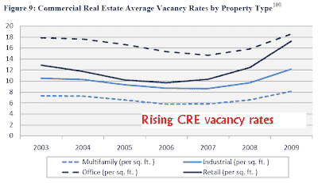
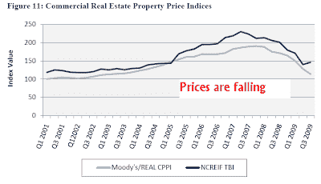
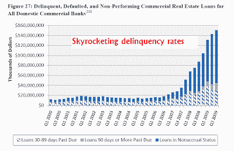

<!--yml
category: 未分类
date: 2024-05-18 00:35:32
-->

# Humble Student of the Markets: The CRE time bomb

> 来源：[https://humblestudentofthemarkets.blogspot.com/2010/03/cre-time-bomb.html#0001-01-01](https://humblestudentofthemarkets.blogspot.com/2010/03/cre-time-bomb.html#0001-01-01)

I have written before about the prospects of economic

[time bombs everywhere](http://humblestudentofthemarkets.blogspot.com/2010/03/time-bombs-everywhere.html)

. While potential problems such as another round of pending residential resets have been well highlighted, the commercial real estate (CRE) time bomb is now as well documented. Recently, Elizabeth Warren stated on

[CNBC](http://www.cnbc.com/id/36085517)

that ½ of all CRE mortgages will be underwater by the end of 2010:

> By the end of 2010, about half of all commercial real estate mortgages will be underwater, said Elizabeth Warren, chairperson of the TARP Congressional Oversight Panel, in a wide-ranging interview on Monday.
> 
> “They are [mostly] concentrated in the mid-sized banks,” Warren told CNBC. “We now have 2,988 banks—mostly midsized, that have these dangerous concentrations in commercial real estate lending."
> 
> As a result, the economy will face another “very serious problem” that will have to be resolved over the next three years, she said, adding that things are unlikely to return to normalcy in 2010.

**Serious CRE problems**

In February 2010, the Congressional Oversight Panel released a report entitled

[Commercial Real Estate Losses and the Risk to Financial Stability](http://cop.senate.gov/documents/cop-021110-report.pdf)

, which contained a number of disturbing data points. The report documents rising CRE vacancy rates:

…falling property prices:

…and rising CRE delinquency rates:

**A fragile banking system**

All of these conditions exist in the context of a fragile banking system. The chart below shows the percentage of banks whose loan loss provisions, or Allowance for Loan and Lease Losses (ALLL), exceed non-performing loans (NPL). If ALLL is greater than NPL, then banks will need to increase their provisions for NPLs.

Can an already fragile banking system withstand another round of loan write-downs?

Add one more thing to the list that keeps me lying awake at night.