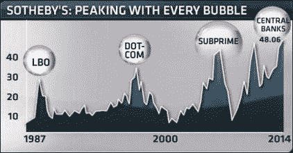

<!--yml
category: 未分类
date: 2024-05-18 03:41:32
-->

# Humble Student of the Markets: The Chanos Sotheby's Indicator flashes a warning

> 来源：[https://humblestudentofthemarkets.blogspot.com/2014/04/the-chanos-sothebys-indicator-flashes.html#0001-01-01](https://humblestudentofthemarkets.blogspot.com/2014/04/the-chanos-sothebys-indicator-flashes.html#0001-01-01)

Last week, hedge fund manager Jim Chanos appeared on

[CNBC](http://www.cnbc.com/id/101551679)

and pointed to the price action of Sotheby's as a warning of an overheated market (emphasis added):

> Closely watched hedge fund manager Jim Chanos says he has the best barometer for gauging where 1 percenters are putting their money, given the Federal Reserve's easy money policies that have been fueling their portfolios to record highs. During an interview Thursday on CNBC's "Squawk Box," he pointed to the stock chart of Sotheby's.
> 
> "That's what people are buying," Chanos said.
> 
> ***The chart shows that shares of Sotheby's have peaked before every major financial bubble since 1987, starting with the leveraged-buyout spree that fueled the stock market before the Black Monday crash that yea***r.

As the price of Sotheby's (BID) appeared to have peaked, Chanos' comment was an intriguing observation. But how good is this Sotheby's Indicator? Just for fun, I charted the BID against SPX. True enough, BID (in purple below) generally peaked out before the stock market (in black) did, but the lags were uncertain. While BID appears to be rolling over now, the mildness of the pullback of BID may not necessarily constitute a definitive sell signal for the equity market.

As an alternative, the BID/SPX ratio worked well in the post-NASDAQ peak period as timing indicator. As well, the decline from the most recent peak is more pronounced. However, the ratio was in decline for much of the late 1990`s during the Tech Bubble and thus made it a poor standalone market timing model.

I did find a better fit by de-trending  the BID/SPX ratio by comparing it to its own 1 year moving average. As the chart below shows (SPX in black, left scale, de-trended BID/SPX ratio in blue, right scale), whenever the BID/SPX ratio was above its long-term moving average and then fell below its 1 year moving average, it usually marked a significant top in the stock market.

(click chart to enlarge)

In the chart, the dates of the BID/SPX ratio peaks are shown in red while the dates of the subsequent SPX peaks are shown in black. Peaks in the de-trended BID/SPX ratio led the actual market peak by between 0 months (1990) to 11 months (2000).

What about Chano's warning on CNBC last week?

My modified Sotheby's Indicator peaked out in October 2013, though the highs it reached was not as high as levels seen in previous significant market peaks. However, the chart shows that this indicator is not very useful as a tactical timing model as the lags between the peaks in the Sotheby's Indicator are uncertain. Nevertheless, it does provide a warning of the investment environment.

*Cam Hui is a portfolio manager at [Qwest Investment Fund Management Ltd.](http://www.qwestfunds.com/) (“Qwest”). The opinions and any recommendations expressed in the blog are those of the author and do not reflect the opinions and recommendations of Qwest. Qwest reviews Mr. Hui’s blog to ensure it is connected with Mr. Hui’s obligation to deal fairly, honestly and in good faith with the blog’s readers.”

None of the information or opinions expressed in this blog constitutes a solicitation for the purchase or sale of any security or other instrument. Nothing in this blog constitutes investment advice and any recommendations that may be contained herein have not been based upon a consideration of the investment objectives, financial situation or particular needs of any specific recipient. Any purchase or sale activity in any securities or other instrument should be based upon your own analysis and conclusions. Past performance is not indicative of future results. Either Qwest or I may hold or control long or short positions in the securities or instruments mentioned.*