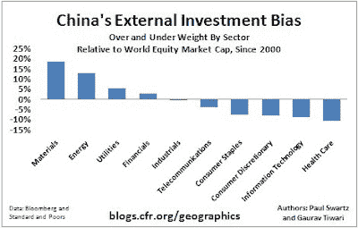

<!--yml
category: 未分类
date: 2024-05-18 00:46:05
-->

# Humble Student of the Markets: The Chinese are coming!

> 来源：[https://humblestudentofthemarkets.blogspot.com/2009/09/chinese-are-coming.html#0001-01-01](https://humblestudentofthemarkets.blogspot.com/2009/09/chinese-are-coming.html#0001-01-01)

Recently there have been a spate of headlines that suggest that the Chinese continue to show a high degree of investment interest in resources. Here are just a few examples:

These stories are anecdotal and suggest that China understands that she is commodity short and is trying to gain long-term control of supply. But stories don’t tell the whole picture. Analysis from the Center for Geoeconomic Studies gives us a better picture of China’s external investment weights:

This chart, along with their announced direct investments, seems a lot like the effects of a long-term investment policy that doesn’t change easily. Many of the announced investments are of the FDI (foreign direct investment) variety, which cannot be sold easily like a stock holding.

While there are some indications that [China may be pulling back on their commodity demand in the short-term](http://ftalphaville.ft.com/blog/2009/09/22/73311/china-cools-on-the-commodity-front/), don’t mistake tactical decisions with the long-term strategic picture.

As long as China is growing, it will mean a secular friendly environment for commodity bulls.