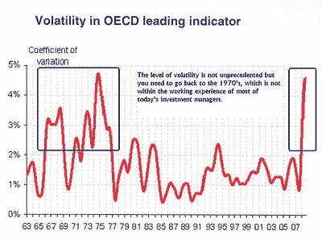
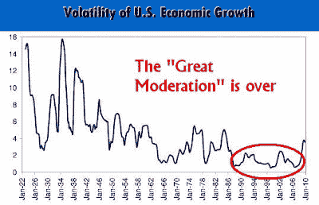

<!--yml
category: 未分类
date: 2024-05-18 00:34:57
-->

# Humble Student of the Markets: The Grant (inflation) vs. Rosenberg (deflation) debate

> 来源：[https://humblestudentofthemarkets.blogspot.com/2010/04/grant-inflation-vs-rosenberg-deflation.html#0001-01-01](https://humblestudentofthemarkets.blogspot.com/2010/04/grant-inflation-vs-rosenberg-deflation.html#0001-01-01)

There is a great

[video](http://www.grantspub.com/about/jim.cfm)

showing a debate between Jim Grant, who recently “downgraded” his credit rating of US government debt, against David Rosenberg, bond bull. Grant’s case was that the overwhelming fiscal pressures on the US government would lead to a credit downgrade, which would be bearish for the US Dollar and bullish for the commodity inflation outlook.

Rosenberg’s contention was that we went through a recession that was induced by a credit induced contraction, which is different from your post WW II garden variety inventory recession. Credit contractions take much longer to resolve and are inherently deflationary. In such cases, investors are much more interested in the return of capital (safety) than return on capital (greed), which is bullish for default-free assets such as US Treasuries.

Who is right?

**A question of time horizon**

In my opinion, they both are. They just differ on time horizon. Jim Grant is correct that these pressures are ultimately negative for the USD and the creditworthiness of the US government paper. I believe that Grant is right in the long run (5-10 years), as is

[Bill Gross](http://www.bloomberg.com/apps/news?pid=newsarchive&sid=aJx0FiNBapiU)

, who recently turned long-term bearish on bonds.

David Rosenberg, by contrast, is a former brokerage firm analyst and more attuned to the markets. I believe that Rosenberg is right in the intermediate term (1-2 years). We are likely to see a double-dip recession (see my previous comments on the risks

[here](http://humblestudentofthemarkets.blogspot.com/2010/03/time-bombs-everywhere.html)

and

[here](http://humblestudentofthemarkets.blogspot.com/2010/03/cre-time-bomb.html)

).

**Long-term bullish on commodities, but be prepared for volatility**

If you believe Grant, as I am, you are likely to gravitate towards being a long-term commodity bull. OECD governments are all pursuing similar policies of stimulus, which amount to competitive devaluation. Pressures on the USD are therefore unlikely to show up in the currency markets, but more likely to manifest themselves in commodity prices.

That’s why I am a long-term commodity bull.

My inner trader, on the other hand, understands that we live in an extremely volatile environment, which I have characterized as

[Extremistan, or Minskyville](http://humblestudentofthemarkets.blogspot.com/2010/03/life-in-extremistan-or-minskyville.html)

. I reiterate my comment that macro-economic volatility has skyrocketed to levels last seen in the 1960’s and 1970’s. Unfortunately, most investment managers alive today weren’t in the business back them and may not be mentally prepared to deal with the new old era of heightened volatility.

ECRI did some analysis on the US economy that came to similar conclusions about the rising economic volatility. ECRI believes that the era of the

*Great Moderation*

, policies used by Greenspan et al to dampen volatility, is over.

Under such circumstances, relapses back into recession are very likely and investors have to be prepared accordingly. Consider the chart below showing the monthly price of gold during the 1970’s. Even though the yellow metal rocketed from $35 to $850 in January 1980, investors would have suffered a correction of 43% - and that’s based on monthly prices. The peak-to-trough correction in gold would have been even more using daily pricing!

What kind of investor would have been willing to withstand this kind of volatility?

**Navigating the volatility**

Today, the economic backdrop is extremely fragile. While Grant may be right about the long term trajectory of Treasuries, we could go through several jaw dropping and heart attack inducing up-and-down cycles over next decade.

Even though I am a long-term commodity bull, I also understand that we need the

[proper tools](http://www.qwestfunds.com/publications/newsletters_pdf/newsletter_november_2009.pdf)

to be able to properly navigate any potential ups-and-downs.