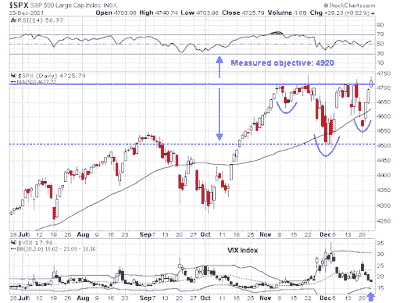

<!--yml
category: 未分类
date: 2024-05-18 01:50:03
-->

# Humble Student of the Markets: The anatomy of a Santa rally

> 来源：[https://humblestudentofthemarkets.blogspot.com/2021/12/the-anatomy-of-santa-rally.html#0001-01-01](https://humblestudentofthemarkets.blogspot.com/2021/12/the-anatomy-of-santa-rally.html#0001-01-01)

**Preface: Explaining our market timing models** 

We maintain several market timing models, each with differing time horizons. The "

**Ultimate Market Timing Model**

" is a long-term market timing model based on the research outlined in our post, 

[Building the ultimate market timing model](https://humblestudentofthemarkets.com/2016/01/26/building-the-ultimate-market-timing-model/)

. This model tends to generate only a handful of signals each decade.

The 

**Trend Asset Allocation Model**

 is an asset allocation model that applies trend following principles based on the inputs of global stock and commodity price. This model has a shorter time horizon and tends to turn over about 4-6 times a year. The performance and full details of a model portfolio based on the out-of-sample signals of the Trend Model can be found

[here](https://humblestudentofthemarkets.com/trend-model-report-card/)

.

My inner trader uses a 

**trading model**

, which is a blend of price momentum (is the Trend Model becoming more bullish, or bearish?) and overbought/oversold extremes (don't buy if the trend is overbought, and vice versa). Subscribers receive real-time alerts of model changes, and a hypothetical trading record of the email alerts is updated weekly 

[here](https://humblestudentofthemarkets.com/trading-track-record/)

. The hypothetical trading record of the trading model of the real-time alerts that began in March 2016 is shown below.

The latest signals of each model are as follows:

*   Ultimate market timing model: Buy equities*
*   Trend Model signal: Bullish*
*   Trading model: Bullish*

** The performance chart and model readings have been delayed by a week out of respect to our paying subscribers.***Update schedule**

: I generally update model readings on my 

[site](https://humblestudentofthemarkets.com/)

 on weekends and tweet mid-week observations at @humblestudent. Subscribers receive real-time alerts of trading model changes, and a hypothetical trading record of those email alerts is shown 

[here](https://humblestudentofthemarkets.com/trading-track-record/)

.

Subscribers can access the latest signal in real-time 

[here](https://humblestudentofthemarkets.com/my-inner-trader/)

.

**Has Santa come to town?**

Will the real Santa Claus rally, which begins on Monday and lasts until the second trading day of January, now begin in earnest? 

I pointed out last week (see

[A breakout to S&P 4920?](https://humblestudentofthemarkets.com/2021/12/19/a-breakout-to-sp-4920/)

) that the S&P 500 was potentially forming an inverse head and shoulders pattern, but head and shoulders patterns are incomplete until the neckline breaks. The market staged a marginal upside breakout through resistance on Thursday. The measured objective of the inverse H&S breakout is about 4920, but that level may be overly ambitious. If the Santa rally has truly begun, one of the tactical indicators that he has returned to the North Pole is whether the VIX Index falls below its lower Bollinger Band, which is an overbought signal to take trading profits.

Here is what else I am watching.

The full post can be found

[here](https://humblestudentofthemarkets.com/2021/12/26/the-anatomy-of-a-santa-rally/)

.