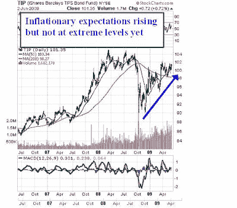
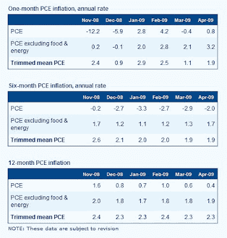
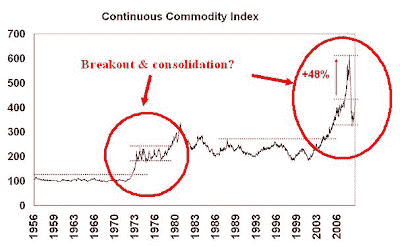
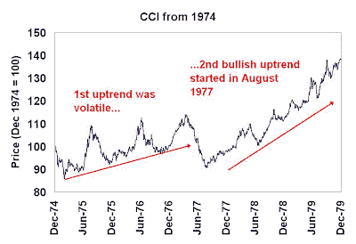
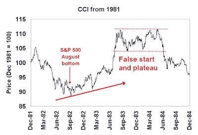
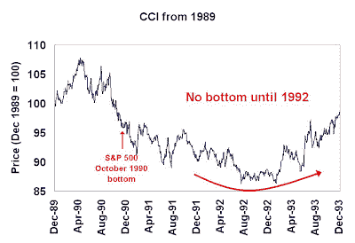
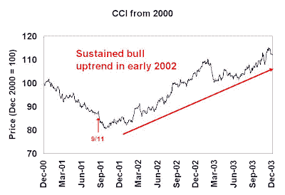
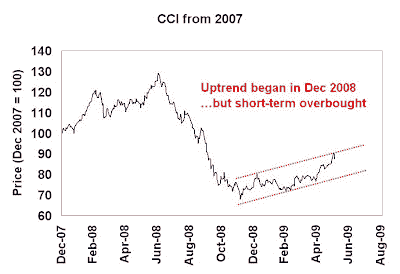

<!--yml
category: 未分类
date: 2024-05-18 00:52:10
-->

# Humble Student of the Markets: The bull & bear case for gold

> 来源：[https://humblestudentofthemarkets.blogspot.com/2009/06/bull-bear-case-for-gold.html#0001-01-01](https://humblestudentofthemarkets.blogspot.com/2009/06/bull-bear-case-for-gold.html#0001-01-01)

Poor Tim Geithner! When he asserted that China’s Dollar assets are safe,

[he drew laughter](http://www.reuters.com/article/usDollarRpt/idUSPEK14475620090601)

from an audience of Chinese student. As well, an American delegation to the Gulf

[reportedly](http://www2.debka.com/headline.php?hid=6062)

drew a blank back in May when it tried to get more petro-dollar investment into the U.S.

As the USD continues to plunge and price of gold heads for

[another test of the $1,000 level](http://www.the-privateer.com/chart/gold-pf.html)

, I thought it is time to review the bull and bear case for gold. In this review, I consider the economic, technical, investor psychology and geopolitical viewpoints when making my assessment.

**Inflation and inflationary expectations under control**

I have written

[before](http://humblestudentofthemarkets.blogspot.com/2009/05/start-of-great-commodity-bull-market.html)

that it is probably too early for commodities to boom. The price chart of the iShare Barclays TIPS Bond Fund (TIP) below gives an indication of inflationary expectations. The price of TIP tanked late last year but has recovered since. Nevertheless, inflationary expectations are elevated but nowhere near hyper-inflationary fear levels. (Remember

[James Carville’s comment](http://www.nytimes.com/1994/06/12/weekinreview/ideas-trends-the-bondholders-are-winning-why-america-won-t-boom.html)

about wanting to be reincarnated as the bond market – and that's because the bond market is usually right.)

Another measure of inflation is the Dallas Fed’s [trimmed mean PCE](http://www.dallasfed.org/data/pce/index.html), which some analysts consider to be a better measure of core inflation than PCE ex-food and energy. Trimmed mean PCE seems to be running ahead of PCE ex-food and energy on a consistent basis in virtually all time periods, indicating rising inflationary pressures. Nevertheless, the readings are not high by any standards and inflation appears to be under control – for now.

**Investor sentiment is very bullish (contrarian bearish)**
[Investor sentiment surveys](http://www.sentimentrader.com/subscriber/charts/WEEKLY/SURVEY_GOLD.htm) on gold show a high degree of bullishness, which is contrarian bearish. [Mark Hulbert’s analysis](http://www.marketwatch.com/story/contrarian-signs-for-gold-sentiment-point-down) also points to the same conclusion.

Longer term, however, the smart money is bullish. Some very successful investors, like [Julian Robertson](http://www.marketfolly.com/2009/06/julian-robertsons-steepener-swap-play.html) and [John Paulson](http://www.telegraph.co.uk/finance/comment/ambroseevans_pritchard/5373570/Gold-bugs-at-last-have-their-perfect-trinity.html) are either long the inflation bet or short the U.S. long bond (which is equivalent to a long inflation bet).

**Technical indicators long-term bullish but appears overbought**
When analyzing gold and commodities, historical price action can serve as a guide. Since gold has been fixed at $35 until the 1970s, we don’t have that much of a long-term history. So instead I looked at the Continuous Commodity Index, which is the a continuation of the old equal weighted CRB Index before [its re-balancing in 2005](http://www.jefferies.com/cositemgr.pl/html/OurFirm/NewsRoom/PressReleases/2005/20050509press.shtml).

The chart below of the CCI is supportive of a long-term commodity bull as it shows two episodes of upside breakout and consolidation since 1956\. The last episode ended with the blow-off which took gold to its old high of $850 in 1980\. Even if commodities don’t blow-off to new highs in the current regime, which is doubtful in this environment of hyper fiscal and monetary stimulus, the potential upside from current levels to the old high is 48% for the CCI. This is indicative of the minimal upside objective in a renewed commodity bull market.

Zooming in more closely, we can look at how commodities behaved when the economy emerged from past recessions. There the picture is mixed. In 1974, the initial price action was biased to the upside, but highly volatile. It wasn’t until 1977 that commodities settled down into a steady and sustainable uptrend.

The 1982 recovery was the start of a dis-inflationary era. That episode was marked by a minor uptrend, breakout and plateau, before a steady decline.

The 1990 recession also occurred in a dis-inflationary period. That period was marked by a continuing commodity price decline, which didn’t bottom until 1992, two years after the end of the economic downturn.

The 2000-2 recession was punctuated by the 9/11 shock to the markets in 2001\. Commodity prices began a steady uptrend shortly thereafter. That commodity price bottom occurred well ahead of the S&P 500 bottom in October 2002.

Looking at the Continuous Commodity Index today, the CCI made a bottom in December 2008 and began an uptrend. Short term, prices are near top of the channel and commodities appear to be short-term overbought.

Looking at the longer term chart, does it stage an upside breakout and blow-off to new highs? Or does it remain in a consolidation pattern?

We’ll have to watch and wait. Even if it stays in a sideways pattern, the potential upside to the top of the trading range is about 48% from current levels.

**The geopolitical wildcard**
So far, the economic dimension and investor psychology both seem to tilt bearish on gold. But I didn’t mention the geopolitical dimension. Gold responds to geopolitical tensions. Could a geopolitical premium be building itself into the gold price?

What about the risk of war or conflict? [Fabius Maximus](http://fabiusmaximus.wordpress.com/2009/06/01/afghanistan-4/) sarcastically commented:

> The plan for victory in Afghanistan is simple and sure:
> 
> 1 stabilizing the country by garrisoning the main routes, major cities, airbases and logistics sites;
> 2 relieving the Afghan government forces of garrison duties and pushing them into the countryside to battle the resistance;
> 3 providing logistic, air, artillery and intelligence support to the Afghan forces;
> 4 providing minimum interface between our occupation forces and the local populace;
> 5 accepting minimal casualties to our forces; and,
> 6 strengthening the Afghan forces, so once the resistance was defeated, our forces can be withdrawn.

Does this like the U.S./NATO strategy in Afghanistan? Whether it is or not, it was actually the Soviet strategy in the 1980s. Oops! We know how that turned out.

I also found some more pointed criticism of the Afghan campaign strategy from the Fabius Maximus blog

[here](http://fabiusmaximus.wordpress.com/2009/05/26/engelhardt/)

.

Could Afghanistan be the geopolitical wildcard?

Meanwhile, here is a post over at

[The Cunning Realist](http://cunningrealist.blogspot.com/2009/06/traveller-from-antique-land.html)

:

> I had an interesting conversation with a native of Pakistan's NWFP recently. He's young, well-educated (partially in the U.S.), and a member of his country's establishment. This won't exactly be news to anyone who's been following the situation there, but he's extremely worried about the effect of U.S. military strikes in Pakistan. Pakistanis see these strikes as targeting not a small group of high level terrorist leaders, but the deep-rooted, increasingly popular Taliban movement itself. One result is growing sympathy for the Taliban among his peers: the young, tech-savvy, well-connected elite who should be -- and traditionally have been -- opposed to everything the Taliban stands for.

Pakistan is a nuclear armed country. Could Pakistan be the geopolitical wildcard?

Right now, there doesn’t seem to be much of a geopolitical premium built into the gold price. The U.S./NATO conduct in Central Asia could be a long-term concern and a source of risk to stability.

**Investors can average in, but traders should tread carefully**

What’s the bottom line? What should someone do?

Given my long term bullish tilt of on gold and commodities, my inner investor tells me to dollar-average into gold and gold-related positions, especially if I have no positions in gold right now. My inner trader, on the other hand, tells me that while there are long-term opportunities to in gold, I would wait for a pullback before piling in.

**Free commodity newsletter**

I repeat my invitation to those who would like to sign up for my weekly commodity email newsletter. It’s free and I’ll keep your email address to myself. If you are interested please sign up

[here](http://humblestudentofthemarkets.blogspot.com/2009/04/for-commodity-bulls.html)

.