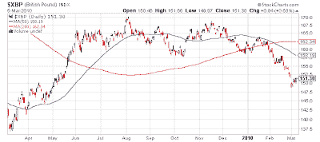

<!--yml
category: 未分类
date: 2024-05-18 00:37:08
-->

# Humble Student of the Markets: The canary keels over?

> 来源：[https://humblestudentofthemarkets.blogspot.com/2010/03/canary-keels-over.html#0001-01-01](https://humblestudentofthemarkets.blogspot.com/2010/03/canary-keels-over.html#0001-01-01)

I have written

[before](http://humblestudentofthemarkets.blogspot.com/2009/01/could-gbp-be-canary-in-mine.html)

that Britain and Pound Sterling (GBP) could be the canary in the mine for the US because of the similarities in their economies, except that the UK is not in the envious position of being the issuer of a major reserve currency.

These days Pound Sterling is falling apart. What's more, the

[UK housing market seems to be moving into double-dip territory](http://www.independent.co.uk/news/business/news/fears-grow-of-double-dip-for-uk-housing-market-1916461.html)

:

> The housing market seems set to undergo its own "double-dip" recession, with Halifax announcing yesterday that there was a 1.5 per cent fall in house prices between January and February, and with the slow economic recovery now on course to depress sentiment for the rest of the year.

Are the troubles in Britain a bad omen for America? Across the Atlantic, there are [signs that the US could face a 2Q contraction](http://globaleconomicanalysis.blogspot.com/2010/02/gdp-contraction-coming-in-second.html). James Hamilton at [Econbrower](http://www.econbrowser.com/archives/2010/03/a_new_index_of.html) points out that a new [financial conditions index](http://research.chicagobooth.edu/igm/events/docs/2010usmpfreport.pdf) is plunging which indicates further near-term deterioration. What's more, Patrick Chovanec highlighted that Bloomberg reported that China, which has been the bulwark of growth and stability in a growth-starved world, is moving to further cool down her economy by [nullifying financing guarantees by local governments](http://chovanec.wordpress.com/2010/03/08/bloomberg-china-to-nullify-financing-guarantees-by-local-governments/) [emphasis mine]:

> Many of the stimulus projects undertaken this past year have been financed, not by the central government directly, but by local governments, including cities, counties, and provinces. For the most part, however, they have limited funds and face official restrictions on their ability to borrow directly. To circumvent these limits, they set up special investment vehicles to borrow the money instead. Because these debts are supposedly guaranteed by the local governments (meaning they would step up to pay if the immediate borrower couldn’t), banks and other lenders tend to treat the loans as essentially risk-free. Northwestern University Professor Victor Shih calculates that local governments have already accumulated RMB 11 trillion (US$ 1.7 trillion) in outstanding debt, with RMB $13 trillion (US$ 1.9 trillion) in available credit lines, belying China’s low reported levels of public debt.
> 
> Now comes news, from top regulators in Beijing, that “China plans to nullify all guarantees local governments have provided for loans taken by their financing vehicles as concerns about credit risks on such debt surges.” (According to the report, the Ministry of Finance is also drafting rules to ban local governments from issuing any more such guarantees in the future). Without the guarantees in place, ***Shih believes, China could face a “gigantic wave” of bad debts and halted projects***.

**A hard landing in China?**

While I recognize that the Chinese authorities are trying to engineer a soft landing, but fiscal and monetary authorities have had a nasty habit of overshooting and turning intended soft landings into hard landings. What happens to risk aversion should the US consumer slows (even more) at the same time that China slows? What does that do to the risk of a Chinese hard landing?

**Heightened downside stock market risk**

Meanwhile, Mark Hulbert reported that there is too much bullishness in

[stocks](http://www.marketwatch.com/story/advisory-bullishness-reaching-too-high-levels-2010-03-05)

and in

[gold](http://www.marketwatch.com/story/gold-timers-increasingly-see-glass-half-full-2010-03-02)

, which are contrarian bearish signs.

[John Hussman](http://www.hussmanfunds.com/wmc/wmc100308.htm)

believes that "the Market Climate for stocks was characterized by unfavorable valuations, overbought conditions, and hostile yield pressures". To put the current conditions into perspective Hussman gave a market history lesson:

> Based on the current overbought status of the market, there are only three similar periods that we can identify in post-war data: August-October 1999 (which was followed by an abrupt air pocket of greater than 10%), September-October 1987 (no comment required), and September-December 1955 (which was followed by a 10% correction, a brief recovery, and a secondary decline to re-test the initial low).

The top-down macro, fundamental, technical and the sentiment pictures are all lining up bearishly. Don't say you weren't warned.