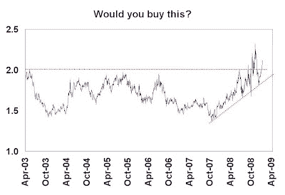
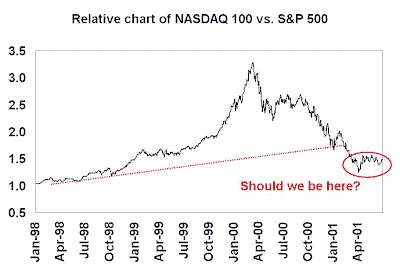
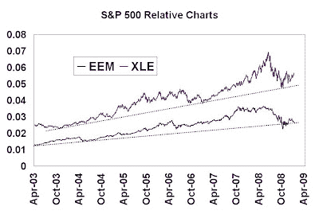
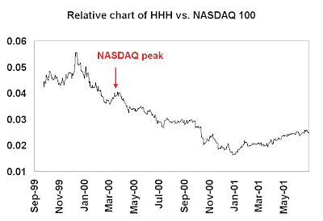

<!--yml
category: 未分类
date: 2024-05-18 00:59:28
-->

# Humble Student of the Markets: The curious case of the stubborn leaders

> 来源：[https://humblestudentofthemarkets.blogspot.com/2009/01/curious-case-of-stubborn-leaders.html#0001-01-01](https://humblestudentofthemarkets.blogspot.com/2009/01/curious-case-of-stubborn-leaders.html#0001-01-01)

In this bear market it is difficult to find chart patterns that look attractive. For more details on this mystery chart, read on…

**Leadership changes during bear markets** Bear markets are periods of catharsis. They serve to cleanse away the excesses of the previous market cycle. That’s why, as a general rule, technicians look for a change in leadership to mark the beginning of a new cycle.

During the early 70s, the Nifty Fifty was the dominant leadership. The late 70s saw inflation hedge vehicles such as the oils and golds lead the market. The 80s was the era of Japan and consumer oriented stocks (remember the LBO boom, which was focused on many of the consumer names?) The bull of the 90s was fueled by Technology, led by Internet stocks. The latest bull was led by the emerging markets and commodity producers, which were views as levered plays on the growth in China and other emerging market economies.

**Watching for the leadership change** To watch for changes in leadership, technicians often use relative price charts. As an example, the chart below shows the NASDAQ 100 relative to the S&P 500 during the Tech Bubble and its aftermath. The NASDAQ peaked in March 2000 and fell, on an absolute basis and relative to the S&P 500\. On a technical basis, the NASDAQ 100 tested the relative uptrend line in January 2001 and broke below it decisively a month later.

 Comparing the above chart to today’s market, the S&P 500 peaked on October 9, 2007 at 1565.15\. Over a year later after the market peak, the chart below shows the relative charts of the Energy Select Sector SPDR (XLE), which is a proxy for the commodity stocks, and the iShare MSCI Emerging Market Index to the S&P 500.

Surprise! Surprise! The leadership is still intact. While it is true that the EEM/SPX line is now testing an uptrend line, these charts look very healthy by comparison.

What about the leaders within the leadership? The chart below shows the Internet HOLDRs (HHH) relative to the NASDAQ 100 at the peak and after the peak of the Tech Bubble. Internet stocks, as represented by HHH, peaked in December 1999, a few months before the NASDAQ actual peak, and were in substantial decline afterwards.

**Stubborn leadership**
By contrast, ***we come to the mystery chart at the beginning of this post, which represents the chart of XLE relative to EEM***. Energy stocks had been in a basing pattern compared to emerging markets for several years. They began an relative uptrend in October 2007 and staged an upside breakout in October 2008.

**What about the economy?**
Right now, the world is swamped by deflation. China recently reported very disappointing 4Q economic growth.

However, I continue to believe that we should still [give inflation a chance](http://humblestudentofthemarkets.blogspot.com/2008/12/giving-inflation-chance.html) given the enormous policy consensus to reflate the banking system and the US consumer. As a result, the USD is at risk of a substantial decline, with the [GBP as the canary in the mine](http://humblestudentofthemarkets.blogspot.com/2009/01/could-gbp-be-canary-in-mine.html). Well, with Pound Sterling is falling that canary is now falling over.

**Listen to the tape**
Despite the sense of panic out there, the market tape is telling us that the situation is starting to stabilize. [Housing stocks](http://humblestudentofthemarkets.blogspot.com/2009/01/some-signs-of-spring-for-homebuilders.html) have stopped falling and they are now forming a base. The [Baltic Dry Index](http://investmenttools.com/futures/bdi_baltic_dry_index.htm), which had been in freefall, is showing some minor signs of recovery.

If we listen to the tale of the tape, we have the unusual situation where the previous leadership of commodity producers remaining intact. With that in mind, I am still inclined to give the inflation trade the benefit of the doubt for now.

**What to do?**
My inner investor tells me to nibble away at energy and commodity positions, as this kind of analysis has a tendency to be early by as much as a year or two. My inner trader, on the other hand, tells me to put on the long XLE/short EEM trade on any kind of decent pullback.