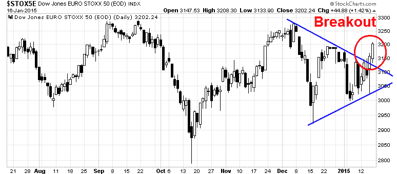
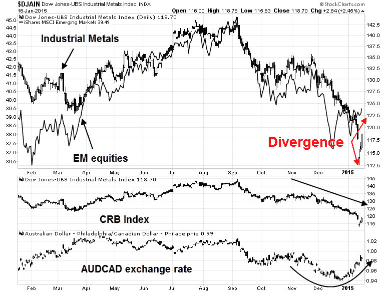

<!--yml
category: 未分类
date: 2024-05-18 03:26:40
-->

# Humble Student of the Markets: The global deflationary storm is abating

> 来源：[https://humblestudentofthemarkets.blogspot.com/2015/01/the-global-deflationary-storm-is-abating.html#0001-01-01](https://humblestudentofthemarkets.blogspot.com/2015/01/the-global-deflationary-storm-is-abating.html#0001-01-01)

**Trend Model signal summary**

Trend Model signal: Neutral

Trading model: Bullish

The Trend Model is an asset allocation model which applies trend following principles based on the inputs of global stock and commodity price. In essence, it seeks to answer the question, "Is the trend in the global economy expansion (bullish) or contraction (bearish)?"

My inner trader uses the trading model component of the Trend Model seeks to answer the question, "Is the trend getting better (bullish) or worse (bearish)?" The history of actual (not backtested) signals of the trading model are shown by the arrows in the chart below. In addition, I have a trading account which uses the signals of the Trend Model. The last report card of that account can be found 

[here](http://humblestudentofthemarkets.blogspot.com/2015/01/an-excellent-trend-model-report-card.html)

.

**Update schedule**

: I generally update Trend Model readings on 

[my blog](http://humblestudentofthemarkets.blogspot.com/)

 on weekends and tweet any changes during the week at @humblestudent.

**Trend Model whipsaw**

In my

[last monthly report card](http://humblestudentofthemarkets.blogspot.com/2015/01/an-excellent-trend-model-report-card.html)

of the trading account that uses the trading model component of Trend Model, I stated that turnover averaged about 200% a month, which indicates that the typical holding period for a position is roughly two weeks. 

In the last two weeks, however, we have seen tremendous volatility in the US equity market. By the book, I would have had two or three signal changes in the trading model which flipped the signal from bullish to bearish and vice versa. The current environment exposes one of the weaknesses of trend following models - you need to have a trend in order to profit from them. Sideways choppy markets create whipsaw in trend following systems, with the resultant hit to the bottom line.

To mitigate this effect, I have overlaid a number of short-term sentiment and overbought/oversold models to the trading model signal. These short-term models identify the risk and reward of being a bull or bear by seeking the answer the question, "Is the market overbought (oversold)? Are bulls (bears) in a crowded long (short)?"

Despite the choppiness of the last couple of weeks, it seems that both the longer term trend and short-term trading models are aligning in a bullish fashion. The world is reflating and US equities are oversold enough that they are ripe for a rally.

**A tour around the world**

My framework of analysis has always been to focus on the three major trading blocs in the world, namely the US, Europe and Asia (or China).

In my last post (see

[Decision time in the eurozone](http://humblestudentofthemarkets.blogspot.com/2015/01/decision-tine-in-eurozone.html)

), I identified a wedge formation in the Euro STOXX 50 and I was watching for the direction of the breakout, largely because the markets were worried about global deflationary fears. The source of deflation was coming from Europe and, to a lessor extent, China, not the US. Therefore monitoring non-US markets made more sense. After I wrote that post, eurozone stocks resolved the wedge in a bullish fashion.

Indeed, the ECB seems to be set to announce a QE program as

[Der Spiegel reported that Draghi briefed Merkel and Schaeuble on the details](http://www.forexlive.com/blog/2015/01/17/spiegel-ecb-draghi-german-merkel-schaeuble-qe-17-january-2015/)

:

> Spiegel magazine (without citing sources) reports that European Central Bank President Mario Draghi has briefed German Chancellor Angela Merkel and German Finance Minister Wolfgang Schaeuble on quantitative-easing plans

> *   Plan is national central banks would buy bonds issued by their own country
> *   Envisages limits of 20 percent to 25 percent on purchases of each country’s debt
> *   Says Greece will be excluded from the program because its bonds don’t fulfill the necessary quality criteria
> 
> An ECB spokesman declined to comment on the design of any QE program
> 
> A German government spokesman said earlier that Merkel and Draghi met on Jan. 14 for “regular informal talks,” while declining to comment on the topic.

European bulls still have to contend with the hurdle of a Greek election on January 25\. However, the chart of the relative performance of Greek stocks relative to the Euro STOXX 50 shows that this ratio is nearing the levels seen in the last crisis low. In effect, the market is already betting on a collapse. Barring the announcement of a Greek withdrawal from the euro, which is not in Syriza's electoral platform, how much more downside is there?

**Less awful in China = reflation**

Conventional wisdom says that Chinese economic growth is decelerating. Shorter term, however, Beijing seems to have blinked and begun a stimulus program this is starting to see results (via

[Business Insider](http://www.businessinsider.com/china-total-social-financing-surges-2015-1)

):

> While attention has been fixed on the slow down it seems the world has taken its eye off one of the most important figures in China — total social financing (TSF). After slowing all through 2014 it made a comeback in December.
> 
> TSF is a measure that the Chinese government invented in 2011 to figure out how much debt non-state entities (like people and private companies) have taken on. Jim Chanos, founder of Kynikos Associates and on of the biggest China bears out there told Business Insider TSF is "still the most under-appreciated number in global finance."
> 
> Why is it so important? Because it gives you a picture of the condition of both borrowers and lenders, and includes things like China's infamous shadow banking sector, where interest rates can hit 20%.

As the chart below shows, TSF ticked up in December, which is suggestive of a near-term "less bad" scenario for Chinese growth.

Indeed, the December 2014 survey of property prices in Chinese cities confirm this theme of "less awful" as we see a deceleration in the pace of decline when compared to November.

A glance at market based indicators tell a similar story of improvement and turnaround. The chart below shows the stock markets of China and its major Asian trading partners. While the parabolic rise of Shanghai is likely a localized anomaly, much like the latest news about the authorities clamping down on margin account. The action in Shanghai can therefore be ignored. On the other hand, the stock markets all of the other Asian trading partner countries, with the exception of South Korea, are turning up.

As China has been the major marginal consumer of commodities, commodity prices is another way of gauging the trajectory of Chinese economic growth. Despite the concerns expressed by many market commentators that cratering commodity prices stems from a lack of demand, which denotes slowing global growth, there are signs of hope. First of all, the above chart shows that the Australian stock market seems to be making a bottom, despite tanking commodity prices as measured by the CRB Index.

The chart below of commodity prices and commodity-related indicators tell a constructive story of global growth. The top panel shows the prices of industrial metals, which are highly sensitive to global growth, compared to emerging market equities (EEM). EM equities have been very correlated to industrial metals, but the latest divergence where EEM has rallied while industrial metals have continued to tank may be an indication that the de-financialization of commodities is beginning. Observant investors will recall that a number of institutions committed funds to commodities several years ago on the basis that their returns were uncorrelated to other assets. This led to the financialization of commodities as an asset class and pushed up prices. As commodity prices have begun to falter, we may be seeing the start of a de-financialization trend where investors exit their commodity investments.

The bottom panel of the AUDCAD exchange rate is another sign that Chinese growth may not be as bad as many people expect. Both Australia and Canada are major commodity producing countries, but Australian exports are more sensitive to Chinese growth while Canada is more sensitive to US growth. The rally in the AUDCAD is another indirect indication of a turnaround in the Chinese growth outlook.

**A resurgent US consumer?**

In the US, the Fed is getting ready to raise interest rates in 2015 as economic growth has begun to liftoff. Despite the dismal retail sales number announced last week, there are signs that the American consumer is ready to drive the economy.

First the blowout UMich Sentiment figures can be thought of an antidote to the retail sales miss.

[Gallup](http://www.gallup.com/poll/122840/gallup-daily-economic-indexes.aspx)

 produces a rolling survey series of economic confidence and employment. As the chart below shows, economic confidence shot up in December just as energy prices tanked.

The chart below shows the relative performance of Consumer Discretionary stocks to the market, as well as the relative performance of industries that are sensitive to consumer spending. Taken together, these form a picture of a resurgent/ consumer and continued economic growth.

**US equities oversold**

In the meantime, many of my short-term indicators show that the risk/reward is skewed to the upside. As an example, this chart from

[IndexIndicators.com](http://www.indexindicators.com/charts/)

show the 50-day highs-lows. This indicator is highly oversold and it is at or below levels where the market has bottomed out in the past (circles are mine), though there is no guarantee that the market can`t get more oversold from current levels.

My option based sentiment indicators are also flashing bottoming signals. In the past, the following combination has been reliable indicators of short-term market bottoms:

1.  An inverted VIX term structure (VIX/VXV ratio more than 1)
2.  VIX more than 20
3.  NYSE TRIN more than 2

The chart below shows past signals in the last three years marked with vertical lines. Last week, we saw two of the three signals and may have seen the third, namely TRIN more than 2.

While TRIN did not close above 2 at any time during the last week, this hourly chart shows that TRIN did move above 2 on an intra-day basis on Wednesday.

[Brett Steenbarger](http://www.traderfeed.blogspot.com/2015/01/keeping-eye-on-other-side-of-your-trade.html)

also made the following observation before the market open on Wednesday, when Tuesday`s closing levels on the SPX was about the same as Friday`s close (emphasis added):

> I have mentioned in the past the [Stock Spotter site](http://www.stockspotter.com/In/Default.aspx) of John Ehlers and Ric Way. They make use of cycle analysis to generate buy and sell signals for individual stocks and ETFs. Notably, they publish their track record of signals and have done well overall. ***I note that, as of yesterday's close, they had 138 buy signals on stocks. Since late 2013, when I began tracking the service, there have only been five occasions in which we've had 100 or more buy signals. It's a small sample, to be sure, but all five occasions were higher in SPY five trading sessions later, by an average of 1.59%.***
> 
> Indeed, when we divide the buy signals by quartiles and look at the highest quartile (most buy signals), we see an average next three-day gain in SPY of +.33%. The lowest quartile (least buy signals) yields an average next three-day gain in SPY of +.06%. This is clearly not how John and Ric designed the service to be used, but I do find it interesting that the broad market has tended to perform best when individual stocks are giving the greatest number of buy signals.

In a more recent

[post](http://traderfeed.blogspot.com/2015/01/three-market-measures-and-what-theyre.html)

, Steenbarger analyzed his trading indicators and concluded that stocks are ripe for a short-term bounce (emphasis added):

> The top chart depicts a ten-day moving average of all stocks across exchanges making three-month new highs vs. lows. That breadth has been deteriorating since late October, but notice also that this week's price lows saw fewer shares making fresh net new lows than at the mid-December bottom. For that reason, ***I'm viewing the market as a range one defined by the December highs and lows.***
> 
> The middle chart takes a look at the balance between buying pressure (upticks) versus selling pressure (downticks) across all NYSE shares. Note the recent intensity of selling pressure ahead of price lows, followed by Friday's buying surge. T***his is a pattern that has been common at intermediate market lows and is consistent with the range perspective noted above.***
> 
> Finally, in the bottom chart we see the 10-day average of changes in shares outstanding for the SPY ETF. This has been an excellent sentiment gauge, as we have tended to see expansions in shares outstanding when traders have been bullish and contractions in shares outstanding when traders and investors have been bearish. ***We finished 2014 with considerable bullishness and recently have swung to the opposite extreme, again consistent with the range notion.***

**Stars are lining up for a rally**

In short, the stars are lining up for a short-term stock market rally. The deflationary storm spooking the market is abating, which should be supporting of the risk-on trade.

I would caution, however, that the skies aren't all clear. Forward consensus EPS continue to fall, even as in this young Earnings Season, the EPS beat rate last week was 84% and sales beat rate was 60%. Here is the chart from

[John Butters](http://www.factset.com/websitefiles/PDFs/earningsinsight/earningsinsight_1.16.15)

of Factset (annotations in red are mine):

As the chart shows, past episodes of weakness in forward EPS have been associated with market weakness. While I fully expect forward EPS to start rising again as Earning Season progresses, largely because of greater optimism from the American consumer, it hasn`t happened yet.

My inner investor is therefore neutrally positioned with an asset mix equal to his policy position mix of stocks and bonds. My inner trader remains bullish on stocks.

**Disclosure:**

Long SPXL, TNA