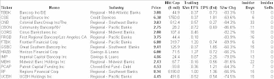

<!--yml
category: 未分类
date: 2024-05-18 01:03:31
-->

# Humble Student of the Markets: The kid in the candy store

> 来源：[https://humblestudentofthemarkets.blogspot.com/2008/10/kid-in-candy-store_26.html#0001-01-01](https://humblestudentofthemarkets.blogspot.com/2008/10/kid-in-candy-store_26.html#0001-01-01)

Top-down oriented investors seems to have significant concerns about the macroeconomic backdrop right now. On the other hand, many value and bottom-up oriented investors who were previously cautious on the market have either become more constructive on stocks or turned outright bullish. The list goes on:

[Warren Buffett](http://www.nytimes.com/2008/10/17/opinion/17buffett.html?_r=1&oref=slogin)

,

[Jeremy Grantham](http://www.gmo.com/websitecontent/JGLetter_ALL_3Q08.pdf)

,

[Ken Heebner](http://www.nytimes.com/2008/10/12/business/12stox.html?_r=2&hp&oref=slogin&oref=slogin)

,

[John Hussman](http://www.hussmanfunds.com/wmc/wmc081020.htm)

,

[John Neff](http://www.philly.com/inquirer/business/homepage/20081015_Former_Vanguard_guru_is_buying_stocks.html)

and return estimates based on the

[ValueLine Survey](http://www.marketwatch.com/news/story/mark-hulbert-last-time-market/story.aspx?guid=%7B857540F1%2D3E4A%2D4264%2DB27A%2D391696699BC2%7D&dist=hplatest)

.

Putting on my bottom-up investor’s hat on, I can sympathize with the bullish assessment. Just for fun I ran a quick screen of low-priced beaten up financials with heavy insider buying and came up with a moderately sized list, which is shown below. It’s easy to see how some of the bottom-up managers are behaving like kids in a candy store. You don't see these kinds of values every day. The P/Es of these financials are low and they have had significant insider buying in the last six months and no insider sales, which is an indication of management confidence. In addition, other deep value screens are also showing long lists of stocks with good upside potential with solid asset value support.

Click for larger image

However, my inner top-down investor remains concerned that there is too much macro downside risk. The market is too dependent on

[policy response](http://humblestudentofthemarkets.blogspot.com/2008/10/barbell-portfolio-for-fork-in-road.html)

for me to sound the all-clear for the bulls.

**Disclaimer: *I don’t have a position in any of these stocks. You should not consider this as a recommendation to trade any of them. You are responsible for your own portfolio and you should do your own homework.***