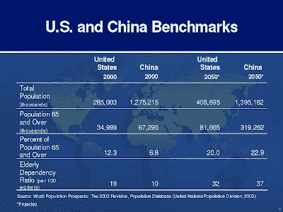

<!--yml
category: 未分类
date: 2024-05-18 01:11:08
-->

# Humble Student of the Markets: The limits to China’s growth

> 来源：[https://humblestudentofthemarkets.blogspot.com/2008/04/limits-to-chinas-growth.html#0001-01-01](https://humblestudentofthemarkets.blogspot.com/2008/04/limits-to-chinas-growth.html#0001-01-01)

I have a seven year old daughter. Despite her Chinese heritage I am not in a huge rush to enroll her in the Chinese Mandarin classes as many of the other parents have enrolled her peers. There are two reasons for this. First, Chinese is a difficult language (no alphabet, all characters must be learned by rote memorization) that is learned best in an immersion environment. Second, I believe that by the time she is ready to move into the working world China will no longer be ascendant the way it is now. The Chinese language courses that parents are rushing to put their children into now will turn out to be as useful as the Japanese courses in the late 1980s (anyone remember Theory Z?)

**A bearish call with a very long term horizon** 

Before you start flaming me, note that I am talking about a very long term time horizon. While I believe that China will grow at very high rates in the next five to ten years, there are two main long-term problems with China which will limit her growth path:

*   China is a nation of small business entrepreneurs but the small business model is not scalable
*   Chinese age demographics are getting more unfavorable

First, some good news and bad news about China’s growth: From personal observation I have found the Chinese tend to be very entrepreneurial. This effect is demonstrated by the business dominance of the overseas Chinese in much of Southeast Asia, which has created friction in the past in countries such as Malaysia, Indonesia and the Philippines. This entrepreneurial spirit has created a nation of small businesses and an enormous dynamism which is fueling much the growth in China.

However, Chinese business culture has not fully developed a professional manager class (with some limited exception in Hong Kong and Singapore). The business model of much of these small businesses consists of a single person at the top with managers and workers below, most of whom have little or no authority. Small businesses are not scalable into large businesses if there are no professional managers. Such a culture can create a nation of shopkeepers but not a nation of industrialists. This will create barriers to further growth at some point in the future.

**Demographics another headwind**
China has undergone over a generation of the one-child policy, which has served to restrict her population growth. The law of unintended consequences raised its head along the way.

The population is aging rapidly. The accompanying chart shows that the UN projects the proportion of China’s elderly population, which is defined as those over age 65, will rise from 6.8% of the population in 2000 to an astounding 22.9% in 2050\. China’s dependency ratio (ratio of non-working to working population) will rise from 10 per 100 workers in 2000 (19 for US in 2000) to 37 in 2050 (vs. 32 for US). The [demographic bonus](http://newsletters.worldbank.org/external/default/main?menuPK=571349&theSitePK=571341&contentMDK=20342969&pagePK=64133601&piPK=64129599) of a rising young, productive, working population will have been spent in the next 20-30 years.

Source: US GAO,

[The Future Sustainability of Social Insurance Programs](http://161.203.16.2/cghome/2004/beijing04/beijing04.pdf)**A nation of little emperors**

Beyond the mere numbers of age demographics, the cultural effects of the one-child male-preferred policy may further inhibit the growth dynamism of China’s economy. The family pyramid has become inverted, with parents and grandparents doting on the single child. This has created a nation of spoiled “little emperors” many of whom have grown up with a sense of entitlement and may not have the same work ethic as older generations. Many of these “little emperors” are now in their 20s. Can we really expect the same entrepreneurial drive from this age cohort as from older cohorts? Culturally, this will further inhibit China’s growth potential in the future.

**Too early to short China** 

I began this post by referring to my seven year old daughter. It is with that time horizon in mind that I refer to China’s longer term challenges. In the meantime, China remains a powerhouse of economic growth for the next 5-10 years. Shorting it now would be like standing in front of a speeding freight train.