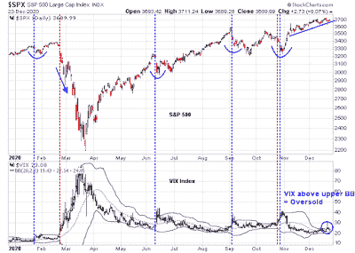

<!--yml
category: 未分类
date: 2024-05-18 02:07:06
-->

# Humble Student of the Markets: The most wonderful time of the year...

> 来源：[https://humblestudentofthemarkets.blogspot.com/2020/12/the-most-wonderful-time-of-year.html#0001-01-01](https://humblestudentofthemarkets.blogspot.com/2020/12/the-most-wonderful-time-of-year.html#0001-01-01)

**Mid-week market update**: In my last post (see [Trading the pre-Christmas panic](https://humblestudentofthemarkets.com/2020/12/21/trading-the-pre-christmas-panic/)), I pointed out that the VIX Index had spiked above its upper Bollinger Band, which is an indication of an oversold market. In the past year, stock prices have usually stabilized and rallied after such signals (blue vertical line). The only major exception was the February and March skid that saw the market become more and more oversold (red line). The market today appears to be following a more typical pattern of stabilization, which should be followed by recovery during the seasonally strong Christmas period.

Even more constructive for the bull case was how stock prices reacted to bad news. Last night after the market close, President Trump called the latest stimulus package a "disgrace" and threatened to veto the bill. This latest surprise not only threatens the stimulus bill, it also raises the risk of a government shutdown on December 28, 2020\. S&P 500 futures initially fell -0.5% overnight on the news but recovered to open green Wednesday morning. 

A market's ability to shrug off bad news is bullish. 

The full post can be found [here](https://humblestudentofthemarkets.com/2020/12/23/the-most-wonderful-time-of-the-year/).