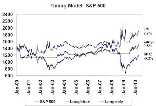

<!--yml
category: 未分类
date: 2024-05-18 00:14:00
-->

# Humble Student of the Markets: The perils of short sales

> 来源：[https://humblestudentofthemarkets.blogspot.com/2010/05/perils-of-short-sales.html#0001-01-01](https://humblestudentofthemarkets.blogspot.com/2010/05/perils-of-short-sales.html#0001-01-01)

When I discuss the

[Inflation-Deflation Timer model](http://www.qwestfunds.com/publications/newsletters_pdf/newsletter_november_2009.pdf)

 with other investors, I have sometimes been asked why I don’t use the model output to initiate short positions, instead of switching to another asset class. (To review, the model is an asset allocation model that uses trend following principles to switch between asset classes, namely commodities, the inflation hedge, US Treasury long bond, the deflation hedge, and equities, the neutral position.)

***Cutting to the chase***

: Investors, i.e. market participants with relatively long time horizons, shouldn't go short for risk control reasons. Simply put, asset classes tend to be more volatile when they are in bear markets and rallies tend to be vicious, such as the current one in response to the European rescue package. Thus, the investor pays for higher returns (even if he is right) in the form of higher volatility. Short sales are more suitable for traders seeking to make a directional bet for short-term profit, or for hedgers, e.g. paired trading.

**Short positions are more volatile**

Since the

[Inflation-Deflation Timer model](http://www.qwestfunds.com/publications/newsletters_pdf/newsletter_november_2009.pdf)

is based on

[trend following principles](http://www.qwestfunds.com/publications/newsletters_pdf/newsletter_february_2010.pdf)

(see previous posts on trend following models

[here](http://humblestudentofthemarkets.blogspot.com/2010/02/trend-following-20.html)

,

[here](http://humblestudentofthemarkets.blogspot.com/2008/11/trend-following-ctas-no-panacea.html)

and

[here](http://humblestudentofthemarkets.blogspot.com/2010/01/simple-style-rotation-model.html)

), I illustrate my point about why I don’t go short by applying a trend following model based on 50 and 200 day moving averages to the S&P 500\. The rules for the backtest are:

**Bullish signal**

: Index > 50 day MA > 200 day MA (long index)

**Bearish signal**

: Index < 50 day MA < 200 day MA (short index, if allowed)

**Neutral signal**

: Otherwise (cash)

For the purposes of this exercise, let's assume that execution is done the day after a signal is given at the closing price and there are no commissions or trading costs. If the model goes to cash, a 0% return is assumed. Returns on the S&P 500 are total returns, as proxied by SPY. The chart below shows the results of the backtest, which began on December 31, 1999 and goes to the present. For the entire period, a buy and hold strategy would have returned -0.2%. If you had used the timing model only to go long, the return would have been 0.5%. A long and short strategy performed best at 2.7%.

When I look at these results, several conclusions can be made. First, these classes of models are good at avoiding much of the brutal downdrafts of bear markets. The long only strategy beat the buy-and-hold strategy by 0.7%, but downside volatility was significantly lower than the benchmark. While the long/short strategy was the best, that performance was achieved at the price of much greater volatility. The incremental volatility was experienced during periods when the model went short, i.e. during bear markets.

**Bear markets are more volatile**

This study leads to the conclusion that bear markets are more volatile, which should be intuitively obvious to traders. After all, the VIX Index, which is a measure of implied volatility, tends to rise when the stock market is falling.

I did a quick check if the rising volatility effect was true in other asset classes. The chart below shows the standard deviation of different asset classes for different assets over differing time periods: DJIA (from 1928 to the present), AGG as a proxy for the US bond market (from 2003) and the CRB Index (from 1999). [Yes I know the time periods are different and I am not exactly comparing apples to apples, but I want to study the behavior of different asset classes during bull and bear phases.] I defined a bull market as when the index was above its 200 day moving average and a bear market as when it was below.

The chart shows a consistent pattern: bear markets tend to be more volatile than bull markets. Technicians have an adage that confirms this observation: "Bottoms are events. Tops are processes." In other words, the price action at bottoms tend to be emotional, spiky affairs - which is what account for the volatility.

Short sellers profit from falling markets, but bear markets are more volatile. Even if the shorts are right, their higher returns come at the price of greater volatility.

**Buy the negatively correlated asset instead**

In an asset allocation model such as the Inflation-Deflation Timer, a better way to get higher risk-adjusted returns is to move into a more favorable asset class when the trend following model flashes a “go short” signal. For instance, an investor can get better risk-adjusted buying the negatively correlated asset, such as the US Treasury long bond, instead of shorting commodities when we see a “deflation” signal.

That's the path to a higher return that lets you sleep better at night.