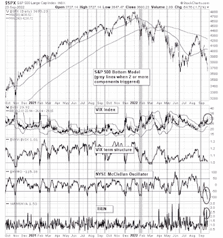

<!--yml
category: 未分类
date: 2024-05-18 01:39:03
-->

# Humble Student of the Markets: The right and wrong way to throw in the towel

> 来源：[https://humblestudentofthemarkets.blogspot.com/2022/09/the-right-and-wrong-way-to-throw-in.html#0001-01-01](https://humblestudentofthemarkets.blogspot.com/2022/09/the-right-and-wrong-way-to-throw-in.html#0001-01-01)

**Preface: Explaining our market timing models** 

We maintain several market timing models, each with differing time horizons. The "

**Ultimate Market Timing Model**

" is a long-term market timing model based on the research outlined in our post, 

[Building the ultimate market timing model](https://humblestudentofthemarkets.com/2016/01/26/building-the-ultimate-market-timing-model/)

. This model tends to generate only a handful of signals each decade.

The 

**Trend Asset Allocation Model**

 is an asset allocation model that applies trend-following principles based on the inputs of global stock and commodity prices. This model has a shorter time horizon and tends to turn over about 4-6 times a year. The performance and full details of a model portfolio based on the out-of-sample signals of the Trend Model can be found

[here](https://humblestudentofthemarkets.com/trend-model-report-card/)

.

My inner trader uses a 

**trading model**

, which is a blend of price momentum (is the Trend Model becoming more bullish, or bearish?) and overbought/oversold extremes (don't buy if the trend is overbought, and vice versa). Subscribers receive real-time alerts of model changes, and a hypothetical trading record of the email alerts is updated weekly 

[here](https://humblestudentofthemarkets.com/trading-track-record/)

. The hypothetical trading record of the trading model of the real-time alerts that began in March 2016 is shown below.

The latest signals of each model are as follows:

*   Ultimate market timing model: Sell equities*
*   Trend Model signal: Neutral*
*   Trading model: Bullish*

** The performance chart and model readings have been delayed by a week out of respect to our paying subscribers.***Update schedule**

: I generally update model readings on my 

[site](https://humblestudentofthemarkets.com/)

 on weekends and tweet mid-week observations at @humblestudent. Subscribers receive real-time alerts of trading model changes, and a hypothetical trading record of those email alerts is shown 

[here](https://humblestudentofthemarkets.com/trading-track-record/)

.

Subscribers can access the latest signal in real-time 

[here](https://humblestudentofthemarkets.com/my-inner-trader/)

.

**A crowded short **

In the wake of the post-FOMC meeting downdraft, three of the four components of my bottom spotting models flashed buy signals. 

*   The VIX Index has spiked above its upper Bollinger Band, which is an oversold condition for the market, 
*   Yhe NYSE McClellan Oscillator had become wildly oversold, and 
*   TRIN spiked above 2, indicating price insensitive panic selling. 

In the past, buy signal counts above two have indicated bullish risk/reward conditions for stock prices.

Other sentiment models are also pointing to crowded short conditions. In many ways, traders had already thrown in the towel even before the FOMC meeting, which is likely to put a floor on stock prices. But there is a right way and a wrong way to throw in the towel.

The full post can be found

[here](https://humblestudentofthemarkets.com/2022/09/25/the-right-and-wrong-way-to-throw-in-the-towel/)

.