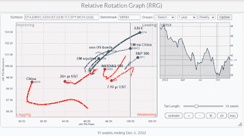

<!--yml
category: 未分类
date: 2024-05-18 01:35:38
-->

# Humble Student of the Markets: The stealth change in market leadership you may have missed

> 来源：[https://humblestudentofthemarkets.blogspot.com/2022/12/the-stealth-change-in-market-leadership.html#0001-01-01](https://humblestudentofthemarkets.blogspot.com/2022/12/the-stealth-change-in-market-leadership.html#0001-01-01)

It's time to conduct one of my periodic market leadership reviews. The review will be done through different viewpoints, starting from the top from an asset lens, a global equity lens, and finally through a factor, or style, lens.

The primary tool for my analysis is the

[Relative Rotation Graph](http://stockcharts.com/docs/doku.php?st=rrg&id=other-tools:rrg-charts)

, or RRG chart, which is a way of depicting the changes in leadership in different groups, such as sectors, countries or regions, or market factors. The charts are organized into four quadrants. The typical group rotation pattern occurs in a clockwise fashion. Leading groups (top right) deteriorate to weakening groups (bottom right), which then rotate to lagging groups (bottom left), which change to improving groups (top left), and finally completes the cycle by improving to leading groups (top right) again. All of the RRG analysis is conducted in USD and therefore includes all currency effects in the returns.

The benchmark for the asset RRG analysis is the Vanguard Balanced Index Fund (VBINX). It shows leadership by virtually all equities except China. Non-US bonds are in the improving quadrant. EM equities are only in the improving quadrant, dragged down by China in the lagging quadrant, which also contains US large-cap growth and Treasuries.

The full post can be found

[here](https://humblestudentofthemarkets.com/2022/12/10/the-stealth-change-in-market-leadership-you-may-have-missed/)

.