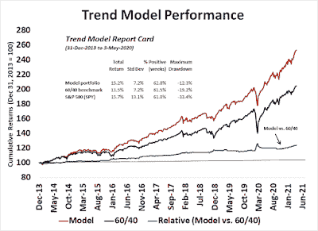

<!--yml
category: 未分类
date: 2024-05-18 01:59:29
-->

# Humble Student of the Markets: The wall at S&P 4200

> 来源：[https://humblestudentofthemarkets.blogspot.com/2021/05/the-wall-at-s-4200.html#0001-01-01](https://humblestudentofthemarkets.blogspot.com/2021/05/the-wall-at-s-4200.html#0001-01-01)

**Preface: Explaining our market timing models** 

We maintain several market timing models, each with differing time horizons. The "

**Ultimate Market Timing Model**

" is a long-term market timing model based on the research outlined in our post, 

[Building the ultimate market timing model](https://humblestudentofthemarkets.com/2016/01/26/building-the-ultimate-market-timing-model/)

. This model tends to generate only a handful of signals each decade.

The 

**Trend Asset Allocation Model**

 is an asset allocation model that applies trend following principles based on the inputs of global stock and commodity price. This model has a shorter time horizon and tends to turn over about 4-6 times a year. The performance and full details of a model portfolio based on the out-of-sample signals of the Trend Model can be found

[here](https://humblestudentofthemarkets.com/trend-model-report-card/)

.

My inner trader uses a 

**trading model**

, which is a blend of price momentum (is the Trend Model becoming more bullish, or bearish?) and overbought/oversold extremes (don't buy if the trend is overbought, and vice versa). Subscribers receive real-time alerts of model changes, and a hypothetical trading record of the email alerts is updated weekly 

[here](https://humblestudentofthemarkets.com/trading-track-record/)

. The hypothetical trading record of the trading model of the real-time alerts that began in March 2016 is shown below.

The latest signals of each model are as follows:

*   Ultimate market timing model: Buy equities*
*   Trend Model signal: Bullish*
*   Trading model: Bullish*

** The performance chart and model readings have been delayed by a week out of respect to our paying subscribers.***Update schedule**

: I generally update model readings on my 

[site](https://humblestudentofthemarkets.com/)

 on weekends and tweet mid-week observations at @humblestudent. Subscribers receive real-time alerts of trading model changes, and a hypothetical trading record of those email alerts is shown 

[here](https://humblestudentofthemarkets.com/trading-track-record/)

.

Subscribers can access the latest signal in real-time 

[here](https://humblestudentofthemarkets.com/my-inner-trader/)

.

**The S&P 500 tests overhead resistance**

The S&P 500 has been trading sideways since mid-April, with overhead resistance at roughly the 4200 level. While the market action in the past week has been frustrating for both bulls and bears, I believe the index should be able to advance past the 4200 level to test the old highs and probably make marginal new highs in early June. My bullish view is supported by the behavior of the VIX Index, which has convincingly fallen below its 20 dma after recycling from above its upper Bollinger Band.

The full post can be found

[here](https://humblestudentofthemarkets.com/2021/05/30/the-wall-at-sp-4200/)

.