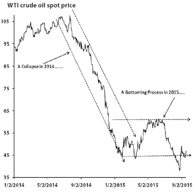

<!--yml
category: 未分类
date: 2024-05-18 03:14:38
-->

# Humble Student of the Markets: The weak USD scenario for equity bulls

> 来源：[https://humblestudentofthemarkets.blogspot.com/2015/10/the-weak-usd-scenario-for-equity-bulls.html#0001-01-01](https://humblestudentofthemarkets.blogspot.com/2015/10/the-weak-usd-scenario-for-equity-bulls.html#0001-01-01)

The Trend Model is an asset allocation model which applies trend following principles based on the inputs of global stock and commodity price. In essence, it seeks to answer the question, "Is the trend in the global economy expansion (bullish) or contraction (bearish)?"

My inner trader uses the trading model component of the Trend Model seeks to answer the question, "Is the trend getting better (bullish) or worse (bearish)?" The history of actual out-of-sample (not backtested) signals of the trading model are shown by the arrows in the chart below.

 of Factset . While the preliminary earnings beat rate is 81%, well above the five-year average of 72%, the revenue beat rate stands at 50%, which is below the historical average of 57%. More importantly, forward EPS estimates are falling, yet stock prices are rising. What gives?

The bad news is starting to accumulate.

[New Deal democrat](http://community.xe.com/blog/xe-market-analysis/weekly-indicators-employment-comes-sharp-focus-edition)

's weekly review of high frequency economic data shows that the US economy is feeling the effects of a shallow industrial recession, though his long leading indicators are not forecasting any weakness in 2016:

> There are two developments going in opposite directions. While industrial production is still in a shallow recession, inventory is no longer being accumulated, although it is not being disposed of yet. This suggests weakness is not getting worse, although the weakness will continue. That, presumably, will include near term weakening of employment.
> 
> And employment is really coming into focus. Tax withholding has gotten much more mixed since the beginning of August. Temporary staffing has gotten worse. Monthly payrolls have been weak for the last two months. At the same time, new jobless claims are at historic lows. Typically hiring slows down or stops before layoffs increase, and it seems that's where we are. So I expect the weakness in employment to continue and maybe intensify until the inventory correction is worked through.

The latest Factset forward EPS data shows that forward 12 month EPS is still falling, which is another bearish sign (annotations in red are mine):

**Momentum to the rescue**

In my post last week, I suggested that the recent risk-on rally is an indication that Mr. Market telling us that he is looking over the valley of temporary weakness. Indeed, volatility has dropped like a rock. Remember those dark days of September when we couldn't go 2-3 days without an overnight swing of 1% or more? Those days are gone.

[Charlie Bilello](http://pensionpartners.com/blog/?p=1673)

 recently presented analysis indicating that stock prices have a positive bias after a precipitous drop in the VIX Index:

> Over the past 10 trading days, the VIX Index has fallen over 41% (from 27.6 to 16.2), one of the steepest 10-day drops in history. Only the collapse in volatility last October saw a larger decline.

I believe that the current rally is likely to continue on an intermediate term basis. As regular readers are aware, my Trend Model uses inter-market analysis to determine stock market trends - and the trend is turning up. The chart below shows that market strength has not just been isolated to the US. Global stocks, US stocks, eurozone and British equities have all recovered to regain their 50 day moving average (dma).

What about China? Remember how spooked everyone was about Chinese weakness in September? The equity markets of China and her Asian trading partners have also rallied and regained their 50 dma.

In addition, commodities have started to turn up as well, aided by a softer tone in the USD, which is inversely correlated to commodity prices:

As the above chart shows, the USD Index violated an uptrend and underwent a "death cross" last week. There is a decent support zone in the 93-94 area. If that is breached, then we are likely to see further greenback weakness. From a macro perspective, near-term USD weakness is likely due to a dovish Fed (see the latest

[Hilsenrath article](http://www.wsj.com/articles/fed-doubts-grow-on-2015-rate-hike-1444866104)

) and emerging strength in China and Europe.

**Watch the USD!**

The near-term behavior of the USD represents the key to further stock market strength. As we progress through Earnings Season, one of the refrains that investors will hear again and again is how a strong USD posed headwinds to earnings and margins.

For a slightly different perspective on the underlying fundamentals of Earnings Season, I turn to Jonathan Golub of RBC (via

[Business Insider](http://www.businessinsider.com/q3-eps-growth-ex-energy-assuming-historical-beat-2015-10)

):

> RBC Capital Markets' Jonathan Golub illustrates this tweak and goes one step further noting that companies historically beat expectations for earnings growth by about 4 percentage points.
> 
> "Current projections indicate a 4.2% decline in 3Q SP 500 EPS, largely the result of Energy weakness (EPS -64% YoY)," Golub wrote on Monday. "Assuming an historical 4.0% beat rate and excluding Energy, trend growth should come in between 7-8%, shown below."

In other words, 3Q earnings growth won`t be that bad if we apply a historical beat rate to the ex-energy component of the market. 

[New Deal democrat](http://bonddad.blogspot.ca/2015/10/inndustrial-production-ex-oil-patch.html)

more or less said the same thing when he analyzed industrial production ex-energy:

> Manufacturing (blue) continues to be in an uptrend, although it is slightly off (-0.3) of its high two months ago, which is actually pretty darned good considering the strong dollar.
> 
> Yes the US is in a shallow industrial recession. But it is focused and limited, and hasn't translated into any downdraft in the consumer economy (see: real retail sales) which is 70% of the total.

**The bullish implications of USD weakness**

So what would happen if the USD weakened and energy prices turned up? To put some numbers on that scenario, a 

[Bloomberg](http://www.bloomberg.com/news/videos/2015-10-12/have-markets-reached-bottom-for-2015-)

 interview with strategist Tom Lee indicated that

***USD strength subtracted about $10 from SPX earnings and the drop in oil prices subtracted about $7***

. So let's do some back of the envelope calculations. Supposing that USD weakness and commodity strength reverses about half of the $17 earnings shortfall in the next 3-6 months. Applying a 16x multiple to those recovered earnings, we get an SPX target price of 2170, or a gain of about 7%.

Wow! An SPX all-time high is well within reach.

[Jim Paulsen](http://wellscap.com/docs/emp/20150917.pdf)

of Wells Capital Management has been recently spot-on on market direction. I cited his work when I turned equity bearish in the spring (see

[Why I am bearish (what would change my mind)](http://humblestudentofthemarkets.blogspot.com/2015/05/why-i-am-bearish-and-what-would-change.html)

). Paulsen has called for a commodity rally. He believes that the recent period of commodity weakness is not a sign of impending recession, but a mid-cycle pause. In fact, falling commodity prices can provide a "second wind" boost to growth (my words, not his).

> In three of the last four recoveries (i.e., the late-1970s, 1980s and 1990s recoveries), commodity prices suffered a severe decline “during an ongoing economic recovery. In each of these cases, the economic recovery persisted well beyond the bottom in commodity prices. Indeed, in the past, once commodity prices bottomed, the pace of economic growth accelerated and the recovery did not end until commodity prices had substantially recovered. For example, in the late-1970s recovery, commodity prices bottomed in July 1977 and the recovery did not end until January 1980\. Similarly, commodity prices bottomed in July 1986 but the economic recovery continued until July 1990\. Finally, commodity prices bottomed in early 1999 but the recovery did not peak until March 2001\. As shown, a significant decline in commodity prices usually points to stronger rather than weaker future economic growth. Moreover, once commodity prices do finally bottom, they have typically risen throughout the balance of the economic recovery.
> 
> Although most believe oil prices (and overall commodity prices) are continuing to collapse, chart 2 suggest they have been in a bottoming process since early this year. While the spot price of WTI crude oil did collapse last year, it is currently about $45, a level it first reached in mid-January. We suspect the commodity markets are about to embark on a multi-year advance which will likely alter leadership in the economy and in the stock market.

From a technical perspective, the recent bout of commodity weakness appears to be overdone and they are due for a bounce. The chart below of the 20-year relative performance of the CRB-SPX ratio shows that commodities are in a relative downtrend when compared to stocks, but the ratio recently saw a positive RSI divergence indicating that they are poised for a relative rally. While I am not postulating the start of a new commodity bull, the CRB-SPX can rally up to test the downtrend line (see red arrow).

Emerging market equities, which are correlated to commodities, are displaying a similar pattern, though the EM-SPX ratio did not show a positive RSI divergence.

The biggest upside potential comes from the energy sector, as shown by this crude oil-SPX relative performance chart, largely because oil prices have cratered badly:

The oil stock-SPX ratio chart also tells the same story:

**A change in leadership**

Indeed, we are starting to see a change in market leadership. The old market leaders of Financials and Healthcare stocks have started to falter, as shown by this relative return chart. Only Consumer Discretionary stocks remain in a relative uptrend.

The emerging leadership are cyclical stocks that are sensitive to USD weakness, such as Industrials, Technology, Materials and Energy.

I do want to make one point clear. My call for USD weakness and commodity price rally is a tactical one with a time horizon of one or two quarters. It is definitely not a forecast of a revival of a secular commodity bull, especially in oil. As this analysis from

[FT Alphaville](http://ftalphaville.ft.com/2015/10/12/2142058/saudi-arabias-gambit-for-market-share-meets-yankee-ingenuity/)

shows, oil extraction technology has improved dramatically as any sustained rise in oil prices will be met by a tsunami of new supply coming onto the market.

In the meantime, stock prices can grind higher. As this chart shows, the weight of the old leadership in the SPX is 44.0%, while the weight of the new leadership is 40.2%. If the American consumer can continue to spend and Consumer Discretionary stocks hold up, then there is no reason why the SPX cannot rise to further highs as over half of the sectors by weight will be in relative uptrends.

**Watching for the "good" overbought readings**

Last week, I postulated that stocks would continue to rise, but may see some short-term consolidation and pullback early in the week (see

[A "What's the credit limit on my VISA card" buy signal](http://humblestudentofthemarkets.blogspot.com/2015/10/a-whats-credit-limit-on-my-visa-card.html)

). That scenario has played out well so far. I also suggested that market rallies off Zweig Breadth Thrusts are often accompanied by a series of "good" overbought readings, where the market gets overbought and stays overbought.

At the end of the week, this chart from

[IndexIndicators](http://www.indexindicators.com/indicators/breadth/)

shows that the market has pulled back slightly off its near-term overbought readings. If the theme of price momentum were to prevail, then the temporary consolidation early last week could propel stocks higher.

The SPX is approaching overhead resistance at the 2040 (past support now turned into resistance) to 2060 level (the 200 dma). RSI(5) is starting to show those "good" overbought conditions, though RSI(14) is not yet overbought. Last week was option expiry week, which tends to have a bullish bias, but weeks following OpEx have a tendency to mean revert and weaken.

My inner trader averaged into long positions in SPX and energy stocks early last week. He expects that any pullbacks will be shallow and he is betting on momentum to carry the day.

My inner investor is also long and expects that this is a start of a rally into year-end.

**Disclosure:**

Long SPXL, ERX