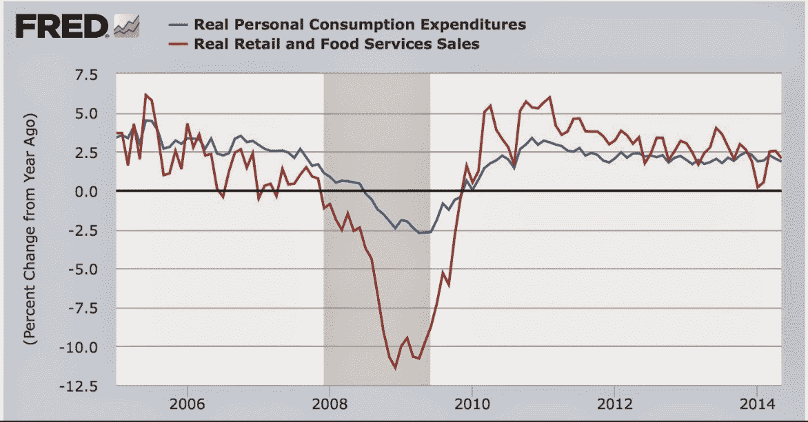
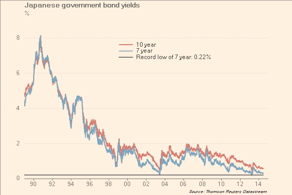

<!--yml
category: 未分类
date: 2024-05-18 03:37:43
-->

# Humble Student of the Markets: This will end in tears, but when?

> 来源：[https://humblestudentofthemarkets.blogspot.com/2014/06/this-will-end-in-tears-but-when.html#0001-01-01](https://humblestudentofthemarkets.blogspot.com/2014/06/this-will-end-in-tears-but-when.html#0001-01-01)

I have outlined in the past my long-term concerns over expected equity returns. Valuations are stretched (see

[More evidence of a low-return equity environment](http://humblestudentofthemarkets.blogspot.com/2014/04/more-evidence-of-low-return-equity.html)

), but there is no immediate signs of a bearish trigger.

This would have been a very long post so I decided to split it into two parts. The first part outlines the risks to the stock market. The second is an analysis of possible bearish triggers and discusses the likely intermediate path for stock prices.

**This will end in tears**

In addition to my valuation concerns,

[Tom Bradley](http://www.theglobeandmail.com/globe-investor/investment-ideas/why-all-this-market-calm-is-so-nerve-racking/article19300062/)

, who is a well-respected local money manager, recently penned an essay outlining what he saw as the risks to the stock market. While the concerns that Bradley expresses are very real, timing is uncertain and the theme of the essay is ”this will end in tears”.

The first concern Bradley outlined is excessive complacency:

> It feels like investors have become complacent about – well – everything.
> 
> The strongest consensus I’ve seen in recent years relates to low interest rates. The rationale is, rates won’t go up because we can’t afford it. A question from a client last week embodies this view. He asked, “Can interest rates actually increase?”
> 
> Related to rates is an increasing comfort with debt. Carrying costs are low and families are okay with heavily leveraged balance sheets. Instead of, “How fast can I get my house paid off?,” the question is, “Should I get an investment loan to go with my mortgage, home equity loan, credit line, car lease and credit cards?”

Too much complacency has shown up in low volatility in all asset classes. Such an environment encourages investors to take on too much risk. Indeed, the Bank for International Settlements has warned of

[euphoric markets being detached from reality](http://www.ft.com/intl/cms/s/0/795160a2-fe26-11e3-b4f1-00144feab7de.html)

:

> The Bank for International Settlements has warned that “euphoric” financial markets have become detached from the reality of a lingering post-crisis malaise, as it called for governments to ditch policies that risk stoking unsustainable asset booms.
> 
> While the global economy is struggling to escape the shadow of the crisis of 2007-09, capital markets are “extraordinarily buoyant”, the Basel-based bank said, in part because of the ultra-low monetary policy being pursued around the world.
> 
> Leading central banks should not fall into the trap of raising rates “too slowly and too late”, the BIS said, calling for policy makers to halt the steady rise in debt burdens around the world and embark on reforms to boost productivity.

It also prompted Zero Hedge to post articles like

["My Credit Score Is Terrible...I'm Surprised They'd Give Me So Much [Credit]"](http://www.zerohedge.com/news/2014-06-26/my-credit-score-terribleim-surprised-theyd-give-me-so-much-credit)

.

On the other hand, it could be argued that rising risk appetite is precisely what the economy needs to grow. If people refrain from taking risks, then they will not invest and there will be no growth and employment will stagnate.

[New Deal Democrat](http://bonddad.blogspot.com/2014/06/mid-cycle-consumer-spending-shift.html)

argued that the US economy is showing the typical signs of being in the mid-cycle phase of an expansion, where retail sales growth start to fall below PCE growth (emphasis added):

> Early in economic expansions, YoY real retail sales growth far outstrips YoY PCE growth. As the economy wanes into contraction, YoY real retail sales grow less and ultimately contract more than YoY. Retail sales minus PCE's are always negative BEFORE the economy ever tips into recession. That's 11 of 11 times. Further, in 10 of those 11 times (1957 being the noteworthy exception), the number was not just negative, but was continuing to decline for a significant period before we tipped into recession. ***This makes perfect sense, as retail sales generally include many far more discretionary purchases. As the economy accelerates, consumers make more discretionary purchases. As it slows, the more discretionary retail purchases are the first things cut.***

The bill for excessive risk-taking only comes due when the economy starts to turn south. Even if the rate of retail sales growth were to slow below PCE growth, it is a very early warning sign of a slowdown. As the above chart indicates, the lead time from the time this signal was triggered to the start of the recession was over a year. So should investors be overly worried at this point?

**Falling margin of safety**

Tom Bradley expressed a second concern - that the market has little room for error:

> There’s also little margin of safety built into valuations. With bond yields edging down this year and inflation gaining momentum, real interest rates (adjusted for inflation) are again approaching zero. The 2.3 per cent yield on a 10-year Government of Canada bond is right in line with the latest inflation numbers.
> 
> The extra yield from owning riskier income vehicles is also on the skinny side. The spread on corporate and high yield bonds is modest and capitalization rates on income properties are extremely low.
> 
> Over the past two years, the move in the stock market has largely been driven by rising valuations. Price-to-earnings multiples have gone from below historical averages (low teens) to above (mid to high teens). P/Es are not extreme, but in my view, they have more room to go down than up.

I agree 100%. I have already expressed my concerns over valuation. In addition, I was shocked to see the price of investors have paid to reach for yield. Sober Look (via

[Pragmatic Capitalism](http://pragcap.com/fixed-income-risk-appetite-headed-for-euphoria)

) observed that investors have significantly extended duration (or maturity) risk in striving for higher yield:

A glance at the

[WSJ's table of market P/E ratios](http://online.wsj.com/mdc/public/page/2_3021-peyield.html)

show that the DJ Utilities is trading at a

***higher trailing P/E ratio***

than the SPX. Are Utilities the new growth stocks?

As an alternative measure and to confirm the somewhat shocking valuation of Utilities, the P/E of

[XLU](https://www.spdrs.com/product/fund.seam?ticker=xlu)

is at 20x earnings, with a dividend yield of 3.6%:

Aren't Utilities supposed to be defensive? While I understand that the 3.6% yield may appear attractive, but 20x earnings for a low-growth sector appears expensive. The P/E valuation of

[XLP](https://www.spdrs.com/product/fund.seam?ticker=xlp)

, the Consumer Staples ETF, also showed little margin for error should the stock market decline. If so-called defensive sectors like Consumer Staples are trading at premium valuations to the underlying index, how much downside protection can investors expect in a bearish environment?

**A cracked tree in the backyard**

Tom Bradley concluded his essay by quoting Bank of Canada governor Poloz about the stock market:

> Bank of Canada Governor Stephen Poloz captured the safety net issue well. He was talking last week about the Canadian housing market, but his comments apply to the capital markets in general. He said, “It’s like if the tree in the backyard has a crack in it, you worry it’s vulnerable to a storm.”

The metaphor about the cracked tree in the backyard perfectly captures the current environment. Indeed, the markets have begun to react to the latent risks in the current environment by bidding up the price of tail-risk. The

[CBOE SKEW Index](http://www.cboe.com/micro/skew/introduction.aspx)

, which is a measure of tail-risk, is nearing all-time highs:

Moreover, 

[J. Lyons Fund Management](https://twitter.com/jlyonsfundmgmt/status/482863723569098752)

pointed out that the SKEW to VIX ratio, a volatility-adjusted measure of tail-risk, is at all-time highs:

**Beware the widowmaker**

What I have painted so far is a ”this will end in tears” environment, but it is unclear what the bearish trigger might be. I tell two cautionary tales about getting bearish too early.

The first came from my own experience. I can recall analyzing the Netscape IPO (yes, remember them?) and deciding that the valuations were sky-high and I was going to avoid internet stocks. While my judgement ultimately proved to be correct, it took several years for the Tech Bubble to pop and the intervening period was highly painful.

The second is a reminder of how many have been devastated Japanese widowmaker trade (from

[FT Alphaville](http://ftalphaville.ft.com/2014/06/27/1889702/the-widowmaker-doesnt-care-if-this-is-nuts/)

):

> Japan is the home of the “widowmaker” trade: the obviously mispriced Japanese government bonds (JGBs) which keep getting more and more mispriced until all the short-sellers have gone out of business.
> 
> JGBs claimed victims in 1993, 2003 and 2013, when yields plunged in the face of all the arguments presented by the bond vigilantes worried about the slow economy and government debt at levels unheard of elsewhere in the world.
> 
> This year was meant to be different. Frantic money-printing by the Bank of Japan last year weakened the yen and so pushed up the price of imported goods, particularly energy, while signs of consumer spending allowed shops to push through price increases.
> 
> Sure enough, inflation hit 3.7 per cent in May, helped on by the rise in the consumption tax. With deflation in the past, bonds must now sell off and offer fat profits to the ragged survivors of the anti-JGB trade.
> 
> Not so much. Japanese bond bears are having an awful time, with the yield on the 7-year JGB, closely watched by traders, dropping to just 0.28 per cent so far this year, only 6bp above its all-time low. Rising inflation has been met by falling yields, in a reversal of all bond logic, as this chart shows:

No analysis can just end with ”this will end in tears” because it is doomsterism. Doomesterism is an ideology and not an investment approach and I try to be apolitical in my investment analysis (see

[Are you a good capitalist?](http://humblestudentofthemarkets.blogspot.com/2014/06/are-you-good-capitalist.html)

).

Unless you have a very long time horizon, investing based on ”this will end in tears” exposes you to the widowmaker trade.

In my next post, I examine the likely bearish triggers and their chances of triggering a bear phase in stock prices.

*Cam Hui is a portfolio manager at [Qwest Investment Fund Management Ltd.](http://www.qwestfunds.com/) (“Qwest”). The opinions and any recommendations expressed in the blog are those of the author and do not reflect the opinions and recommendations of Qwest. Qwest reviews Mr. Hui’s blog to ensure it is connected with Mr. Hui’s obligation to deal fairly, honestly and in good faith with the blog’s readers.”

None of the information or opinions expressed in this blog constitutes a solicitation for the purchase or sale of any security or other instrument. Nothing in this blog constitutes investment advice and any recommendations that may be contained herein have not been based upon a consideration of the investment objectives, financial situation or particular needs of any specific recipient. Any purchase or sale activity in any securities or other instrument should be based upon your own analysis and conclusions. Past performance is not indicative of future results. Either Qwest or I may hold or control long or short positions in the securities or instruments mentioned.*