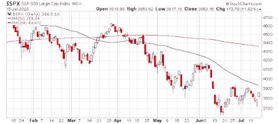

<!--yml
category: 未分类
date: 2024-05-18 01:41:52
-->

# Humble Student of the Markets: Three catalysts that could spark a rip-your-face-off rally

> 来源：[https://humblestudentofthemarkets.blogspot.com/2022/07/three-catalysts-that-could-spark-rip.html#0001-01-01](https://humblestudentofthemarkets.blogspot.com/2022/07/three-catalysts-that-could-spark-rip.html#0001-01-01)

**Preface: Explaining our market timing models** 

We maintain several market timing models, each with differing time horizons. The "

**Ultimate Market Timing Model**

" is a long-term market timing model based on the research outlined in our post, 

[Building the ultimate market timing model](https://humblestudentofthemarkets.com/2016/01/26/building-the-ultimate-market-timing-model/)

. This model tends to generate only a handful of signals each decade.

The 

**Trend Asset Allocation Model**

 is an asset allocation model that applies trend following principles based on the inputs of global stock and commodity prices. This model has a shorter time horizon and tends to turn over about 4-6 times a year. The performance and full details of a model portfolio based on the out-of-sample signals of the Trend Model can be found

[here](https://humblestudentofthemarkets.com/trend-model-report-card/)

.

My inner trader uses a 

**trading model**

, which is a blend of price momentum (is the Trend Model becoming more bullish, or bearish?) and overbought/oversold extremes (don't buy if the trend is overbought, and vice versa). Subscribers receive real-time alerts of model changes, and a hypothetical trading record of the email alerts is updated weekly 

[here](https://humblestudentofthemarkets.com/trading-track-record/)

. The hypothetical trading record of the trading model of the real-time alerts that began in March 2016 is shown below.

The latest signals of each model are as follows:

*   Ultimate market timing model: Sell equities*
*   Trend Model signal: Bearish*
*   Trading model: Neutral*

** The performance chart and model readings have been delayed by a week out of respect to our paying subscribers.***Update schedule**

: I generally update model readings on my 

[site](https://humblestudentofthemarkets.com/)

 on weekends and tweet mid-week observations at @humblestudent. Subscribers receive real-time alerts of trading model changes, and a hypothetical trading record of those email alerts is shown 

[here](https://humblestudentofthemarkets.com/trading-track-record/)

.

Subscribers can access the latest signal in real-time 

[here](https://humblestudentofthemarkets.com/my-inner-trader/)

.

**A resilient market**

The US stock market has been surprisingly resilient in the face of bad news. The pattern has been the same on Wednesday and Thursday. Futures opened the day deeply negative, first on a hot CPI print Wednesday and a hot PPI print and earnings disappointment Thursday, but rallied over the day to erase most, if not all of the previous losses. The banks, which kicked off Q2 earnings season, have mostly been disappointing, but it only took one positive surprise to spark Friday's relief rally.

A market that does not react to bad news is a sign of bearish exhaustion. Here are some other catalysts that could spark an unexpected "rip your face off" rally and change the narrative from bearish to bullish.

The full post can be found

[here](https://humblestudentofthemarkets.com/2022/07/17/three-catalysts-that-could-spark-a-rip-your-face-off-rally/)

.