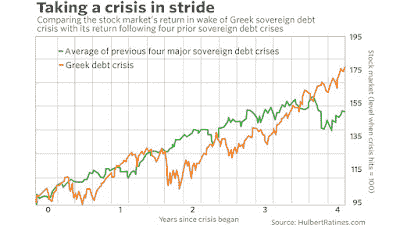

<!--yml
category: 未分类
date: 2024-05-18 02:38:43
-->

# Humble Student of the Markets: Three reasons to ignore the Turkish Apocalypse hype

> 来源：[https://humblestudentofthemarkets.blogspot.com/2018/08/three-reasons-to-ignore-turkish.html#0001-01-01](https://humblestudentofthemarkets.blogspot.com/2018/08/three-reasons-to-ignore-turkish.html#0001-01-01)

**Mid-week market update**

: Earlier in the week,

[Mark Hulbert](https://www.marketwatch.com/story/stock-market-investors-should-see-this-turkish-crisis-as-a-buying-opportunity-2018-08-13)

wrote that "U.S. investors should see this Turkish crisis as a buying opportunity". Hulbert went on to cite the historical record of past currency crises:

> And it’s not just 20-20 hindsight for me to point this out now, with a strong bull market under our belts. On the contrary, [in a series of columns beginning in March 2010](https://www.marketwatch.com/story/stocks-tend-to-take-sovreign-debt-crises-in-stride-2010-03-01), I regularly pointed out that the stock market usually takes currency and sovereign debt crises very much in stride.
> 
> I based my confidence on how the stock market had reacted previously to other such crises over the prior two decades. The crises on which I focused were the 1994 Mexican peso devaluation and associated crisis; the Thai government debt crisis 1997 (which led to the term “Asian contagion”); the 1998 Russian ruble devaluation in August 1998 (which led to the bankruptcy of Long-Term Capital Management), and the 2001 Argentine government debt/currency crisis.
> 
> The accompanying chart shows how the U.S. stock market—on average—reacted to these four crises. For both data series, 100 represents the stock market’s level when those crises first broke onto the world financial scene. Notice that equities’ reaction over the four years following the Greek crisis was remarkably close to the average of its behavior in the wake of the previous crises.

I agree. In addition to Hulbert`s points, there are two other reasons why the Turkey Tantrum will blow over.

The full post can be found at our new site

[here](https://humblestudentofthemarkets.com/2018/08/15/three-reasons-to-ignore-the-turkish-apocalypse-hype/)

.