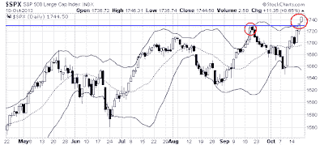

<!--yml
category: 未分类
date: 2024-05-18 03:48:01
-->

# Humble Student of the Markets: Time for a market pause?

> 来源：[https://humblestudentofthemarkets.blogspot.com/2013/10/time-for-market-pause.html#0001-01-01](https://humblestudentofthemarkets.blogspot.com/2013/10/time-for-market-pause.html#0001-01-01)

OK, the major US equity averages have staged upside breakouts to new all-time highs. What's more, US market strength has been confirmed by upside breakouts and uptrends in many other foreign market indices. However, markets are overbought and short-term sentiment models are nearing crowded long readings (see AAII bull readings via 

[Bepoke](http://www.bespokeinvest.com/thinkbig/2013/10/17/bullish-sentiment-increases-for-third-straight-week.html)

). This suggests that the stock market may be in for a consolidation or minor corrective period lasting about a week or so.

**Market is overbought**

Consider this chart of the SPX, which poked its head above the 2 standard deviation Bollinger Band last Thursday. Many other US indices, such as the NASDAQ Composite, Russell 2000, etc., also closed above their 2SD Bollinger Bands at the same time. Markets that close above their 2SD Bollinger Band levels generally don't stand there for long. I circled the last occasion when this happened, which was mid-September, and the market retreated back to bottom of the 2SD band.

What happens when the SPX closes above its 2SD Bollinger Band? To answer that question, I went back to 2000 and found 68 occasions when we saw such a signal. I then calculated the median cumulative return 1-10 days after the first instance of the signal. The results are shown in the chart below. The red bars represent the median return after a close after the 2SD band and the blue bars are for all instances during the study period. As you can see, the market underperformed in these instances. Negative performance bottomed out, on average, seven days after the violation of the 2SD level - which was last Thursday.

***Note that the return for Monday, October 21st represents day 2 of the signal.***

In addition to the return metric, I also considered the batting average of this signal, as measured by the percentage of positive cumulative returns after the signal. As the chart below shows, the SPX typically starts to weaken significantly on day 4 and bottoms on on day 7.

**Bearish tripwires**

My inner trader got more cautious last week on the basis of my bearish tripwires (see

[Buy the rumor, sell the news?](http://humblestudentofthemarkets.blogspot.com/2013/10/buy-rumor-sell-news.html)

), which were:

*   Earnings outlook
*   Macro outlook
*   Fed policy

I stated that while Fed policy remained bullish, the macro outlook had begun to deteriorate, which was a concern to me. However,

[New deal democrat](http://community.xe.com/forum/xe-market-analysis/weekly-indicators-heaving-sigh-relief-edition-0)

noted on the weekend that some of the high frequency economic releases were bouncing back:

> Despite the looming US debt default on Wednesday, the high frequency data this week generally had a positive bounce. The long leading indicator of interest rates improved, and mortgage refinance applications had a slight rebound, although purchase applications and real estate loans remain negative. Money supply remains positive and seems to have stopped decelerating. Spreads between corporate bonds and treasuries also slightly improved this week.

While the uptick in macro indicators was a reason to be more sanguine about the market outlook, the earnings picture had deteriorated.

[Bespoke](http://www.bespokeinvest.com/thinkbig/2013/10/18/third-quarter-earnings-and-revenue-beat-rates.html)

pointed out that the earnings beat rate was mediocre:

> Below is a look at the historical earnings beat rate for US stocks by quarter since 2001\. As shown, 60.5% of the companies that have reported so far this season have beaten consensus analyst EPS estimates. This is a mediocre reading compared to the average beat rate of 63% that we've seen since the bull market began in March 2009.

The beat rate on the revenue line was even more disappointing:

> Top-line numbers have also been mediocre so far this season. As shown below, 50.9% of the companies that have reported have beaten revenue estimates, which is 9 percentage points below the average of 60% that we've seen since the bull market began.

So far, this Earnings Season report card can only be described as so-so. But Earnings Season is just a report card, what is more important is the Street's reaction to the reports, which has been mildly negative. 

[Brian Gilmartin](http://fundamentalis.com/?p=2725)

 noted that consensus forward 12 month earnings estimates were revised downward last week:

> Per ThomsonReuters, “This Week in Earnings”, the “forward 4-quarter” estimate for the SP 500 estimate finished the week at $118.75, down $0.19 from last week.

This is the second consecutive week that forward 12 month earnings have ticked down and the continuing downward revisions represent another headwind for market bulls.

**A correction/consolidation in an uptrend**

My inner trader is in the business of playing the odds. The odds suggest that we are due for a one-week pullback and consolidation of the gains that stocks saw last week. If history is to be our guide, then any correction is likely to be shallow. My initial SPX target is the 20 day moving average, which is about the 1700 level. If the correction were to get deeper, it would likely get halted at the bottom of the Bollinger Band, or the 1650-1660 level.

Longer term investors, on the other hand, shouldn't be concerned about these tiny blips.Consider, for example, that European equities are staging upside breakouts and remain in an uptrend:

Like Europe, China's Shanghai Composite is in an uptrend:

Resource sensitive markets like Australia has staged upside breakouts:

So had Canada, though the move looks a bit extended and may be due for a pullback:

Similarly, the cyclically sensitive Korean market has broken out to the upside:

**Bottom line:**

 Analysis of the intermediate term trend indicates that the bulls are in control of the tape, but the short-term technical picture suggests that markets look a bit extended and may be due for a brief pause or pullback.

There is potential for lots of volatility in the week ahead. About 30% of SP500 components will be reporting earnings and there will be a couple of major market moving events. On Tuesday, the US releases the all-important employment report, which was delayed because of the government shutdown. On Wednesday, the ECB will be releasing the details of its Asset Quality Review of eurozone banks. It is not a stress test, but a review of eurozone bank assets, but the report has the potential to shake up markets.

At the very least, traders may wish to step aside given the unpredictability of the cross-currents.

*Cam Hui is a portfolio manager at [Qwest Investment Fund Management Ltd](http://www.qwestfunds.com/). (“Qwest”). The opinions and any recommendations expressed in the blog are those of the author and do not reflect the opinions and recommendations of Qwest. Qwest reviews Mr. Hui’s blog to ensure it is connected with Mr. Hui’s obligation to deal fairly, honestly and in good faith with the blog’s readers.”**None of the information or opinions expressed in this blog constitutes a solicitation for the purchase or sale of any security or other instrument. Nothing in this blog constitutes investment advice and any recommendations that may be contained herein have not been based upon a consideration of the investment objectives, financial situation or particular needs of any specific recipient. Any purchase or sale activity in any securities or other instrument should be based upon your own analysis and conclusions. Past performance is not indicative of future results. Either Qwest or I may hold or control long or short positions in the securities or instruments mentioned.*