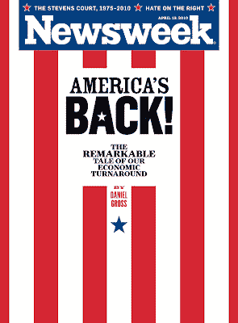

<!--yml
category: 未分类
date: 2024-05-18 00:33:44
-->

# Humble Student of the Markets: Time to be fearful yet?

> 来源：[https://humblestudentofthemarkets.blogspot.com/2010/04/time-to-be-fearful-yet.html#0001-01-01](https://humblestudentofthemarkets.blogspot.com/2010/04/time-to-be-fearful-yet.html#0001-01-01)

I have written before about the

[return of the risk trade](http://humblestudentofthemarkets.blogspot.com/2010/04/signs-of-apocalypse.html)

. Now there are more signs that investors are gorging again at the risk table:

*   The latest [BofA Merrill Lynch Fund Manager Survey](http://ftalphaville.ft.com/blog/2010/04/13/201636/i-believe-in-the-goldilocks-recovery/) (via FT Alphaville) shows institutional investors have now gone “all-in” on the V-shaped recovery trade.
*   [Individual investors](http://blogs.wsj.com/deals/2010/04/16/mean-street-happy-days-are-here-again-suckers/) seem to be coming back into the stock market and [sentiment measures](http://pragcap.com/stock-market-optimism-continues-to-surge) appear to be at a bullish extreme again.
*   [Sentiment Trader](http://www.zerohedge.com/article/nasdaq-cumulative-tick-5300-highest-2002-relative-putcall-ratio-most-extreme-ever-bubble-now) (via ZeroHedge), pointed out that Nasdaq TICK almost passed an all time high and equity-only Put/Call ratio dropped to 0.32, the lowest reading since January 16, 2004\. What's more, the ISEE Sentiment Index is showing an [off-the-charts bullish reading](http://www.tradersnarrative.com/today-its-the-retail-option-traders-turn-to-go-crazy-3947.html).
*   There are indications that [investors are overly optimistic](http://www.nytimes.com/2010/04/18/your-money/stocks-and-bonds/18fund.html) going into this Earnings Season and therefore earnings disappointments are just around the corner.
*   [FT Alphaville](http://ftalphaville.ft.com/blog/2010/04/15/203451/the-return-of-the-other-northern-rock/) also highlighted the rise of Paragon, a buy-to-let mortgage lender, which relies on the wholesale and securitisation markets to do its business (The return of the “other” Northern Rock).
*   [Paul Kedrosky](http://paul.kedrosky.com/archives/2010/04/sokay_were_good.html) highlights the Newsweek cover as a contrarian indicator.

 **Riding a motorcycle at 100mph without a helmet**

Warren Buffett has famously said, “Be fearful when others are greedy and greedy when others are fearful”. Is it time to be fearful yet?

I believe that the market is in a

[fragile state](http://humblestudentofthemarkets.blogspot.com/2010/04/quants-explanation-of-market-fragility.html)

, but that's the equivalent of riding around on a motorcycle at 100mph without a helmet on. It doesn't necessarily mean that you get hurt. It just means that if you hit a bump in the road the damage will be very, very bad.

My inner investor is therefore a blubbering nervous wreck. The

[Goldman Sachs news](http://www.sec.gov/news/press/2010/2010-59.htm)

Friday is a typical "bump in the road". It remains to be seen what kind of damage it causes to market psychology and whether Goldman's

[failure to disclose the receipt of a Wells Notice](http://www.bloomberguniversity.com/apps/news?pid=20601087&sid=a52BBUru4.hM&pos=4)

is the beginning of a death spiral for the investment bank (or the market). My inner trader, on the other hand, tells me to stay with the positive momentum for now, watch for technical breaks and maintain very tight stops.