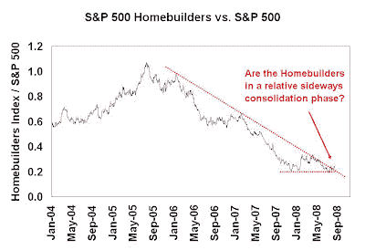

<!--yml
category: 未分类
date: 2024-05-18 01:06:33
-->

# Humble Student of the Markets: Time to cover housing shorts

> 来源：[https://humblestudentofthemarkets.blogspot.com/2008/08/time-to-cover-housing-shorts.html#0001-01-01](https://humblestudentofthemarkets.blogspot.com/2008/08/time-to-cover-housing-shorts.html#0001-01-01)

I write these words with great trepidation as I hate to agree with Greenspan and his

[housing call](http://online.wsj.com/article/SB121865515167837815.html)

as he has been consistently wrong in his analysis for a long time.

However, I do believe that the easy money shorting the housing crisis may be over. There are signs that valuations are starting to become more attractive in housing, value players are now entering the space and the homebuilding group is now technically undergoing a bottoming process relative to the market.

**Buying a house is starting to make economic sense** 

In California, which has been one of the hardest hit markets, buying a house is starting to make economic sense again. This recent

[report](http://news.yahoo.com/s/nm/20080801/us_nm/california_housing_dc_1)

shows analysis indicating that in California, “home prices are dropping to a point where the cost of a mortgage and taxes equals rent”.

**Sovereign funds buying real estate** 

There is also this

[report](http://www.nypost.com/seven/08102008/business/lost_sovereignity_123879.htm)

indicating that sovereign funds are buying US real estate: “one sovereign fund, said to have earmarked $29 billion to purchase foreclosed residential real estate, recently hired a West Coast mortgage broker and is starting to search for bargains.”

These funds tend to have a long time horizon and are typically value players. With the caveat that value investors do tend to be early, sovereign funds have the advantage of being not directly constrained by the tight credit conditions that exist in the US right now.

**Homebuilders making a relative technical bottom**

The chart below shows the chart of the S&P 500 Homebuilders relative to the S&P 500\. As the chart shows, the group has broken out of a relative downtrend. The next phase is likely to be a sideways consolidation pattern.

**Warning:** ***I am not calling of a real estate bottom!*** 
The Homebuilders are likely to go from free fall to market performer. Since my belief is that the market has a negative bias, this group is likely to continue to fall. However, the easy money is over from shorting this group. If you are short, cover your shorts.

Substantial downside risk remain in the group. Recently Barry Ritholtz at [Big Picture](http://bigpicture.typepad.com/comments/2008/08/nar-housing-aff.html) outlined the risks to housing. Though his comments are directed toward the NAR Housing affordability index, these comments are valid with regards to my valuation comments. To paraphrase, my California affordability and valuation analysis:

*   Assumes 20% down payment – who has that anymore?
*   Ignores debt carried by homeowner – household balance sheets have deteriorated substantially
*   Ignores falling FICO scores – see comment above about poor household balance sheets
*   Other ownership costs are rising – e.g. property taxes, maintenance, heating, etc.

****Tightening credit = more downside for housing?**
Meredith Whitney, who correctly called the credit and housing crisis, is also forecasting further downside in housing because of tightening credit conditions.

<param name="movie" value="//www.youtube.com/v/42mVTnFkuus&amp;hl=en&amp;fs=1"><param name="allowFullScreen" value="true"><embed src="//www.youtube.com/v/42mVTnFkuus&amp;hl=en&amp;fs=1" type="application/x-shockwave-flash" allowfullscreen="true">

**Cover your housing shorts**
An improvement in housing would be positive in general for the equity markets and the US economy. Bottoms don’t happen overnight and this is part of a process.

I would cover any housing shorts. The downside here is limited – don’t be greedy.**