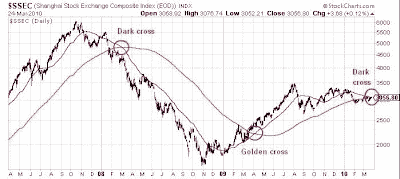

<!--yml
category: 未分类
date: 2024-05-18 00:35:52
-->

# Humble Student of the Markets: Time to drink the (Chinese) Kool-Aid?

> 来源：[https://humblestudentofthemarkets.blogspot.com/2010/03/time-to-drink-chinese-kool-aid.html#0001-01-01](https://humblestudentofthemarkets.blogspot.com/2010/03/time-to-drink-chinese-kool-aid.html#0001-01-01)

There have a lot of concerns expressed about the property bubble in China. The latest missive comes from

[Edward Chancellor](https://www.gmo.com/America/MyHome)

’s ten signs of manias and financial crises as applied to the analysis of the “China dream”. Here is his checklist, all of which apply to China:

> 1\. Great investment debacles generally start out with a compelling growth story.
> 2\. Blind faith in the competence of the authorities.
> 3\. A general increase in investment is another leading indicator of financial distress. Capital is generally misspent during periods of euphoria. Only during the bust does the extent of the misallocation become clear.
> 4\. Great booms are invariably accompanied by a surge in corruption.
> 5\. Strong growth in the money supply is another robust leading indicator of financial fragility. Easy money lies behind all great episodes of speculation from the Tulip Mania of the 1630s – which was funded with IOUs – onward.
> 6\. Fixed currency regimes often produce inappropriately low interest rates, which are liable to feed booms and end in busts.
> 7\. Crises generally follow a period of rampant credit growth.
> 8\. Moral hazard is another common feature of great speculative manias. Credit booms are often taken to extremes due to a prevailing belief that the authorities won’t let bad things happen to the financial system. Irresponsibility is condoned.
> 9\. A rising stock of debt is not the only cause for concern. The economist Hyman Minsky observed that during periods of prosperity, financial structures become precarious.
> 10\. Dodgy loans are generally secured against collateral, most commonly real estate.

**A China put?**

Will China’s boom end badly? No doubt it will. The question is one of timing.

[Stephen Roach](http://humblestudentofthemarkets.blogspot.com/2010/03/perennial-bear-turns-sanguine.html)

recently turned sanguine on China. Roach's former Morgan Stanley colleague

[Andy Xie](http://www.marketwatch.com/story/frayed-string-for-chinas-property-balloon-2010-03-23)

also indicated that while the Chinese economy may go down, it likely won't be a hard landing because the authorities have signaled to the market that they will put a floor on the market:

> It seems we have seen this movie before. Beijing launched property-tightening measures several times in the past but then relaxed them as soon as the market felt the bite. The bottom line is that local governments, and Beijing through them, depend very much on property for fiscal revenues. And now, the market does not believe the government will cut off the hand that feeds it.

Despite the signs of official tightening, the markets are getting ready for another upleg [emphasis mine]:

> ***Contrary to Beijing's policy intent, local governments are readying for another round of property inflation.*** Local governments have been using bank loans to resettle residents, and resettlement costs have skyrocketed since those being moved need enough compensation to buy properties at today's prices. Unless property prices rise considerably, local governments will end up losing money, which they cannot afford.
> 
> Such resettlements played an important role in supporting demand for property last year. The overwhelming majority of end-user purchases probably came from resettled residents who used their compensation cash for down payments. Resettlement compensation is the biggest transfer of wealth from the government to the household sector since the privatization of low-cost public housing a decade ago. It is probably the most important government action supporting today's economy.

Despite the signs of excesses, investors should remember the lessons of the dot com bubble. Stupid valuations can get stupider.

So the Greenspan put, which morphed into the Bernanke put, has become the China put.

If there is indeed a China put out there, then while China bubble may take a pause, any weakness won’t be the hard landing the apocalyptic crowd expect but a buying opportunity. Bears need to respect the possibility that the China bubble may inflate further.

**Is the "dark cross" a sign of the Apocalypse, or a false prophet?** 

The Shanghai Composite is seeing a "dark cross" where the 50-day moving average is crossing below the 200-day moving average, a bearish technical sign. Traders should be extremely cautious near for any near-term weakness. Investors, on the other hand, may want to lighten up some positions but also watch the evolution of government policy to see if this is indeed a great buying opportunity.

