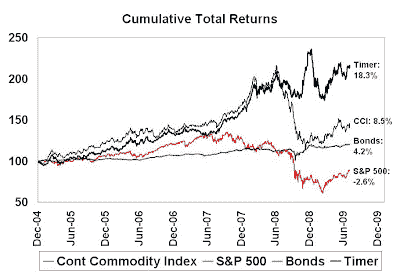
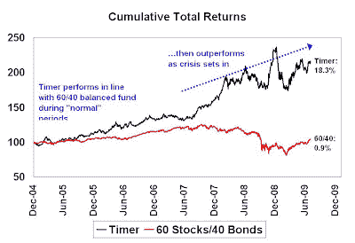

<!--yml
category: 未分类
date: 2024-05-18 00:48:41
-->

# Humble Student of the Markets: Timing the inflation/deflation trade

> 来源：[https://humblestudentofthemarkets.blogspot.com/2009/08/timing-inflationdeflation-trade.html#0001-01-01](https://humblestudentofthemarkets.blogspot.com/2009/08/timing-inflationdeflation-trade.html#0001-01-01)

For investors, the inflation vs. deflation call is probably the Call of the Decade.

Never in my investment career have I seen opinions so bifurcated. While there are many smart investors calling for rising inflation because of the wall of money coming from fiscal and monetary stimulus around the world. At the same time, there are equally convincing arguments indicating that there powerful deflationary force at work and the global economy is facing, at best, an L-shaped recovery.

**Enter the trend following model**

In addressing the inflation vs. deflation conundrum, trend following models are especially useful as they tend to pick up on macro-economic trends, which are persistent. Using

[trend following modeling techniques](http://www.michaelcovel.com/all-versions-of-michael-covel-books/)

, I have built an inflation/deflation timer. Here is how it works. While the details of the model are proprietary, I can say that they use common trend following techniques (crossing moving averages, trailing stops, etc.) to identify and profit from long-dated persistent price trends.

Here is how it works. When the timer model signals:

**Inflation:**

Buy the Continuous Commodity Index

**Deflation:**

Buy the long bond (iShares Barclays 20+ Year Treas Bond, Ticker: TLT)

**Neutral:**

Buy the S&P 500 SPDR (SPY)

The results of the simulation are shown below. Returns are total returns, which include interest and dividends. Signals are generated at the end of day and then executed at the close of the next day. The simulation assumes no frictional costs.

The chart and table below tell the story. The timing model’s returns beat all the other asset classes, with a downside risk profile that is similar to the long bond.

**Timing model shines at the inflation/deflation tails**

When I compare the returns of the timing model compared to a passive 60% stock/40% bond asset mix benchmark, the timing model performs roughly in line with the 60/40 benchmark during normal periods. The real value of the model stands out during crisis periods, when fears about inflation and deflation dominate investment psychology.

Such a model could prove to be invaluable in the days ahead as investor sentiment oscillates between the extremes of rising inflation (or hyperinflation) and deflation. Under these kinds of circumstances, active management could significantly add to returns.

**Stay long the inflation trade**

So what is the timing models saying now?

It is currently showing a bullish reading on inflation. For those who are interested, I will endeavor to update these readings regularly on this blog. Please check back regularly.