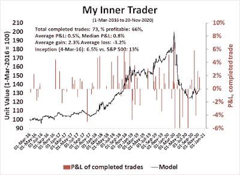

<!--yml
category: 未分类
date: 2024-05-18 02:08:38
-->

# Humble Student of the Markets: Too far, too fast?

> 来源：[https://humblestudentofthemarkets.blogspot.com/2020/11/too-far-too-fast.html#0001-01-01](https://humblestudentofthemarkets.blogspot.com/2020/11/too-far-too-fast.html#0001-01-01)

**Preface: Explaining our market timing models**

We maintain several market timing models, each with differing time horizons. The "

**Ultimate Market Timing Model**

" is a long-term market timing model based on the research outlined in our post,

[Building the ultimate market timing model](https://humblestudentofthemarkets.com/2016/01/26/building-the-ultimate-market-timing-model/)

. This model tends to generate only a handful of signals each decade.

The

**Trend Asset Allocation Model**

is an asset allocation model which applies trend following principles based on the inputs of global stock and commodity price. This model has a shorter time horizon and tends to turn over about 4-6 times a year. In essence, it seeks to answer the question, "Is the trend in the global economy expansion (bullish) or contraction (bearish)?"

My inner trader uses a

**trading model**

, which is a blend of price momentum (is the Trend Model becoming more bullish, or bearish?) and overbought/oversold extremes (don't buy if the trend is overbought, and vice versa). Subscribers receive real-time alerts of model changes, and a hypothetical trading record of the email alerts are updated weekly

[here](https://humblestudentofthemarkets.com/trading-track-record/)

. The hypothetical trading record of the trading model of the real-time alerts that began in March 2016 is shown below.

The latest signals of each model are as follows:

*   Ultimate market timing model: Buy equities*
*   Trend Model signal: Bullish*
*   Trading model: Neutral*

** The performance chart and model readings have been delayed by a week out of respect to our paying subscribers.* **Update schedule**

: I generally update model readings on my 

[site](https://humblestudentofthemarkets.com/)

 on weekends and tweet mid-week observations at @humblestudent. Subscribers receive real-time alerts of trading model changes, and a hypothetical trading record of those email alerts is shown

[here](https://humblestudentofthemarkets.com/trading-track-record/)

.

Subscribers can access the latest signal in real-time 

[here](https://humblestudentofthemarkets.com/my-inner-trader/)

.

**Rainbows and unicorns?**

It is said that it's a recession is when your neighbor loses his job, and it's a Depression if you lose your job. In other words, economic weakness is only academic until it hits home. The denizens of New York City and Wall Street were jolted last week when the MTA, which operates the NYC subway and commuter services Metro-North and Long Island Rail Road, announced that it may need to dramatically cut services in the absence of fiscal support. The MTA proposed laying off 9,000 employees and cuts to transit services of 40-50%.

The bad news is hitting home, and Wall Street is suddenly realizing that the recovery is not all rainbows and unicorns. In addition, the decision by the US Treasury to end a series of emergency CARES Act support programs raises the risk to state and local organizations like the MTA.

As well, the latest BoA Global Fund Manager Survey revealed that fund managers were stampeding into equities and the reflation trade.

Cash levels have dropped dramatically. To be sure, low cash levels have acted only as a warning, and have not been actionable sell signals in the past [annotations in blue are mine].

Has the rally gone too far, too fast? Is the Great Rotation trade of growth to value and large-caps to small-caps just a mirage?

The full post can be found

[here](https://humblestudentofthemarkets.com/2020/11/22/too-far-too-fast/)

.