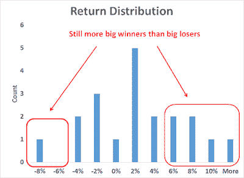

<!--yml
category: 未分类
date: 2024-05-18 03:20:34
-->

# Humble Student of the Markets: Trend Model report card: Lessons learned

> 来源：[https://humblestudentofthemarkets.blogspot.com/2015/06/trend-model-report-card-lessons-learned.html#0001-01-01](https://humblestudentofthemarkets.blogspot.com/2015/06/trend-model-report-card-lessons-learned.html#0001-01-01)

For much of 2014, the returns of the account based on my Trend Model signals of 30-40% (see 

[An intriguing Trend Model interim report card](http://humblestudentofthemarkets.blogspot.com/2014/07/an-intriguing-trend-model-interim.html)

) seemed too good to be true. I have long believed that the long-term return estimate on my long-short  was about 20%. Little did I expect that returns would adjust from the 30-40% level to 20% so quickly though.

The Trend Model account fell -8.1% in May; the one-year return was 21.1%; and the return from inception of September 30, 2013 was 20.1%. Peak-to-trough drawdown was -15.5%.

***I reiterate my disclaimer that I have nothing to sell anyone right now. I am not currently in a position to manage anyone`s money based on the investment strategy that I am describing.*** Trend Model description

For readers who are unfamiliar with my Trend Model, it is a market timing, or asset allocation, model which uses trend following techniques as applied to commodity and global stock market prices to generates a composite Risk-On/Risk-Off signal (risk-on, risk-off or neutral). I have begun updating readers on the Trend Model signals on a weekly basis and via Twitter @humblestudent as new developments occur.

The chart below shows the actual out-of-sample (not back-tested) changes in the direction of the signal, which are indicated by the arrows, overlaid on top of a chart of the SP 500\. You can think of the blue up arrows, which occurred when the trend signal changed from negative to positive, as buy signals and the red down arrows, which occurred when the trend signal changed from positive to negative, as sell signals.

**Trend Model Signal History**

As the chart shows, the market pattern for much of 2015 has been choppy and consequently the signals have suffered from whipsaw. The stock market remains above the level shown by the latest Sell signal, which accounts for the recent poor performance.

**A proof of concept**

Backtests are always a good starting point for model building, but there is no substitute for actual performance. As a proof of concept, I started to manage a small account that traded long, inverse and leveraged ETFs on the major US market averages and, on occasion, sector and industry ETFs. Trading decisions were based on Trend Model signals combined with some short-term sentiment indicators. The inception date of the account was September 30, 2013 and the chart below represents an interim report card of that account. (For more details on how the Trend Model or how the account is managed, see my post 

[Trend Model FAQ](http://humblestudentofthemarkets.blogspot.com/2015/01/trend-model-faq.html)

).

When evaluating the performance of this trading account, keep in mind that this is intended to be an absolute return vehicle. While I do show the SPY total return, which includes re-invested dividends, for illustrative purposes, the SP 500 is not an appropriate benchmark for measuring the performance of this modeling technique.

**A difficult environment**

The account performance continued to be challenging this years, though one year returns at 21.1% and returns from from inception (September 2013) of 20.1% are quite respectable. The difficult returns are not surprising. 

[Wisdom Trading](http://www.wisdomtrading.com/state-trend-following-may/)

 compiles the performance of different trend following CTA managers and the results have been spotty this year.

I have also documented in the past how choppy markets have been unfriendly to trend following models (see

[All washed up!](http://humblestudentofthemarkets.blogspot.com/2015/01/all-washed-up.html)

). The chart below of the SPX shows that the index has moved through its 50 day moving average (dma) and snapped back at least once a month in 2015\. Trend following models simply do not perform well under these circumstances.

**Possible bear trend ahead**

Further research showed that while long-term trends were strong, as evidenced by a steadily rising market with no 10% correction since 2011, shorter term trends were weak. Using monthly DJIA data going back to 1900, such conditions have resulted in

***trends***

that happen to be bearish.

A study by James Paulsen of 

[Wells Capital Management](http://ig.cdn.responsys.net/i4/responsysimages/str2/__RS_CP__/20150406_EMP.pdf)

 which showed that when a long-term stock market price trend is extended, as it is now now, such conditions have led to reversals. My own analysis (

[How to make your first loss your best loss](http://humblestudentofthemarkets.blogspot.com/2015/04/how-to-make-your-first-loss-be-your.html)

).showed that the differential between the long-term (3-year) trend and short-term (6-month) trend is at levels consistent with past major inflection points like the Crash of 1929 and 1987 (bottom panel of chart). However, I would like to emphasize this analytical approach only predicts direction, not magnitude and therefore a major market crash is unlikely.

Recent market conditions are showing widespread technical deterioration, in breadth, momentum and risk appetite metrics. These reading suggest that a bear trend is about to assert itself.

***For a trend following model, any trend is a good trend.*** **Strategy characteristics still promising**

Despite the challenging environment and near-term returns, keep the following in mind:

*   **You can't expect to make 20% (my best guess long-term estimate for this strategy) without a 10-15% drawdown.** So far, the maximum drawdown is 15.5%. Most hedge funds aim for a return to maximum-drawdown ratio of 2 to 1, but a 1.5 to 1 to 1 is a more realistic target. By comparison, the drawdown for equities was in the order of 50% and most balanced funds saw losses of about 20% during the 2008-2009 period. Using even a 1 to 1 ratio and working backwards, it would be hard to envisage a long-term return expectation of 50% for stocks and 20% for balanced funds today.
*   **Long term returns continue to be respectable.** The one-year return was 21.1% and return from inception (September, 30, 2013) was 21.1%.
*   **Monthly returns continues to be skewed positively.** The chart below of the distribution of monthly returns show that, despite the disappointing -8.1% return in May, there were many more instances of high positive returns than negative ones.

*   **Returns are highly diversifying compared to major asset classes.** They are uncorrelated with equities (correlation of -0.21 with SPY) and bonds (0.11 with AGG).
*   **Returns are still positive**, with a 65% monthly batting average. The investment business is an industry where portfolio managers have very low signal-to-noise ratios. Someone with a batting average of 55% will make a decent living. A batting average of 65% will make you a superstar.

The market environment in 2015 has been challenging for the Trend Model trading strategy in 2015\. Throughout this difficult period, I can point to a couple of lessons learned.

First, tighten up risk control when you see an unfriendly market environment. I had already anticipated this in a 2014 year-end review when I postulated a positive year for US stock prices but with a much higher volatility (see 

[2015: Bullish skies with scattered periods of volatility](http://humblestudentofthemarkets.blogspot.com/2014/12/2015-bullish-skies-with-scattered.html)

). I followed up with a similar comment in January (see 

[All washed up!](http://humblestudentofthemarkets.blogspot.com/2015/01/all-washed-up.html)

). In hindsight, the correct response would have been to reduce the level of capital commitment until market trend becomes more friendly.

Second, be patient! Trend following models work, but not all models work well all the time.

[Alpha Architect](http://blog.alphaarchitect.com/2015/05/19/tactical-asset-allocation-beware-geeks-bearing-formulas/)

 recently conducted a study of several asset allocation modeling approaches, namely Max Sharpe, Risk Parity, Minimum Variance, Momentum and Trend Following. It concluded that Trend Following showed the best results (emphasis added).

> The results can be summarized as follows:
> 
> *   The tangency portfolio, or “max-sharpe” method perform the worst and cannot even compete with the benchmarks.
> *   Minimum variance beats the tangency portfolio, which is ironic, given the theoretical underpinnings for the tangency portfolio. Nonetheless, the strategy, while risk-managed, does poorly on upside returns, underperforming the simply 10-Year bond CAGR.
> *   The risk parity methodology performs admirably, with strong risk-adjusted statistics and strong drawdown containment.
> *   Momentum also performs admirably, with the highest CAGR, however, the strategy has to contend with large drawdowns.
> *   ***The EW index with trend-following performs the best, capturing much of the upside, but preventing large drawdowns***.

But the trend following TAA model has performed abysmally since 2008:

> There is no panacea when it comes to tactical asset allocation. The evidence seems to suggest that trend-following rules are the most effective and the most robust, but as the recent 5 year run highlights, NOTHING WORKS ALL THE TIME.

To summarize, investment results this year have been challenging but continue to be promising for this model longer term. I am comfortable with the current hiccup in returns is a characteristic of a difficult environment for this class of model and that environment become more favorable in the near future. Readers who want to monitor the signals of the Trend Model to subscribe to my blog posts 

[here](http://www.feedburner.com/fb/a/emailverifySubmit?feedId=2701205&loc=en_US)

, which include Trend Model updates, or follow me via Twitter @humblestudent.