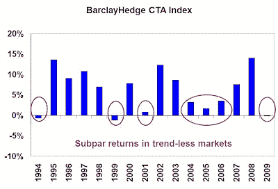
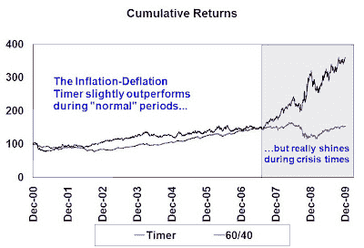

<!--yml
category: 未分类
date: 2024-05-18 00:38:11
-->

# Humble Student of the Markets: Trend following 2.0

> 来源：[https://humblestudentofthemarkets.blogspot.com/2010/02/trend-following-20.html#0001-01-01](https://humblestudentofthemarkets.blogspot.com/2010/02/trend-following-20.html#0001-01-01)

I have written about the pros and cons of trend following models before (see examples

[here](http://www.qwestfunds.com/publications/newsletters_pdf/newsletter_february_2010.pdf)

,

[here](http://humblestudentofthemarkets.blogspot.com/2008/11/trend-following-ctas-no-panacea.html)

and

[here](http://humblestudentofthemarkets.blogspot.com/2010/01/simple-style-rotation-model.html)

).

[Thomas Holmes](http://www.opalesque.com/OFI1138/Practitioner_trend_is_your_strategies_are605.html)

of Genesis Futures Corporation, a commodity trading advisor (CTA), recently wrote the following about the diversification effects of trend following models:

> Diversification will give some protection during slight or even moderate market perturbations. When a real disaster hits, supposedly diversified investments are subject to similar losses as concentrated positions because our portfolio constructs do not include sufficient non-correlating assets. In other words, in major sell-offs, everything moves together, albeit at varying rates. Losing less than market averages is not a comforting factor when your portfolio is down 30% to 50%.
> 
> [..]
> 
> What has caught our attention is that during almost every dislocation, especially the major stock market declines (1987 and 2008), systematic, trend-following systems garnered returns that could have made a significant and positive impact on portfolio performance. In 2008, BarclayHedge’s Systematic Index, a weighted average of some 448 CTA’s, rose 18.6% while the S&P500 declined precipitously (-38.5%). Genesis Futures’ NT4 system adheres to this paradigm.

**The dog that didn’t bark**

In other words, CTA returns do well during crisis periods when the stock market goes down – and that’s diversifying.

This brings to mind the story of another Holmes, Sherlock Holmes, and the story of the dog that didn’t bark. What Thomas Holmes and other CTAs don’t mention is the weakness of CTA trend following systems. The chart below shows the yearly returns of the

[BarclayHedge CTA Index](http://www.barclayhedge.com/research/indices/cta/sub/cta.html)

. Trend following models simply don’t perform well during periods when the system can’t find a trend.

**The best of both worlds**

By contrast, my

[Inflation-Deflation Timer model](http://www.qwestfunds.com/publications/newsletters_pdf/newsletter_november_2009.pdf)

, which is also based on trend following principles, performs in line with a 60% stock/40% bond benchmark during “normal” periods and outperforms during crisis periods.

Instead of showing negative returns in 2009, as the BarclayHedge CTA Index did, the Inflation-Deflation Timer had a perfectly respectable

[2009 return](http://humblestudentofthemarkets.blogspot.com/2010/01/2009-inflation-deflation-timer-model.html)

of 18.0%. This shows that investors using trend following models need to evolve beyond the simple application of these models in order to get more stable returns.

The Inflation-Deflation Timer model is a proof of concept that a trend following investor can have his cake and eat it too. You get positive returns when other markets are bad and returns roughly in line with other asset classes during other times.