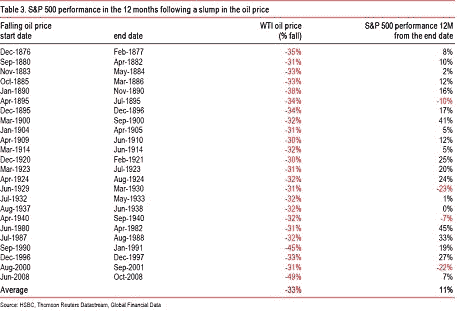

<!--yml
category: 未分类
date: 2024-05-18 03:28:34
-->

# Humble Student of the Markets: Trust (the bull), but verify (the trend)

> 来源：[https://humblestudentofthemarkets.blogspot.com/2014/11/trust-bull-but-verify-trend.html#0001-01-01](https://humblestudentofthemarkets.blogspot.com/2014/11/trust-bull-but-verify-trend.html#0001-01-01)

**Trend Model signal summary**

Trend Model signal: Risk-on

Trading model: Bullish

The Trend Model is an asset allocation model used by my inner investor. The trading component of the Trend Model keys on changes in direction in the Trend Model - and it is used by my inner trader. The actual historical (not back-tested) buy and sell signals of the trading component of the Trend Model are shown in the chart below:

**Update schedule**

: I generally update Trend Model readings on 

[my blog](http://humblestudentofthemarkets.blogspot.com/)

 on weekends and tweet any changes during the week at @humblestudent. In addition, I have been trading an account based on the signals of the Trend Model. The last report card of that account can be found 

[here](http://humblestudentofthemarkets.blogspot.com/2014/11/trend-model-report-card-14-oct-351-1-yr.html)

.

**In the words of Ronald Reagan...**

The US Thanksgiving long weekend isn`t supposed to be like this. Hitler had a habit of attacking over a long weekend, when his opponents`leadership had gone away early, and I suppose it sort of felt like this in Hawaii on the morning of December 7, 1941 when the Japanese fleet bombed Pearl Harbor. But the OPEC decision was telegraphed well in advance and the degree of volatility it induced in the energy and other markets was highly surprising. As  Friday drew to a close in a volatility-induced thinly traded market, I am somewhat unclear about the meaning of the Trend Model's readings.

Here is where we stand. The Trend Model remains at a bullish risk-on reading, both for my inner investor and inner trader. However, the emotionally laden panic sell-off in oil prices created enormous implications for the future path of earnings. In addition, the SP 500 violated a short-term uptrend in the form of its 5-day moving average, which has been closely watched by market technicians. Josh Brown remarked that the most recent streak, which has broken all records of days above the 5 dma, may represent momentum-driven buying that can lead to a crowded long:

> What’s happening here is classic herding behavior and the market isn’t letting you back in if you’ve sold.
> 
> The danger here is clear – mass complacency and a moment at which anyone who could buy, would buy or needed to buy throws everything they have at the tape just to end the pain.

Whenever the bull trend reverses itself, it could have nasty negative implications (emphasis added in bold):

> The market has been a wall for the dip-buyers. Impenetrable. They cannot get in unless they’re willing to pay the all-time high. It’s a high barrier of entry psychologically, especially if they’d been counseling caution all this time to their clients. ***The about-face could be career-wrecking, especially if it happens at a major top.***

The recent market action in oil prices, as well as a number of events next week, could lead to a turning point in the markets. While the Trend Model indicates that US equity prices will continue to slowly grind upwards, current conditions lead me to paraphrase the words of Ronald Reagan:

> Trust the bull, but verify the trend.

At the end of the week, there are plenty of reasons to be bullish and bearish. Let`s go through the bull and bear cases, one at a time.

**The bull case**

The bull case consists of:

*   Positive seasonality for stocks;
*   The US expansion is continuing with no recession in sight;
*   Earnings boost from lower oil prices, not just in the US, but globally; and
*   Friendly central bankers worldwide.

**Bullish reason 1: Positive seasonality**

First of all, December has been seasonally positive for stocks.

[Tim Edwards](http://www.indexologyblog.com/2014/11/25/a-santa-claus-rally-yes-virginia/)

of S+P Dow Jones Indices found the following seasonal effect on global stock prices:

> At least in the past few years, December has borne gifts for equity investors. But does the market’s good or bad behavior earlier in year have any influence? Exhibit 2 shows the average performance during December for each of these markets, split into those times when the previous 11 months had generated positive (“nice”) or negative (“naughty”) returns.

Since the equity markets have generally been “nice”, Edwards postulated that Santa Claus will come in December for equity investors.

**Bullish reason 2: Continued US expansion **

One of the key fundamental drivers of the stock market is the earnings outlook, whose upward progress has mainly been interrupted by recessions. As this chart from

[Factset](http://www.factset.com/websitefiles/PDFs/earningsinsight/earningsinsight_11.28.14)

shows, stock prices have been highly correlated with consensus forward 12 month EPS estimates. Further to the hiccup in estimates seen in the October correction, forward EPS has steadied and started to rise slightly. 

If we were to step back for a moment, the US economic expansion is continuing and there is no sign of a recession in sight.

[New Deal democrat](http://community.xe.com/blog/xe-market-analysis/weekly-indicators-sharp-contrasts-edition)

summed up the current economic conditions well in his weekly review:

> There was a little change in tone this week, as indicators were more sharply mixed...
> 
> For the moment, oil prices are collapsing, a strong positive. Temp hiring made an all time high. On the other hand, there were a few significant, if slight, new negatives. I don't think Q4 is going to match the strong growth of Q2 and Q3 - although that's not saying much. Barring a sharp reversal in gas prices, however, the first part of 2015 in particular looks like it will feature an increase in growth.

Until we see definitive signs of slowing growth, the bulls have little to worry about.

**Bullish reason 3: Higher EPS momentum from falling energy prices**

Another tailwind for the bulls will be the positive effects on earnings from a drop in oil prices. The aforementioned forward EPS figures from Factset were compiled before their sudden fall. If oil prices were to remain at these lower levels, I would expect that EPS estimates to start rising in the next few weeks. 

> Tumbling oil prices are a bonanza for global stock markets, provided the chief cause is a surge in crude supply rather than a collapse in economic demand.
> 
> HSCB says the index of world equities rose 25pc on average over the twelve months following a 30pc drop in oil prices, comparable to the latest slide. Equities rose 19pc in real terms.
> 
> Data stretching back to 1876 is less emphatic but broadly tells the same tale. The SP 500 index of Wall Street stocks rose by 11pc on average. The equity rally of 1901 was a corker.

|  |
| Click to enlarge |

Further analysis from Citi shows the oil price sensitivity of the equity markets of different countries to a drop in oil. The biggest winners in relative performance are the US and Japan, in that order, and the biggest losers are Norway, Russia, Canada and Brazil.

The fall in oil prices should be bullish for eurozone equities as well, largely because eurozone countries are mainly net consumers of energy. I had already pointed out that European equities represent a value play that is seeing the benefit of positive momentum (see

[Two contrarian plays that will make you queasy](http://humblestudentofthemarkets.blogspot.com/2014/11/two-contrarian-plays-that-will-make-you.html)

), I would expect that the Street will further raise EPS estimates in Europe in the days to come. Such a development should be another bullish development for eurozone equities.

Indeed, Morgan Stanley had put out a bullish note on Europe, even before the OPEC news hit the tape (via

[Value Walk](http://www.valuewalk.com/2014/11/europe-stocks-dividend-yield/)

):

> The analysts believe now is the wrong time to trim exposure to Europe for various reasons. The analysts point out that despite European ETF and mutual fund outflows at historically significant levels, Europe’s 6 month underperformance and de-rating to global stocks is close to prior lows:

**Bullish reason 4: Dovish central bankers**

Last but not least, the bulls have the support of accommodative central bank policy around the world (see my comment last week

[Don`t fight the tape (or central bankers)](http://humblestudentofthemarkets.blogspot.com/2014/11/dont-fight-tape-or-central-bankers.html)

):

> In effect, the Chinese saw the party at the BoJ`s place and decided to throw one of their own. Party now, pay later.

and:

> The BoJ party wasn`t enough. The PBOC party wasn`t enough. The ECB has decided that it wants in on the party action too. So we now have a Central Bankers street party.

**The bear case**

Despite the bullish backdrop, there are plenty of reasons to be cautious as well:

*   Valuations are elevated;
*   Technical conditions point to a pause or pullback; 
*   Potential trouble from the HY market, sparked by energy; and
*   Possible central bank easing headwinds, mainly from falling energy prices.

**Bearish reason 1: Equities are expensive**

The most longer term problem for the bull case is the elevated equity valuation levels. In a recent post, I showed that US equities are expensive from both a value and growth perspective (see

[How cheap are stocks? (growth investor edition)](http://humblestudentofthemarkets.blogspot.com/2014/11/how-cheap-are-stocks-growth-investor.html)

).

Moreover, we are seeing signs of froth in Silicon Valley, which is the high-beta part of the stock market (via

[Wolf Street](http://wolfstreet.com/2014/10/09/priming-the-startup-scene-and-ipo-market-for-burnout/)

):

Elevated valuations should not be a problem as long as positive momentum, otherwise known as the Greater Fool Theory, is dominant. But

[Todd Schneider](http://toddwschneider.com/posts/techcrunch-bubble-index/)

pointed out that confidence is starting to roll over among Silicon Valley VCs, as measured by startup announcements:

And by funding value:

Now consider that the latest BoAML Fund Manager Survey shows managers to be highly overweight Technology, both at a global and US sector level. The combination of deteriorating momentum and a crowded long position can be ingredients for a nasty sell-off.

**Bearish reason 2: Vulnerable technical conditions**

Another reason to be short-term cautious on stocks are red flags from technical and sentiment models. I already pointed out that the time that the SPX had been above its 5 dma is at a record/ The index finally broke down below its 5 dma level in the last hour of trading on Friday. As the break was neither convincing nor definitive, especially on a holiday-shortened day, we need to look for technical confirmation during Monday`s trading hours. A break below the 5 dma may be the signal for either a sideways consolidation or pullback in the market.

As well, some sentiment models are flashing red, or at least amber. The chart below of Rydex sentiment tells the story. The top panel is the SPX going all the back to 1998, when Rydex data was first available. The middle panel shows the ratio of Rydex bear to bull assets and the bottom panel shows the ratio of flow to bearish Rydex and money market assets to bullish assets.

From this chart, I can make a number of observations. First of all, the long-term trend of Rydex investors are generally correct. They were bullish and poured money into bull funds during the Tech Bubble. When the market turned, they were sellers until the market bottomed in 2003, when they turned into marginal buyers. When the market bottomed in 2009, Rydex investors correctly turned bullish and poured money into bull funds. Strictly from a bear/bull asset ratio viewpoint, I would therefore not be overly bothered by the all-time lows of bear/bull assets shown on the middle panel chart.

However, I can make a case that traders can find useful signals when the bear/bull asset ratio (middle panel) reaches a near-term extreme and the bear/bull flow ratio (bottom panel) reaches an extreme as well. I have marked with dotted vertical lines when conditions indicating excessive bullishness have occurred since the 2007 market peak. The red lines indicate episodes when the market has either stalled or retreated, while the blue lines indicate when the market has continued to rally. Despite the low number of signals, this indicator has been more right than wrong in the past.

This week, this Rydex indicator flashed a cautionary signal. When I combine this condition with the break in the 5 dma, it may signal some near-term weakness for stock prices.

Longer term, I am also concerned about the latest picture from margin debt data (via

[Doug Short](http://www.businessinsider.com/nyse-margin-debt-oct-2014-2014-11)

). As the chart below shows, the stock market has shown a tendency to peak when margin debt peaked out from an all-time high and rolled over. These market peaks could be explained by excessive stock market speculation, as measured by margin debt, combined with a stalling out of momentum, as shown by the retreat from all-time margin debt highs.

Historically, margin debt rollover has generally led the market peak by several months. The current episode is slightly unusual because margin debt peaked out in February 2014, started to decline and rose again. However we did see similar patterns in past market peaks as well. Nevertheless, this pattern in margin debt is a concern and something to keep an eye on.

Last but not least in the froth department, I present the Business Insider's

[20 under 20: Meet the teen traders trying to take over the finance world](http://www.businessinsider.com/20-under-20-in-finance-2013-11?op=1)

. Not only are these kids trading plain vanilla stocks, they are into derivatives and exotics like *shudder*

[CFDs](http://www.investopedia.com/articles/stocks/09/trade-a-cfd.asp)

,

[butterfly option spreads](http://www.investopedia.com/terms/b/butterflyspread.asp)

, 

[iron condors](http://www.investopedia.com/terms/i/ironcondor.asp)

 and so on.

**Bearish reason 3: The HY canary in the coalmine**

A further reason for concern are the signs of brewing trouble in the high-yield (HY), or junk bond market. The HY market is important barometer of risk appetite. What I find troubling is that are HY spreads are blowing out, indicating reduced risk appetite:

HY analyst Martin Fridson had been forecasting a junk bond Apocalypse as early as last November, with a wave default to start in 2016 (via

[Bloomberg](http://www.bloomberg.com/news/2013-11-12/default-wave-of-1-6-trillion-looming-for-junk-fridson-says.html)

):

> Almost $1.6 trillion of junk bonds globally will default between 2016 and 2020, according to Martin Fridson, chief executive officer of New York-based FridsonVision LLC, a research firm specializing in speculative-grade debt.
> 
> With historical evidence indicating default rates will surge between 2014 and 2016 and persist, implying a rate of more than 30 percent cumulative during four years, Fridson estimated in a report for Standard and Poor’s Capital IQ Leveraged Commentary and Data that the face value of total defaults will be $1.576 trillion. That’s a market value of $752 billion, according to Fridson, who started his career as a corporate debt trader in 1976\.
> 
> “When the default tidal wave eventually hits, it will be very big,” Fridson said in an e-mail. “No one realizes how much distressed debt is going to be available for investment when it finally hits.”

Now that oil prices have tanked and energy companies having a progressively higher weight in the HY market, defaults in energy have the potential to push this market over the edge.

A meltdown in HY could get ugly and spread beyond the credit market (via

[CNBC](http://www.cnbc.com/id/102223823)

, emphasis added):

> "This is the one thing I've seen over and over again," said Larry McDonald, head of U.S strategy at Newedge USA's macro group. "When high yield underperforms equity, a major credit event occurs. It's the canary in the coal mine."
> 
> Since the turn of the last century, there have been 12 times when the value of high-yield debt dropped at least 10 percent in 60 days, according to Kensho, a quantitative analytics tool used by hedge funds. (The Credit Suisse High Yield Bond Fund was the benchmark.)
> 
> ***Sixty days after those credit events, shares of Citigroup had a median return of negative 8 percent. Bank of America's stock had a median return of negative 6 percent. JP Morgan took a 5 percent hit.***
> ***This may not seem that bad, but those are just "median" returns, and including times when high yield falls just 10 percent. The decline in these stocks and prices of high-yield bonds can get much worse.***

Isabella Kaminska of

[FT Alphaville](http://ftalphaville.ft.com/2014/11/24/2050942/lies-damned-lies-and-liquidity-expectations/)

also pointed to liquidity risk in thin markets like HY. Thus risk were the subject of a paper by "the Committee on the Global Financial System (CGFS)

[published](http://www.bis.org/publ/cgfs52.pdf)

on the same day, focusing on similar themes, rubber-stamped by William Dudley of the New York Fed." Kaminska observed that many banks have withdrawn from their market making business because of higher capital requirements:

> A key observation is that many market-making businesses have shifted towards a more order-driven or brokerage model, meaning the execution of large trades is taking more time, with many market-makers being more reluctant to absorb large positions.
> 
> The consequence of this is that market liquidity is now becoming more dependent on the portfolio allocation decisions of only a few large institutions.

The cited paper noted:

> Furthermore, even though reliable data are often unavailable, trading appears to remain highly concentrated in just a few liquid issues in most corporate bond markets, with signs of further concentration evident in some markets. ***One example is US corporate bond markets, where the share of securities with a 12-month turnover ratio of at least 50%*** (i.e. the sum of traded volumes accounting for at least half of the securities’ outstanding amount) ***has declined from 20% to less than 5%*** (Graph 5, right-hand panel)

Even worse, perceived liquidity rests with ETF providers, who promise real-time liquidity but may not have the sufficient capital to back up those promises should the markets become disorderly (I`m looking at you, JNK and HYG):

> Bond ETFs improve price discovery in illiquid markets by providing a market price on a portfolio whose underlying holdings are often thinly traded. ETFs allow market-makers to hedge inventory risks when liquidity in the underlying bond and related derivatives markets is insufficient and ETFs are also commonly used for rebalancing flows by investors with passive or index-linked strategies. The liquidity of ETF bond funds, however, builds on the willingness and capacity of authorised participants – typically the same dealers that provide immediacy services in bond markets – to make markets for ETF shares.
> 
> Liquidity shocks may thus spread across different segments of the bond market via their impact on the risk-taking capacity of key market-makers. At the current juncture, with mutual funds and ETFs having attracted significant inflows from both institutional and retail investors, a reversal in global bond markets could trigger redemptions that, as funds sell assets to meet cash demands, could amplify the decline in bond valuations. Notably, bond mutual funds have managed significant outflows in the past (eg during previous episodes of monetary policy tightening) that have generally not disrupted financial markets. Yet, past episodes of large redemptions occurred at times when fund holdings were much smaller, both in absolute terms and relative to trading volumes and dealer inventories. ***Current market-making trends, however, suggest that redemptions could have a larger impact on bond market liquidity than in the past.***

The combination of over-levered energy companies dependent on the HY market for funding, a collapsing oil price, an illiquid bond market and diminishing risk appetite are the ingredients for a bond market meltdown. Such an event may not be contained within the credit markets and see contagion effects spread throughout the financial system. In other words, a HY market sell-off could get very ugly - and fast.

Wait! There's more.

[James Farro](http://signalinea.com/why-a-credit-crisis-in-the-energy-sector-may-be-coming-at-the-worst-time/)

(via

[Josh Brown](http://thereformedbroker.com/2014/11/29/plot-twist-the-oil-crash-kneecaps-high-yield-which-halts-buybackpalooza/)

) reminded us how intricately linked share buybacks are to junk bond financings. If backbacks start to dry up, it will start to hinder EPS growth as the "S" in EPS stop shrinking:

> With the ongoing massacre in crude oil my thought has been that the highly leveraged players would have debt issues which would just facilitate industry consolidation. But with the state of the credit market excluding sovereigns, we could have something else entirely. The energy sector makes up a large segment of the HY bond market and it’s about to take a big hit.. Sooner or later it’s coming. If the high-yield market in it’s fragile state is given a push we could see a real rout in the markets. It’s starting to look like energy debt could go bidless for a time and take HY with it if action isn’t taken soon. And that action, in part should be for the orgy of debt issuance that is being used for buy-backs to stop asap.
> 
> But wait.. The stock buy-backs have been a major enabler of higher equity prices.
> 
> Yep.
> 
> Why is no one talking about potential consequences from this ocean of unproductive debt issuance that’s not used for expansion/capex but merely multiple expansion?

**Bearish reason 4: How will central bankers and oil mix?**

So far, we have seen global central bankers tilt dovishly in their policies. The PBOC and BoJ have announced stimulative policies. The ECB may finally be ready to join the party. I see a number of potential problems cropping up in the weeks to come.

First,

[Gavyn Davies](http://blogs.ft.com/gavyndavies/2014/11/26/fault-lines-within-the-ecb/)

highlighted some deep philosophical differences at the ECB. Simply put, Draghi is a New Keynesian while Weidman and his allies are Austrian economists:

> The dispute is fundamental and longstanding. Mr Draghi has adopted the New Keynesian approach that dominates US academia and central banking. There is really no difference between the philosophy that underpins his latest speech and that of Ben Bernanke, vintage 2011-13\. In contrast, recent remarks by representative hawks such as Mr Weidmann and ECB executive board member Yves Mersch stem directly from the Austrian school of European economics. It is no wonder that these differences are so difficult to bridge.

As a result of this dispute, Draghi's initiatives get watered down to goals and suggestions instead of actual policies. As the ECB will be meeting next week and the markets appear to be expecting further announcements about QE, all eyes will be on Frankfurt as to how these kinds of differences get resolved. In addition, falling energy prices will give a boost for the eurozone economy and will provide an excuse for ECB hawks to delay QE policies.

Already, we are seeing signs of opposition to further stimulus from Weidman ally Lautenschlaeger (via

[Bloomberg](http://www.bloomberg.com/news/2014-11-29/lautenschlaeger-rebuffs-qe-as-germans-step-up-opposition-in-ecb.html)

, emphasis added):

> European Central Bank Executive Board member Sabine Lautenschlaeger said quantitative easing isn’t the right policy choice for the euro area currently, hardening a split among officials over the right response to slowing inflation.
> 
> “A consideration of the costs and benefits, and the opportunities and risks, of a broad purchase program of government bonds does not give a positive outcome,” Lautenschlaeger, a former Bundesbank vice president, said at an event in Berlin today. “There are very few shared competencies in fiscal policy. As long as this is the case, the ECB’s purchase of government securities is inevitably linked to a serious incentive problem.”
> 
> Lautenschlaeger’s comments signal she’s become ECB President Mario Draghi’s highest-ranking opponent in the debate over introducing QE to the euro area. ***They echo the position of Bundesbank President Jens Weidmann, who has said QE diverts attention from the need for governments to make structural adjustments to their economies***.

How

~~German~~

Austrian of you, Sabine!

As well, we have the US Employment Report being released this coming Friday. How will the Fed and market react to the report in light of lower oil price? Will good news (beat) be good news or bad news for stocks? The current environment just creates more volatility and uncertainty.

In addition, Izabella Kamanska at

[FT Alphaville](http://ftalphaville.ft.com/2014/11/24/2050482/on-the-hypothetical-eventuality-of-no-more-petrodollars/)

pointed to a Citi report on the negative effects of fewer petrodollars on bond yields and central bank balance sheets. One part of the Citi report reads:

> The pace of petrodollar accumulation is highly correlated to the price of oil. When Brent and WTI were trading at $110 and $90 respectively, as they were for much of the last three years, sovereign wealth funds were rapidly growing assets. Indeed, we find a strong empirical relationship between the price of oil and sovereign wealth fund AUM (see figure). WTI above $100 has corresponded to AUM growth of +10%, while WTI at current levels suggests a more modest 5% growth rate.

Kamanska commented:

> The key implication, they note, is that with WTI trading below $80 and Brent right at that level, one should not expect another $500bn of assets to be bought by petrodollar investors in 2015\. They add that the longer crude prices persist at current levels, the more likely it is that these investors stop seeing inflows, which could see the drop in oil prices effectively offsetting further balance-sheet expansion from the BoJ and ECB.

In other words, petrodollar recycling involves oil exporting SWFs buying US Treasury assets, largely because SWFs are conservative by nature. Fewer petrodollars will mean a lessened demand for Treasury and other sovereign paper, which would drive up interest rates.

What about the stimulative effects of a lower oil price on the economy? The Citi report stated that the nature of petrodollar SWF demand is very different from consumer demand and they would affect the demand for interest rate instruments differently (emphasis added):

> While that’s certainly the case, what matters is how the savings from lower crude oil prices end up getting invested relative to the investments made by sovereign wealth funds and FX reserve managers. And on that score, ***we suspect that petrodollar investors generally make conservative investments that are inherently fixed income-friendly, while the savings from lower gasoline prices tend to grow the top line revenue of consumer-oriented companies and the margins of those companies with significant transportation costs***. As such, forsaken petrodollars rarely find their way back into fixed income markets.

**Time to call an audible**

Regular readers know that I have been managing an account based on the signals of the Trend Model. In the

[last monthly report card](http://humblestudentofthemarkets.blogspot.com/2014/11/trend-model-report-card-14-oct-351-1-yr.html)

for that account, I wrote:

> As a proof of concept, I started to manage a small account that traded long, inverse and leveraged ETFs on the major US market averages and, on occasion, sector and industry ETFs. Trading decisions were based on Trend Model signals combined with some short-term sentiment indicators.

My Trend Model remains bullish and so does my inner investor. However, the "short-term sentiment indicators" that I mentioned indicate that uncertainty is rising and therefore so are risk levels. We have several key events to watch for in the week to come that will that must be answered:

1.  What will happen to oil prices and how will the stock and bond markets react to them?
2.  What will the ECB do, because it affects the near-term outlook for the sputtering growth in the eurozone?
3.  Unemployment claims have missed forecasts for two consecutive weeks, what will the Non-Farm Payroll release on Friday tell us about the pace of US expansion? How will the market react?

Even though the trend remains at a risk-on reading and bullish, my inner trader recognizes that near-term risks have risen considerably. Under such circumstances, he is inclined to call an audible at the line of scrimmage and move to a neutral position in his portfolio. He wants to wait and watch how the market reacts to all of the events next week before committing to either a bullish or bearish position.

In effect, my inner investor is telling me to "trust the bull" as the medium term outlook remains positive, but my inner trader is telling me to "verify the trend" as the market may be nearing an inflection point.