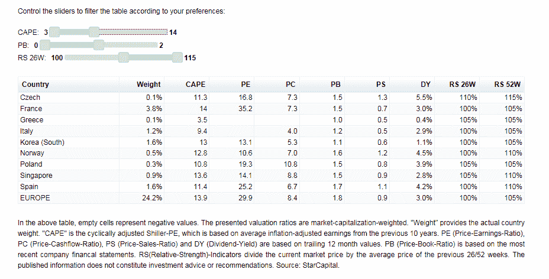

<!--yml
category: 未分类
date: 2024-05-18 03:29:13
-->

# Humble Student of the Markets: Two contrarian plays that will make you queasy

> 来源：[https://humblestudentofthemarkets.blogspot.com/2014/11/two-contrarian-plays-that-will-make-you.html#0001-01-01](https://humblestudentofthemarkets.blogspot.com/2014/11/two-contrarian-plays-that-will-make-you.html#0001-01-01)

In a recent post, I wrote that being a contrarian investor can be a lonely task and can involve considerable career risk (see

[Do you have what it takes to be a contrarian investor?](http://humblestudentofthemarkets.blogspot.com/2014/11/do-you-have-what-it-takes-to-be.html)

). The point being that contrarian investments are non-consensus investments that make you queasy.

With that in mind, here are a couple of contrarian plays guaranteed to make you queasy.

**Worried about deflation?**

Consider, for example, that the latest

[Bloomberg Global Investor Poll](http://www.bloomberg.com/news/2014-11-13/world-outlook-darkening-as-89-in-poll-see-europe-deflation-risk.html)

indicated a high degree of concern over deflation:

> The world economy is in its worst shape in two years, with the euro area and emerging markets deteriorating and the danger of deflation rising, according to a Bloomberg Global Poll of international investors.
> 
> A plurality of 38 percent of those surveyed this week described the global economy as worsening, more than double the number who said that in the last poll in July and the most since September 2012, when Europe was mired in a recession.
> 
> Much of the concern is again focused on the euro area: Almost two-thirds of those polled said its economy was weakening while 89 percent saw disinflation or deflation as a greater threat there than inflation over the next year. Respondents said the European Central Bank and the region’s governments are making the situation worse by pursuing too-tight policies, and fewer expressed confidence in ECB President Mario Draghi and German Chancellor Angela Merkel.

Even the Fed is worried about deflation, according to the latest FOMC minutes. "Many participants observed the committee should remain attentive to evidence of a possible downward shift in longer-term inflation expectations," according to the minutes. "Some of them noted that if such an outcome occurred, it would be even more worrisome if growth faltered."

[Ambrose Evans-Pritchard](http://www.telegraph.co.uk/finance/economics/11226558/Spreading-deflation-across-East-Asia-threatens-fresh-debt-crisis.html)

added fuel to the fire by highlighting deflationary concerns in East Asia causing a debt crisis:

> Deflation is becoming lodged in all the economic strongholds of East Asia. It is happening faster and going deeper than almost anybody expected just months ago, and is likely to find its way to Europe through currency warfare in short order.
> 
> Factory gate prices are falling in China, Korea, Thailand, the Philippines, Taiwan and Singapore. Some 82pc of the items in the producer price basket are deflating in China. The figures is 90pc in Thailand, and 97pc in Singapore. These include machinery, telecommunications, and electrical equipment, as well as commodities.
> 
> Chetan Ahya from Morgan Stanley says deflationary forces are “getting entrenched” across much of Asia. This risks a “rapid worsening of the debt dynamic” for a string of countries that allowed their debt ratios to reach record highs during the era of Fed largesse. Debt levels for the region as a whole (ex-Japan) have jumped from 147pc to 207pc of GDP in six years.

Indeed, 

[Thomson-Reuters](http://alphanow.thomsonreuters.com/2014/11/chart-week-chinas-disinflation-process-continues/)

reported that Chinese disinflationary forces taking hold:

Evans-Prichard warned about how deflation is threatening the Chinese economy which, if forced into a hard landing, could send shock waves throughout the global financial system:

> China itself is now one shock away from a deflation trap. Chinese PPI has been negative for 32 months as the economy grapples with overcapacity in everything from steel, cement, glass, chemicals, and shipbuilding, to solar panels. It dropped to minus 2.2pc in October.
> 
> The sheer scale of over-investment is epic. The country funnelled $5 trillion into new plant and fixed capital last year - as much as Europe and the US combined - even after the Communist Party vowed to clear away excess capacity in its Third Plenum reforms. Old habits die hard.
> 
> Consumer prices are starting to track factory prices with a long delay. Headline inflation dropped to 1.6pc in October. This is so far below the 3.5pc target of the People’s Bank of China that it looks increasingly like a policy mistake. Core inflation is down to 1.4pc.

With widespread concerns over deflation and falling inflation, I sense a disconnect in the

[Bloomberg Global Investor Poll](http://www.bloomberg.com/news/2014-11-16/pain-trade-ending-for-bonds-in-poll-saying-this-time-bears-right.html)

(emphasis added):

> When asked which asset they would short if they had the opportunity to choose just one, ***20 percent of participants in a poll of 510 Bloomberg customers picked government debt***, making it the most-popular choice, while 17 percent said junk bonds.

Moreover, the outlook for the 10-year Treasury yield remains bearish, which is confirmed by other institutional sentiment surveys (see

[What do the pros REALLY think about the market?](http://humblestudentofthemarkets.blogspot.com/2014/10/what-do-pros-really-think-about-market.html)

):

> Wall Street prognosticators were just as bearish on bonds at the start of the year, bolstered by signs U.S. demand would allow the Fed to end its unprecedented stimulus and lead the central bank to raise interest rates from close to zero.
> 
> Based on a Bloomberg survey of economists and strategists in January, they foresaw yields on the 10-year Treasury note, the benchmark for trillions of dollars of securities, rising to 3.44 percent by year-end, from 3.03 percent at the end of 2013\.

So let me get this straight. The market is worried about deflation, but bearish on Treasury bond prices, presumably because few could bring themselves to buy bonds with yields this low. Isn't that the classic definition of Treasuries climbing a wall of worry? Aren't those good enough reasons to be a contrarian buyer of Treasuries here? (I told you that being contrarian would make you queasy).

**How low can Europe go?**

How low can Europe go? Here is the relative returns of US and eurozone equities relative to the MSCI All-Country World Index (ACWI). All returns are shown in USD so that currency effects are neutralized.

There have been lots of hand wringing over Europe (via the

[Washington Post](http://www.washingtonpost.com/business/economy/japan-recession-europe-stagnation-cast-pall-over-global-economic-outlook/2014/11/17/5cd81612-6e8f-11e4-ad12-3734c461eab6_story.html)

, emphasis added):

> In the Guardian, Cameron described the euro zone as “***teetering on the brink of a possible third recession, with high unemployment, falling growth and the real risk of falling prices too***.”
> 
> Add in stalled trade talks, conflict in the Middle East, fighting in eastern Ukraine and the alarming spread of the Ebola virus, Cameron warned, and the world is functioning against “a dangerous backdrop of instability and uncertainty.”
> 
> Cameron’s bleak prognosis came at the end of the Group of 20 summit in Brisbane, Australia, where leaders of the world’s biggest economies struggled with strategies for kick-starting growth. Similarly negative pronouncements have echoed from other sources in recent days, particularly in relation to Europe.
> 
> Mark Carney, the governor of the Bank of England, told reporters in London last week that “***a specter is now haunting Europe — the specter of economic stagnation***.” International Monetary Fund chief Christine Lagarde has warned of ***“the risk of a new mediocre” in Europe, with low growth, low inflation, high unemployment and high deb***t.

While we saw a ray of hope for the eurozone, the latest round of weakness has not been helped by German intransigence on monetary and fiscal stimulus. To put some perspective on the German problem in Europe, here is

[Wolfgang Münchau's latest column](http://www.ft.com/intl/cms/s/0/e257ed96-6b2c-11e4-be68-00144feabdc0.html?siteedition=intl#axzz3JOKYHhdi)

in the FT. The opening sentence is hilarious:

> German economists roughly fall into two groups: those that have not read Keynes, and those that have not understood Keynes. To describe the economic mainstream in Germany as conservative misses the point. There are some overlaps with the various neoclassical or neoconservative schools in the US and elsewhere. But as compelling as a comparison between the German mainstream and the Tea Party may appear, it does not survive scrutiny. German orthodoxy straddles the centre-left and the centre-right. The only party with some Keynesian leanings are the former communists.

Münchau concluded (emphasis added):

> The ordoliberal doctrine may even have worked well for Germany, though I suspect that the country’s economic success is due mostly to technology, high skills and the presence of some excellent companies, rather than to economic policy. ***Through its dominance of the euro system, Germany is exporting ordoliberal ideology to the rest of the single currency bloc. It is hard to think of a doctrine that is more ill suited to a monetary union with such diverse legal traditions, political system and economic conditions than this one. And it is equally hard to see Germany ever giving up on this. As a result the economic costs of crisis resolution will be extremely large.***

In all seriousness, it seems that even as the eurozone slides into deflation, German intransigence and continued opposition to fiscal stimulus is the only thing that stands between growth and another recession. Antonio Fatas commented on German stubborness this way:

> Here is my guess from what I have learned from many heated discussions over the last years about economic policy in Europe: the resilience (stubbornness) of this view on economic policy comes from a combination of faith and the inability of the economic profession to apply enough real world filters to models.
> 
> Faith in a certain economic model comes from many years of being trained about the beauty of markets and all the inefficiencies that governments generate. But faith also comes from the belief that only through (individual) hard work and sacrifice (saving) one can achieve any economic progress. In this world (what Wolfgang Munchau refers to as Germany's parallel universe) there is no room for an economic crisis caused by lack of demand. Recessions only take place as a result of misbehavior, debt and lack of willingness to work hard (and reform). The only way to get out is to behave.

**Are European equities contrarian enough for you?**

Are European equities hated enough for you? Despite the high levels of investor skittishness, I am seeing enough upside potential in Europe to believe that it warrants a second look for a number of reasons.

First, despite the very much publicized problems in the eurozone periphery, some peripheral countries have made tremendous strides in making adjustments through the process of internal devaluation. Data from this site of

[Euro area statistics](https://www.euro-area-statistics.org/?cr=eur&lg=en)

show that unit labor costs, adjusted for productivity, in Ireland, Greece (yes, that Greece!) and Spain have fallen considerably and now competitive with German costs. (It may not be that long before BMW locates that next plant in Valencia or Thessalonika):

To be sure, not all countries have sufficiently adjusted to the new reality, which will give the Germans will continue to lecture their European partners:

In addition, I discovered and started playing with a neat country valuation screen from 

[StarCapital](http://www.starcapital.de/research/stockmarketvaluation)

. When I screen on cheap valuations (CAPE under 14, PB less than 2) and positive price momentum, most of the countries that appear are European. These readings confirm my Trend Model readings of a region that has dipped into deep value territory that is exhibiting positive momentum (see 

[Why I am not (just) a technician](http://humblestudentofthemarkets.blogspot.com/2014/11/why-i-am-not-just-technician.html)

).

|  |
| Click to enlarge |

In addition, CS also pointed out their forecast for robust eurozone equity earnings growth:

In Europe, we have a beaten down region with attractive valuations and emerging positive momentum, which is often an indication that a value investment is starting to turn up. Value investors can't ask for too much more than that.