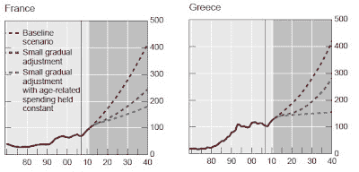

<!--yml
category: 未分类
date: 2024-05-18 04:03:31
-->

# Humble Student of the Markets: Two perspectives on the "French lion in the grass"

> 来源：[https://humblestudentofthemarkets.blogspot.com/2012/07/two-perspectives-on-french-lion-in-grass.html#0001-01-01](https://humblestudentofthemarkets.blogspot.com/2012/07/two-perspectives-on-french-lion-in-grass.html#0001-01-01)

In this week's essay,

[John Mauldin](http://www.ritholtz.com/blog/2012/07/the-lion-in-the-grass/)

characterized France as the "lion in the grass". He began with the comment that there are certainly lots of risks (lions) in Europe:

> We can all see the lions, large and small, of Greece, Portugal, Ireland, Spain, Italy, and now Cypress and Malta. The fear of contagion is what keeps European leaders up at night, trying to figure out how to keep Spain afloat. Because if Spain sinks, the focus immediately turns to Italy.

The hidden risk is in France, Mauldin wrote:

> But enough of the lions we can see. Don’t look now, but the lion that lies hidden in the grass is France. Yes, the France that is supposedly a big part of the solution to eurozone woes and Germany’s stalwart partner in guaranteeing all that debt. AAA France. Rated that way by the same people who turned the nuclear waste of subprime CDO squareds, composed 100% of the worst sort of BBB junk, into gold.
> 
> Now, the rating agencies are using the same alchemical Philosopher’s Stone to transmute French debt into … fool’s gold.

Today, investors are lending to the French state for five years

[for less than 1%](http://www.bloomberg.com/quote/Gfrn5:IND)

 and its

[10-year yields are at all-time lows](http://www.businessinsider.com/french-bond-yields-since-1746-2012-7)

, presumably it has been lumped in with the likes of Germany as being a safe haven, the French fiscal outlook is dire. In particular, he pointed to an IMF study (actually, I believe that it was a BIS working paper called

[The future of public debt: prospects and implications](http://www.bis.org/publ/work300.pdf?noframes=1)

). The study examined the debt to GDP path of various major industrialized countries and Mauldin observed that the French debt trajectory look the most like Greece.

> |  |
> | **BIS Public Debt to GDP projections** |
> 
> Yes, the country most like France is Greece. Yes, THAT Greece. The one that just defaulted. The one that everyone agrees is dysfunctional. Also notice that if Greece were to follow the suggested draconian path, it could stabilize its debt. And then notice that if France were to make the same level of draconian cuts, its debt-to-GDP ratio would merely rise to almost 200% within 25 years. Oops.

**Two reactions**

I have two reactions to that analysis. My inner investor says, wow that's terrible. France is an accident waiting to happen. French debt costs will surely blow up and investors need to re-examine the credit risks of any debt paper that they consider. If French yields were to surge because of some event, then risk premiums will also blow sky high and that won't be good at all for the risk-on trade, i.e. stocks, commodities, etc.

My inner trader tells me that, under the current circumstances, French real interest rates are negative and the

***France is actually making a profit by running these deficits***

. It has zero incentive given market conditions to rein in its deficits. In fact, it should be taking advantage of current conditions to extend the maturity of its debt structure in order to lock in low rates.

It's important to be aware of the long-term risks of the French fiscal path, these kinds of things have a way of not mattering to the market until it matters. As a trader who is measured by the bottom line in his portfolio, he has to be aware of the risk but not hide in the bunker and act on this "lion in the grass" until the lions starts to move. You have to watch for the inflection point.

These differing viewpoints certainly put the Merkel/austerity vs. Hollande/stimulus debate into a fresh perspective.

*Cam Hui is a portfolio manager at [Qwest Investment Fund Management Ltd](http://www.qwestfunds.com/). ("Qwest"). This article is prepared by Mr. Hui as an outside business activity. As such, Qwest does not review or approve materials presented herein. The opinions and any recommendations expressed in this blog are those of the author and do not reflect the opinions or recommendations of Qwest.***None of the information or opinions expressed in this blog constitutes a solicitation for the purchase or sale of any security or other instrument. Nothing in this article constitutes investment advice and any recommendations that may be contained herein have not been based upon a consideration of the investment objectives, financial situation or particular needs of any specific recipient. Any purchase or sale activity in any securities or other instrument should be based upon your own analysis and conclusions. Past performance is not indicative of future results. Either Qwest or Mr. Hui may hold or control long or short positions in the securities or instruments mentioned.**