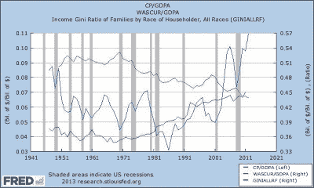

<!--yml
category: 未分类
date: 2024-05-18 03:52:54
-->

# Humble Student of the Markets: Two view of income inequality

> 来源：[https://humblestudentofthemarkets.blogspot.com/2013/06/two-view-of-income-inequality.html#0001-01-01](https://humblestudentofthemarkets.blogspot.com/2013/06/two-view-of-income-inequality.html#0001-01-01)

Recently, I have seen a number of blog posts and articles about the uneven nature of the US economic recovery.

[Zero Hedge](http://www.zerohedge.com/news/2013-06-08/american-households-foodstamps-climb-new-record)

documents how the number of households on food stamps have climbed to a new record.

Over at

[FT Alphaville](http://ftalphaville.ft.com/2013/06/06/1527192/us-inequality-and-digging-into-aggregate-data/)

, Cardiff Garcia has pointed out that most of benefits of the post-Lehman Crisis recovery have accrued to the wealthy.

You can see the disparity in the consumer confidence figures by breaking them down by income levels.

My inner investor is horrified by these statistics. He could go on and start railing about how rising income inequality will ultimate create social pressures, which will ultimately damage the social fabric of the nation and be very bearish for the US in the long run. As an illustration of this trend, the chart below shows corporate profits as a percentage of GDP (in blue), employee compensation as a percentage of GDP (in red) and the US Gini coefficient, which is a measure of inequality (in green).

Classic economic theory holds that the three factors of production are capital, labor and rents. As the above chart shows, the returns to capital (profitability) has been rising while returns to labor (compensation) has been falling for several decades. Moreover, a rising Gini coefficient indicates that income inequality has been rising. At some point, this will create social pressures that has the potential to tear society apart. The American Dream is about equality of opportunity, not equality of wealth. Any steps that erode the equality of opportunity erodes American competitiveness (see my previous post

[Another American step to Argentina](http://humblestudentofthemarkets.blogspot.com/2011/04/another-american-step-to-argentina.html)

).

My inner trader is more agnostic. He shrugs and tells my inner investor that these problems have a way of not mattering until they matter. The income inequality situation is exemplified by the Tiffany vs. Wal Mart pair*. As the 10-year chart of the pair shows, the TIF/WMT ratio is rising and is not at an extreme yet and it is exhibiting positive momentum. In fact, my inner trader is more inclined to go long this pair with an eye to the upper end of the band as a target.

The Great Gatsby lives!

* I am being metaphorical. I would not actually trade this pair as a way of playing the income inequality macro trade, as there are highly company specific issues that can affect both TIF and WMT.

*Cam Hui is a portfolio manager at [Qwest Investment Fund Management Ltd](http://www.qwestfunds.com/). ("Qwest"). This article is prepared by Mr. Hui as an outside business activity. As such, Qwest does not review or approve materials presented herein. The opinions and any recommendations expressed in this blog are those of the author and do not reflect the opinions or recommendations of Qwest.**None of the information or opinions expressed in this blog constitutes a solicitation for the purchase or sale of any security or other instrument. Nothing in this article constitutes investment advice and any recommendations that may be contained herein have not been based upon a consideration of the investment objectives, financial situation or particular needs of any specific recipient. Any purchase or sale activity in any securities or other instrument should be based upon your own analysis and conclusions. Past performance is not indicative of future results. Either Qwest or Mr. Hui may hold or control long or short positions in the securities or instruments mentioned.*