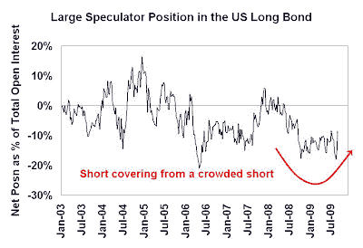
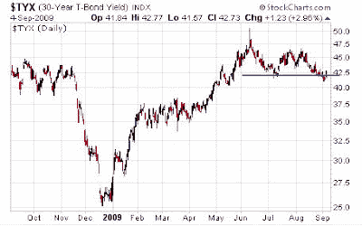
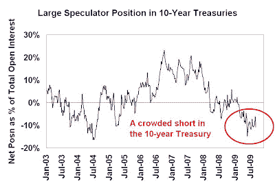
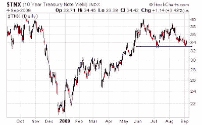

<!--yml
category: 未分类
date: 2024-05-18 00:47:20
-->

# Humble Student of the Markets: US bond market poised to rally

> 来源：[https://humblestudentofthemarkets.blogspot.com/2009/09/us-bond-market-poised-to-rally.html#0001-01-01](https://humblestudentofthemarkets.blogspot.com/2009/09/us-bond-market-poised-to-rally.html#0001-01-01)

James Carville, advisor to then president Bill Clinton, famously

[said](http://www.nytimes.com/1994/06/12/weekinreview/ideas-trends-the-bondholders-are-winning-why-america-won-t-boom.html)

that he wanted to be reincarnated as the bond market so that he could intimidate everybody – that’s because the bond market is usually right.

So what is happening with the bond market?

**Large speculators are in a crowded short**

The CFTC's

[Commitment of Traders report](http://www.cftc.gov/marketreports/commitmentsoftraders/index.htm)

shows that large speculators (read: hedge funds) are either in crowded short or near crowded short positions in the 10-year and the long bond. The chart below shows the net position of large speculators in the long T-Bond futures contract. Readings were in a crowded short and there has been some minor short covering.

Coincidentally, long bond yields have fallen through a support line and bond prices have begun to rally.

In the 10-year, large speculators remain in a crowded short.

…and yields are sitting right at technical support.

These sentiment readings are evocative of a stretched rubber band ready to snap back. You don’t often see crowded long or crowded short positions in futures contracts. The dual crowded short readings in both the 10-year and long bond are even more rare and confirm my belief that the bond market is poised for a tactical rally.