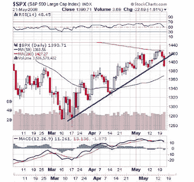

<!--yml
category: 未分类
date: 2024-05-18 01:09:59
-->

# Humble Student of the Markets: Uh oh!

> 来源：[https://humblestudentofthemarkets.blogspot.com/2008/05/uh-oh.html#0001-01-01](https://humblestudentofthemarkets.blogspot.com/2008/05/uh-oh.html#0001-01-01)

The technicians aren't going to like this:

Consensus sentiment from

[AAII](http://www.sentimentrader.com/subscriber/charts/WEEKLY/SURVEY_AAII_BULLRATIO_4WK.htm)

is on the bullish side so the market lacks buying support from an excessively bearish sentiment reading. If there is follow-through selling tomorrow it could portend more short-term weakness.