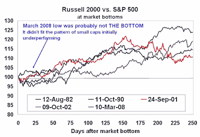

<!--yml
category: 未分类
date: 2024-05-18 01:09:30
-->

# Humble Student of the Markets: Waiting for a ride on the Phoenix

> 来源：[https://humblestudentofthemarkets.blogspot.com/2008/05/waiting-for-ride-on-phoenix.html#0001-01-01](https://humblestudentofthemarkets.blogspot.com/2008/05/waiting-for-ride-on-phoenix.html#0001-01-01)

As a follow up to my previous post on

[Altman Z](http://humblestudentofthemarkets.blogspot.com/2008/05/limitations-of-altman-z.html)

score, investors who use solvency analysis to avoid bankrupt companies should beware of the effects of an economic recovery. The other side of the coin of solvency analysis is the

*Phoenix effect*

.

When the economy comes out of recession, shares of near-bankrupt companies see eye-popping returns as they rise Phoenix-like from the ashes of near insolvency. Examples include Chrysler moving from $2 to over $30 in the 1982-3 recovery; Magna International from under $2 to over $80 in 1991-2; and Akamai Technologies from under $2 to over $18 in 2003-4.

Buying shares of near bankrupt companies is a dangerous but exciting game. To be successful, an investor needs to identify the Phoenix candidates and correctly time the turn in the market. The rewards are can be big. Buying a basket Phoenix stocks can yield returns of 100-200% over a 12-18 month period.

**Phoenix is partly a small cap effect** 

The Phoenix effect can be characterized partly as a small cap effect. The chart below shows the relative returns of the small cap Russell 1000 relative to the large cap S&P 500\. I indexed the start value of 100, at dates representing stock market lows coinciding with economic slowdowns since 1980\. On average, the Russell 1000 outperformed the S&P 500 by about 17% one year after the market low. The initial upward thrust in the market has always been marked by large cap outperformance.

Interestingly, the recent March 2008 low was characterized by small cap outperformance which leads me to conclude that this rally is just a bear market rally and the March low was probably not THE BOTTOM in this bear.

**Looking for Phoenix candidates**

Phoenix candidates are not just small cap stocks, but shares of companies that are at risk of insolvency and benefit from the tremendous positive operating leverage from an improving economy and high financial leverage which put them at risk of bankruptcy. The obvious quantitative way of finding Phoenix candidates is to screen the market for shares of companies that are at risk of insolvency. However, there is a simpler heuristic: low-priced stocks.

Stock price is a factor that’s not in most equity quants’ factor lists. However, it is a deceptively simple way of screening for Phoenix recovery candidates. I remember that

[Jeff deGraaf](http://www.isigrp.com/corp/dec2005/jeffdg.jsp)

, who was at Lehman Brothers at the time, reported in late 2003 that the return spread between the lowest and highest decile of stock price was about 70% - an astounding return to a factor for less than one year.

I roughly confirmed these results by running a backtest using the current components of the Russell 1000\. Had you bought the lowest decile by stock price in December 2002 and held them for a year, the median outperformance compared to the top decile was about 110%. This simple study has problems, mainly in the form of a survivorship bias. The use of a median return instead of an average return does mitigate some of the survivorship bias issues. Nevertheless, it does illustrate the magnitude of the effect. Using a long-only approach, this study over the 2003 and previous recovery period suggest that a basket of Phoenix stocks has the potential to rise by a factor of between 2 and 3 over a 12-18 month period.

**Phoenix candidate = low stock price + dramatic fall + insider activity**

Just buying low priced stocks gets you partly there but we should eliminate stocks that have always traded at low prices. Phoenix candidates are stocks that have taken a pounding, or stocks that have fallen dramatically (70-90%) from the 52-week high. This is a likely indication that it is at risk of insolvency.

These companies are on the verge of Chapter 11 so buying their shares is highly risky. To mitigate downside risk of possible bankruptcy, add an additional insider activity screen. Ideally I would like to see recent insider buying in Phoenix candidates, which indicates that the fundamentals may be turning. At the very least, I would like to see the lack of insider selling, a sign that the worst is may over for the company under consideration.

**Timing: Be patient, the Phoenix will rise**

Right now, the weight of the evidence suggests that the turn has not occurred yet. I am preparing a list of Phoenix candidates for my portfolio but waiting for signals of a bottom before buying. In a future post I will write about how I would time the buy decision of these stocks.