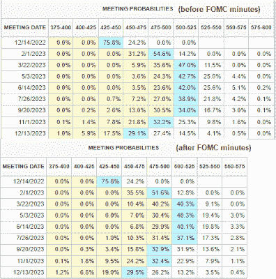

<!--yml
category: 未分类
date: 2024-05-18 01:36:12
-->

# Humble Student of the Markets: Waiting for clarity from the Nov 30 Powell speech

> 来源：[https://humblestudentofthemarkets.blogspot.com/2022/11/waiting-for-clarity-from-nov-30-powell.html#0001-01-01](https://humblestudentofthemarkets.blogspot.com/2022/11/waiting-for-clarity-from-nov-30-powell.html#0001-01-01)

**Preface: Explaining our market timing models** 

We maintain several market timing models, each with differing time horizons. The "

**Ultimate Market Timing Model**

" is a long-term market timing model based on the research outlined in our post, 

[Building the ultimate market timing model](https://humblestudentofthemarkets.com/2016/01/26/building-the-ultimate-market-timing-model/)

. This model tends to generate only a handful of signals each decade.

The 

**Trend Asset Allocation Model**

 is an asset allocation model that applies trend-following principles based on the inputs of global stock and commodity prices. This model has a shorter time horizon and tends to turn over about 4-6 times a year. The performance and full details of a model portfolio based on the out-of-sample signals of the Trend Model can be found

[here](https://humblestudentofthemarkets.com/trend-model-report-card/)

.

My inner trader uses a 

**trading model**

, which is a blend of price momentum (is the Trend Model becoming more bullish, or bearish?) and overbought/oversold extremes (don't buy if the trend is overbought, and vice versa). Subscribers receive real-time alerts of model changes, and a hypothetical trading record of the email alerts is updated weekly 

[here](https://humblestudentofthemarkets.com/trading-track-record/)

. The hypothetical trading record of the trading model of the real-time alerts that began in March 2016 is shown below.

The latest signals of each model are as follows:

*   Ultimate market timing model: Sell equities*
*   Trend Model signal: Neutral*
*   Trading model: Bearish*

** The performance chart and model readings have been delayed by a week out of respect to our paying subscribers.***Update schedule**

: I generally update model readings on my 

[site](https://humblestudentofthemarkets.com/)

 on weekends. I am also on Twitter at @humblestudent and on Mastodon at @humblestudent@toot.community. Subscribers receive real-time alerts of trading model changes, and a hypothetical trading record of those email alerts is shown 

[here](https://humblestudentofthemarkets.com/trading-track-record/)

.

Subscribers can access the latest signal in real-time 

[here](https://humblestudentofthemarkets.com/my-inner-trader/)

.

**Marginally more dovish**

Fed policy is still moving markets. The release of the

[November FOMC minutes](https://www.federalreserve.gov/monetarypolicy/fomcminutes20221102.htm)

confirmed what Fed officials had been telegraphing in the past few weeks, namely that "a substantial majority of participants judged that a slowing in the pace of increase would likely soon be appropriate". However, "the target range for the federal funds rate...had become more important ...than the pace of further increases in the target range". Fed Funds expectations turned marginally more dovish in the wake of the release and the S&P 500 rallied. 

Despite the market's excitement about the slowing in the pace of rate hikes, Fed Chair Powell sounded a more hawkish tone and said during the

[November FOMC press conference](https://www.federalreserve.gov/mediacenter/files/FOMCpresconf20221102.pdf)

that he's "never thought of [a series of milder inflation readings] as the appropriate test for slowing the pace of increases or for identifying the appropriately restrictive level". Fed Chair Jerome Powell is scheduled to speak at the

[Brookings Institution on November 30](https://www.brookings.edu/events/federal-reserve-chair-jerome-powell-the-economic-outlook-and-the-labor-market/)

on the economy and labor markets, just two days before the  start of the blackout window for Fed speeches ahead of the December FOMC meeting. That speech is likely to set the tone for the markets for the coming weeks.

The full post can be found

[here](https://humblestudentofthemarkets.com/2022/11/27/waiting-for-clarity-from-the-nov-30-powell-speech/)

.