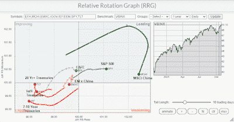

<!--yml
category: 未分类
date: 2024-05-18 01:53:02
-->

# Humble Student of the Markets: Waiting for the FOMC

> 来源：[https://humblestudentofthemarkets.blogspot.com/2021/10/waiting-for-fomc.html#0001-01-01](https://humblestudentofthemarkets.blogspot.com/2021/10/waiting-for-fomc.html#0001-01-01)

**Preface: Explaining our market timing models** 

We maintain several market timing models, each with differing time horizons. The "

**Ultimate Market Timing Model**

" is a long-term market timing model based on the research outlined in our post, 

[Building the ultimate market timing model](https://humblestudentofthemarkets.com/2016/01/26/building-the-ultimate-market-timing-model/)

. This model tends to generate only a handful of signals each decade.

The 

**Trend Asset Allocation Model**

 is an asset allocation model that applies trend following principles based on the inputs of global stock and commodity price. This model has a shorter time horizon and tends to turn over about 4-6 times a year. The performance and full details of a model portfolio based on the out-of-sample signals of the Trend Model can be found

[here](https://humblestudentofthemarkets.com/trend-model-report-card/)

.

My inner trader uses a 

**trading model**

, which is a blend of price momentum (is the Trend Model becoming more bullish, or bearish?) and overbought/oversold extremes (don't buy if the trend is overbought, and vice versa). Subscribers receive real-time alerts of model changes, and a hypothetical trading record of the email alerts is updated weekly 

[here](https://humblestudentofthemarkets.com/trading-track-record/)

. The hypothetical trading record of the trading model of the real-time alerts that began in March 2016 is shown below.

The latest signals of each model are as follows:

*   Ultimate market timing model: Buy equities*
*   Trend Model signal: Bullish*
*   Trading model: Neutral*

** The performance chart and model readings have been delayed by a week out of respect to our paying subscribers.***Update schedule**

: I generally update model readings on my 

[site](https://humblestudentofthemarkets.com/)

 on weekends and tweet mid-week observations at @humblestudent. Subscribers receive real-time alerts of trading model changes, and a hypothetical trading record of those email alerts is shown 

[here](https://humblestudentofthemarkets.com/trading-track-record/)

.

Subscribers can access the latest signal in real-time 

[here](https://humblestudentofthemarkets.com/my-inner-trader/)

.

**An asset rotation review**

A review of the asset returns on an RRG chart and found a possible inflection point for both equity market leadership and bond prices. As a reminder, I use the Relative Rotation Graphs, or RRG charts, as the primary tool for the analysis of sector and style leadership. As an explanation, RRG charts are a way of depicting the changes in leadership in different groups, such as sectors, countries or regions, or market factors. The charts are organized into four quadrants. The typical group rotation pattern occurs in a clockwise fashion. Leading groups (top right) deteriorate to weakening groups (bottom right), which then rotates to lagging groups (bottom left), which change to improving groups (top left), and finally completes the cycle by improving to leading groups (top right) again.

Here are the main takeaways from the analysis of daily asset returns using a 60/40 US stock/bond mix as a benchmark for USD investors.

*   The **S&P 500** is in the leading quadrant and shows no signs of weakness. The market is on track for a rally into year-end. The open question is whether value or growth stocks will lead the charge.
*   **EAFE**, or developed market international stocks, is in the improving quadrant, but price momentum is weakish.
*   **MSCI China** is also in the leading quadrant, but it is showing some signs of weakness. Investors are returning to Chinese equities but face considerable risks.
*   **EM xChina** has fallen into the lagging quadrant.
*   **Bond prices** are in the lagging quadrant but showing signs of improvement. In particular, long Treasuries (TLT) is on the verge on rising into the improving quadrant. Much depends on the language from the FOMC meeting in the coming week.

The full post can be found

[here](https://humblestudentofthemarkets.com/2021/10/31/waiting-for-the-fomc/)

.