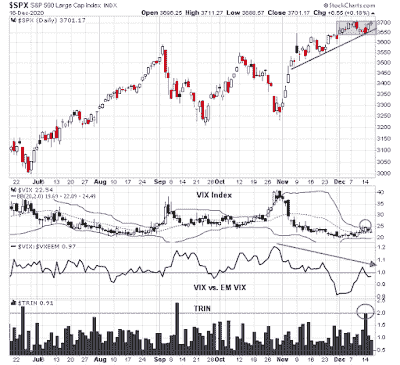

<!--yml
category: 未分类
date: 2024-05-18 02:07:29
-->

# Humble Student of the Markets: Waiting for the breakout

> 来源：[https://humblestudentofthemarkets.blogspot.com/2020/12/waiting-for-breakout.html#0001-01-01](https://humblestudentofthemarkets.blogspot.com/2020/12/waiting-for-breakout.html#0001-01-01)

**Mid-week market update**: It's difficult to make a coherent technical analysis comment on the day of an FOMC meeting, but the stock market remains in a holding pattern. While the S&P 500 remains in an uptrend (blue line), it has been consolidating sideways since late November and early December. 

Until we see either an upside breakout or downside breakdown out of the trading range (grey area), it's difficult to make a definitive directional call either way. The bull can point to a brief spike of the VIX above its upper Bollinger Band on Monday, which is a sign of an oversold market. TRIN also rose to 2 on Monday, which can be an indication of panic selling. As well, the VIX Index is normalizing relative to EM VIX since the election. The US market has stopped acting like an emerging market as anxieties have receded. As the S&P 500 tests the top of the range, these are constructive signs that the market is about to rise. On the other hand, the bears can say that even with all these tailwinds, the stock market remains range-bound and unable to stage an upside breakout, indicating that the bulls are having trouble seizing control of the tape.

The full post can be found [here](https://humblestudentofthemarkets.com/2020/12/16/waiting-for-the-breakout/).