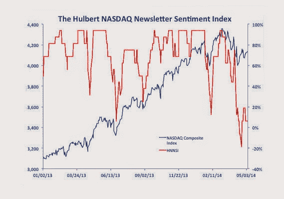

<!--yml
category: 未分类
date: 2024-05-18 03:39:48
-->

# Humble Student of the Markets: Watch for the sentimental rally

> 来源：[https://humblestudentofthemarkets.blogspot.com/2014/05/watch-for-sentimental-rally.html#0001-01-01](https://humblestudentofthemarkets.blogspot.com/2014/05/watch-for-sentimental-rally.html#0001-01-01)

Regular readers will know that I have been fairly cautious on the stock market for the past several weeks (see

[A case of risk exhaustion?](http://humblestudentofthemarkets.blogspot.com/2014/04/a-case-of-risk-exhaustion.html)

,

[Interpreting a possible volatility regime change](http://humblestudentofthemarkets.blogspot.com/2014/04/interpreting-possible-volatility-regime.html)

,  

[Should you sell in May?](http://humblestudentofthemarkets.blogspot.com/2014/04/should-you-sell-in-may.html)

 and

[The bearish verdict from market cycle analysis](http://humblestudentofthemarkets.blogspot.com/2014/05/the-bearish-verdict-from-market-cycle.html)

). However, investor sentiment have moved to an overly bearish reading indicating a crowded short. While I remain convinced that the intermediate term path of least resistance is down for equities, we are likely to see a rally that takes the major large cap stock averages to marginal new highs in the next week or so.

**Hulbert: Too much bearishness**

The signs of excessive bearishness are emerging.

[Mark Hulbert](http://www.marketwatch.com/story/investors-get-bearish-suggesting-stocks-will-rise-2014-05-07)

wrote last week that his NASDAQ newletter writer sentiment index was at a bearish extreme:

> Even though the market is more or less at the same level today than it was a month ago, if not slightly higher, the average market timer is more bearish today than then. That’s positive from a contrarian perspective, since it means that the wall of worry is that much stronger.
> 
> Notice also from the accompanying chart that, at the NASDAQ Composite’s mid-April low, the HNNSI dipped to minus 20% — meaning that the average NASDAQ-oriented timer was allocating 20% of his equity portfolio to going short. That is a significantly bearish posture to take. It’s the greatest amount of bearishness, in fact, in well more than a year.
> 
> Notice also that, even though the average timer is not as bearish today as he was in mid-April, he is still just as bearish as he was at the market’s lows last June. That is particularly noteworthy, since the NASDAQ Composite today is 24% higher today than then. Because the usual pattern is for bullishness to rise and fall more or less in lockstep with the market itself, it’s remarkable that there is not a lot more bullishness.
> 
> All of this suggests that there is a strong wall of worry out there for the market to climb. That doesn’t guarantee that the market will rise, of course. But it does mean that, if it does, it will have the sentiment winds blowing in its sails.

**More AAII bears than bulls**

In addition,

[Bespoke](http://www.bespokeinvest.com/thinkbig/2014/5/8/fewer-bulls-than-bears.html)

reported that the latest AAII survey showed more bears than bulls.

My own interpretation of this chart is that the low level of bulls and bears indicate a lack of conviction and a highly jittery market, where sentiment survey readings will be volatile and be subject to wild swings. (Remember that sentiment surveys ask people about their opinions, not what they have done.)

**Put-call ratio indicate a crowded short**

The chart below shows the equity only put-call ratio, with a 5 day exponential moving average (in blue) and a 21 day moving average (in red). A rising put-call ratio indicates a heightened levels of fear as investors buy more put options for downside protection.

With the equity only put-call ratio at an elevated level relative to recent history, I would watch for the SPX to rally and test and perhaps overcome the resistance zone (top panel, shown in grey) and possibly a test of the 12 support level on the VIX Index (bottom panel) in the upcoming week.

**A small cap rally?**

One of the likely beneficiaries of any stock market rally would be the beleaguered small cap sector. The chart of the Russell 2000 below (top panel) shows that the RUT has descended to test an important support zone. As well, the RUT to SPX ratio (bottom panel) shows that the small cap to large cap ratio is also testing an important zone of relative support.

With sentiment overly bearish, one likely rally candidate would be the RUT. I would watch for either a test of the pictured downtrend lines, shown on the top panel, or the relative downtrend line, shown on the bottom channel. If I am correct about the sentiment-based rally, then the ability of the bulls to overcome either downtrend would be an important test of the intermediate term outlook.

My inner investor remains cautious and he is taking this bout of strength to raise some cash. My inner trader has abandoned his bearish stance and cautiously taken on a small long position in stocks.

*Cam Hui is a portfolio manager at [Qwest Investment Fund Management Ltd](http://www.qwestfunds.com/). (“Qwest”). The opinions and any recommendations expressed in the blog are those of the author and do not reflect the opinions and recommendations of Qwest. Qwest reviews Mr. Hui’s blog to ensure it is connected with Mr. Hui’s obligation to deal fairly, honestly and in good faith with the blog’s readers.”

None of the information or opinions expressed in this blog constitutes a solicitation for the purchase or sale of any security or other instrument. Nothing in this blog constitutes investment advice and any recommendations that may be contained herein have not been based upon a consideration of the investment objectives, financial situation or particular needs of any specific recipient. Any purchase or sale activity in any securities or other instrument should be based upon your own analysis and conclusions. Past performance is not indicative of future results. Either Qwest or I may hold or control long or short positions in the securities or instruments mentioned.*