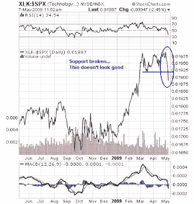
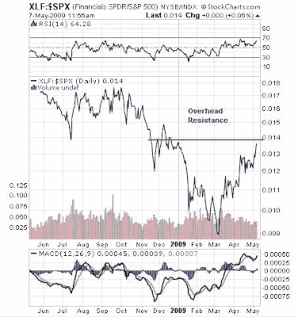
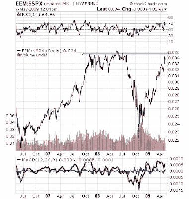

<!--yml
category: 未分类
date: 2024-05-18 00:53:46
-->

# Humble Student of the Markets: Weak leadership imperils market advance

> 来源：[https://humblestudentofthemarkets.blogspot.com/2009/05/weak-leadership-imperils-market-advance.html#0001-01-01](https://humblestudentofthemarkets.blogspot.com/2009/05/weak-leadership-imperils-market-advance.html#0001-01-01)

Further to my last post entitled

[Respect this market rally](http://humblestudentofthemarkets.blogspot.com/2009/05/respect-this-bear-market-rally.html)

, there are further data points that point to a high risk environment for this equity market.

It is sometimes instructive to analyze market relative charts to see who the market leaders are and how the leadership is behaving. Technology had been standouts in the past few months. As the chart of the Technology Select SPDR ETF (XLK) relative to the S&P 500 below shows, the sector has been plummeting against the market and has broken down below a support zone.

  

The Financials had taken up the leadership mantle since the March bottom, but as the chart below of the XLF relative to the S&P 500 shows, the sector may be running into relative overhead resistance soon.

**Financials vs. S&P 500**

The best relative performers since 3Q 2008 has been emerging market stocks. The chart below of the iShare MSCI Emerging Market ETF (EEM) relative to the S&P 500 shows that it, too, is likely to encounter relative overhead resistance soon.

**Emerging Markets vs. S&P 500**

These pictures of faltering leadership and relative overhead resistance for recent leaders point to limited near-term upside potential for equities here.