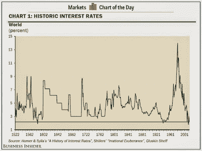
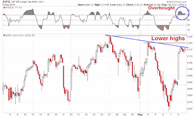

<!--yml
category: 未分类
date: 2024-05-18 03:21:48
-->

# Humble Student of the Markets: What I learned from Bundegeddon

> 来源：[https://humblestudentofthemarkets.blogspot.com/2015/05/what-i-learned-from-bundegeddon.html#0001-01-01](https://humblestudentofthemarkets.blogspot.com/2015/05/what-i-learned-from-bundegeddon.html#0001-01-01)

**Trend Model signal summary**

Trend Model signal: Neutral

Trading model: Bearish

The Trend Model is an asset allocation model which applies trend following principles based on the inputs of global stock and commodity price. In essence, it seeks to answer the question, "Is the trend in the global economy expansion (bullish) or contraction (bearish)?"

My inner trader uses the trading model component of the Trend Model seeks to answer the question, "Is the trend getting better (bullish) or worse (bearish)?" The history of actual (not backtested) signals of the trading model are shown by the arrows in the chart below. In addition, I have a trading account which uses the signals of the Trend Model. The last report card of that account can be found 

[here](http://humblestudentofthemarkets.blogspot.com/2015/05/trend-model-april-report-card-playing.html)

.

**Update schedule**

: I generally update Trend Model readings on 

[my blog](http://humblestudentofthemarkets.blogspot.com/)

on weekends and tweet any changes during the week at @humblestudent.

**Signs of distribution**

I have been warning about the signs of distribution in the US equity market for several weeks and those signs are continuing. I wrote about how the intersection of a strong long-term trend and a faltering short-term trend was a sign that complacency may be getting its comeuppance (see

[3 secrets from the Book of (Trend Following) Revelations](http://humblestudentofthemarkets.blogspot.com/2015/04/3-secrets-from-book-of-trend-following.html)

and

[How to make your first loss your best loss](http://humblestudentofthemarkets.blogspot.com/2015/04/how-to-make-your-first-loss-be-your.html)

). One graphical way of illustrating this effect is to see how the

[MACD histogram](http://stockcharts.com/school/doku.php?st=macd+histogram&id=chart_school:technical_indicators:macd-histogram)

, which is a measure of long and short term trend divergence, has gone negative on the monthly SPX chart. Every past instance of this condition in the last 20 years (marked by vertical lines) has seen the market go down, either with the MACD as a leading, coincidental or lagging indicator.

A shorter term chart of the SPX is also showing disturbing signs of distribution. The SPX has broken a key uptrend that began last October and appears to be tracing out a rounding top formation. In addition, we are seeing a negative divergence in

[On Balance Volume](http://stockcharts.com/school/doku.php?st=obv&id=chart_school:technical_indicators:on_balance_volume_obv)

, which is a volume-based measure of accumulation and distribution.

In addition, Urban Carmel

[tweeted](https://twitter.com/ukarlewitz/status/596735291978850304)

the following observation during the day on Friday:

Also see Andrew Nyquist's

[posts](http://stocktwits.com/andrewnyquist/message/36660210)

about negative breadth divergences, which is another sign of distribution.

**A wobbly growth outlook**

The rally on Friday was sparked by the combination of a surprise Conservative majority win in the UK election and a not-too-hot-not-too-cold Employment Report, which the market interpreted as the Fed would stay on hold for a little longer. Despite the positives seen in the Employment Report,

[New Deal democrat](http://bonddad.blogspot.com/2015/05/april-jobs-report-much-better-but.html)

cautioned that he was still seeing signs of a mild industrial recession based on his read of the leading indicator portions of the report:

> But the leading portions of the employment report are sounding an alarm. The manufacturing workweek was down. Overtime was down. Unemployment from zero to 5 weeks increased significantly. Revisions to prior months were negative. This is the third month of this negative trend in the leading indicators in the employment report. In my "Weekly Indicators" column, for the last month I have said that the US is in a shallow manufacturing recession. Today's report confirms that.

As well, rising bond yields from the mini Bundegeddon panic last week (more on that later) is a negative for housing. Bond yields directly affect mortgage rates, another component of the long leading indicators that New Deal democrat monitors on a regular basis. In his latest

[weekly summary of high frequency economic releases](http://community.xe.com/blog/xe-market-analysis/weekly-indicators-watch-interest-rates-edition)

, he confirmed his assessment of the risks to the US economy:

> In the last several months the theme has been poor coincident indicators with generally positive long and short leading indicators, reflecting a shallow industrial recession due to the strong dollar and oil patch weakness, but a resilient domestic, consumer economy. The big addition this week was the move in interest rates. Should interest rates spike much more, they will begin to drag down housing again, and that will leave money supply as the only positive long leading indicator, as corporate profits have already turned down.

There were other calls highlighting the dark cloud overhanging the silver lining of the Employment Report. Greg Ip of the

[WSJ](http://blogs.wsj.com/economics/2015/05/08/even-with-the-april-bounceback-its-a-weak-start-to-2015/?utm_content=bufferce895&utm_medium=social&utm_source=twitter.com&utm_campaign=buffer&mg=blogs-wsj&url=http%253A%252F%252Fblogs.wsj.com%252Feconomics%252F2015%252F05%252F08%252Feven-with-the-april-bounceback-its-a-weak-start-to-2015%253Futm_content%253Dbufferce895%2526utm_medium%253Dsocial%2526utm_source%253Dtwitter.com%2526utm_campaign%253Dbuffer)

pointed to signs of a slowing economy:

> Look closer and the jobs data still sends a worrying signal about the economy’s underlying strength. Because little of the data in the payroll survey goes directly into the expenditure-based measure of GDP, it can serve as a useful “check” on that broader economy-wide number. According to Chris Varvares of Macroeconomic Advisers, total hours worked is a good predictor of output both in the current quarter and the next.
> 
> The good news, then, is that total hours worked per week in the private sector, a measure that captures both the number of people on the job and how many hours they work, rose 0.2% in April from March. The bad news is that the level of hours is still lower than in February. As the nearby chart shows, hours over the last three months rose at a tepid 1.3% annual rate compared to the prior three months. Hours showed a similar dip a year earlier but began to recover by March.

The latest update of Doug Short's

[Big 4 Recession Indicators](http://www.advisorperspectives.com/dshort/updates/Big-Four-Economic-Indicators.php)

 are now in for March. The composite score has now been negative for two consecutive months, with two of the four component in the red for the month of March. Weakness in industrial production and real income dragged down the overall score, compared to an extremely negative Real Sales print in February, which rebounded strongly in March. These figures are arguably backward looking and the story of 1Q weakness is well known, but they nevertheless paint the picture of an economy that is near stall speed.

[Gavyn Davies](http://blogs.ft.com/gavyndavies/2015/05/03/global-growth-report-card-is-the-world-slowdown-temporary/)

also warned of a global growth slowdown:

> Overall, the growth rate of the global economy has therefore slowed further, according to our models. Our estimate of activity growth in the major advanced economies plus China, which we use as a proxy for global activity, has dropped to 3.0 per cent at the end of April, from 3.7 per cent a month ago. This measure of global activity has now broken below the roughly 4 per cent rate that had been established since mid 2014.

According to Davies, the odds of a strong US expansion are falling and recession risk is starting to tick up, though readings are nowhere near panic button levels.

For the stock market, it all boils to the earnings growth outlook, which remains clouded.

[Ed Yardeni](http://www.yardeni.com/Pub/peacockfeval.pdf)

reported that while forward EPS estimates for the large cap S+P 500 have resumed their upward climb, the mid cap S+P 400 and small cap S+P 600 are still seeing downward EPS revisions. In a separate

[blog post](http://blog.yardeni.com/2015/05/analysts-continue-to-lower-s-500.html)

, he openly fretted about the combination of stretched valuation and downward estimate revisions:

> Although the dollar might have peaked on March 13 for a while, and the price of crude oil might have bottomed on January 13 for a while, industry analysts who cover the S+P 500 are still lowering their earnings estimates for both 2015 and 2016\. They now expect $119.02 and $134.18 per share for this year and next year, down 5.9% and 5.2% from their estimates at the end of last year. For this year, they’ve been lowering their Q2-Q4 estimates as earnings have beaten expectations during Q1 with a 4.7% “hook-up” move so far over the past two weeks, which is typical during earnings seasons.
> 
> It’s getting harder to find much if any GAARP (growth at a reasonable price) in the US given the latest lofty valuation ranking for the S+P 500 sectors: Energy (28.8 vs. 14.2 year ago), Consumer Staples (19.7, 17.4), Consumer Discretionary (19.0, 17.4), Health Care (17.8, 16.2), Materials (17.2, 16.7), S&P 500 (17.2, 15.3), Utilities (16.4, 16.1), IT (16.2, 14.4), Industrials (16.2, 16.3), Financials (13.9, 13.5), and Telecom Services (13.4, 13.1).

Incidentally, the latest update from John Butters of

[Factset](http://www.factset.com/websitefiles/PDFs/earningsinsight/earningsinsight_5.8.15)

on Earnings Season shows that, with 447 companies having reported and Earnings Seasons nearly over, the EPS beat rate came in at a respectable 71%, but the revenue beat rate was an abysmal 45%. Corporate management have learned over the years to play the EPS expectations game, but the revenue beat rate does not pain a picture of robust growth.

**Lessons learned from "Bundegeddon"**

My main takeaway from the signs of distribution is that technical analysis is telling us that stock prices are poised to fall. We just need a trigger, whose cause is unknown.

The surprise selloff in Bunds last week is instructive as to how a bearish trigger can come out of nowhere (a longer summary

[here](http://www.telegraph.co.uk/finance/economics/11590314/Violents-bond-moves-signal-tectonic-shifts-in-global-markets.html)

). In hindsight, all the signs were there. European bond yields had gone negative in a substantial portion of the front end of the yield curve. While those conditions left many people scratching their heads, fast money was pouring into eurozone sovereign bonds, and Bunds in particular, as a way to front-run the ECB QE program. We then saw a disorderly unwind sparked by the inflationary fears and exacerbated by the lack of liquidity in the bond market.

[Joseph Cotterill](https://twitter.com/jsphctrl/status/596251519374258176)

of FT Alphaville made an apt analogy to NYC rooftop bars at closing time to describe to situation:

> New York rooftop bars are rather fine things. They especially seem so after one or two (or three) martinis. The trouble comes at closing time. A small elevator has gradually taken sober patrons up 40 or so floors throughout the evening. Suddenly everyone is three sheets to the wind, and they all want to leave at once.

The Bund selloff induced comparisons with the 2003 spike in JGB yields.

**The risks lurking in the bond market**
By the end of last week, the mini-panic appeared to be over and Bund yields had retraced part of their move. Will they continue to fall next week or is this just a pause? I have no idea, but this rush for the exits in "risk-free" bonds is a lesson for stock market bulls. Thing can turn south a lot faster than you think.

What I do know is that bond yields are extraordinarily low compared to its 600 year history (via

[Business Insider](http://www.businessinsider.com/chart-of-interest-rates-since-16th-century-2015-5)

):

Fed Chair

[Janet Yellen](http://www.reuters.com/article/2015/05/06/us-usa-fed-yellen-idUSKBN0NR1JI20150506)

warned last week about the risks to stock prices should long bond yields start to tick up:

> I would highlight that equity market valuations at this point generally are quite high. There are potential dangers there...
> 
> We’ve also seen the compression of spreads on high-yield debt, which certainly looks like a reach for yield type of behavior...
> 
> When the Fed decides it’s time to begin raising rates, these term premiums could move up and we could see a sharp jump in long-term rates. So we’re trying to ... communicate as clearly about our monetary policy so we don’t take markets by surprise.

Incidentally, there are plenty of other warnings about valuation and interest rates.

[Warren Buffett](http://www.businessinsider.com/buffett-says-stocks-overvalued-with-normal-rates-2015-5)

indicated that stocks look cheap compared to bonds today, they won't look so cheap should interest rates normalize. Recently, longtime market bull Abby Joseph Cohen conceded that

[stocks are no longer as attractive](http://www.newsmovingmarkets.com/2015/05/goldmans-abby-cohen-us-stock-valuations.html)

.

In a recent

[presentation](http://www.businessinsider.com/jeff-gundlach-ny-yacht-club-presentation-2015-5?op=1)

, Jeff Gundlach also warned about the crowded long in the fixed income market. Investors have been lengthening their duration in reaching for yield and that increases the price sensitivity to interest rate changes in their portfolios.

Credit quality is also falling as another sign of stretching for yield.

Despite the rhetoric about data dependency, the Fed has shown a historical tendency to keep hiking once it first starts to raise rates. When it all unwinds, watch out!

HY spreads also tend to widen dramatically when interest rates rise.

Could the recent Bundegeddon episode be a dress rehearsal for the real event later this year? What happens if we get one or more data points, or Fedspeak, pointing to an imminent rate hike? What if we were to see a Greek default without a Grexit, how would the fixed income markets react?

So far, credit market risk appetite remains healthy, but the behavior of HY bonds will be an important canary in the credit market coalmine.

The stage for a risk-off induced downturn is set, both from a technical and macro viewpoint. None of this means that a bear phase will start tomorrow, or ever. It just means that risks are elevated and we need a catalyst, which can come out of nowhere as the Bund selloff did.

**No sentiment support for stock prices**

If a market downturn were to occur, current investor sentiment models readings are not supportive of stock prices. The chart below shows the AAII Bear-Bull spread (black) and Rydex bear-bull ratio (green). Readings had moved off a crowded long reading and into neutral. However, they are nowhere near the panic levels seen at major market bottoms.

The

[NAAIM exposure index](http://www.naaim.org/newsresources/naaim-exposure-index/)

show managers to be slightly bullish, but remain in neutral territory.

Market based sentiment metrics, such as the VIX term structure, are still showing a fair degree of complacency (a ratio above 1 shows rising fear). We did see a brief bout of fear last week when the VIX Index rode the its upper Bollinger Band, which was a sign of a "bad oversold" reading where the markets gets oversold and stays oversold.

It would be instructive to observe what happened with these indicators during the market selloff in 2011.

Similarly, the CNN Money

[Fear and Greed Index](http://money.cnn.com/data/fear-and-greed/)

 is meandering in neutral territory. It has yet to break out either upwards or downwards, reflecting uncertainty about direction.

**The week ahead: Top of the range?**

Last week, we saw a Bundegeddon induced downleg in stock prices. The market had stabilized on Thursday when I began to short the market. Friday morning saw a rally sparked by the surprise David Cameron majority win in the UK election and the favorable Employment Report, though the GBP rally was cut short by the prospect of a UK-referendum on EU membership under a Tory government.

What`s next? My interpretation is that the stock market is back to the choppy back-and-fill pattern. Upside potential is limited and the risk-reward ratio is tilted to the downside.

As the chart below shows, the SPX had moved to a near overbought reading in the space of two days where it has topped out in the past few weeks (see RSI(5), top panel). The more standard RSI(14) indicator remains tightly range bound and refuses to get either overbought or oversold, but readings are at the top of the current range where the market has staged a retreat. In addition, the SPX is displaying a pattern of lower highs, indicating a loss of momentum.

As well, this chart from 

[IndexIndicators](http://www.indexindicators.com/indicators/breadth/)

 is just one of many examples of the swift reversal seen in breadth and momentum indicators. Upside potential is limited given the recent wimpy-bull and wimpy-bear pattern.

If we were to zoom into an hourly chart of the SPX for a more tactical view, we see a familiar pattern of an overbought reading on RSI(5), where it has struggled to see much upside action in the recent past. We also see the short-term downtrend that I identified early of lower highs. If the market were to rally further, it will have to contend with first resistance at the 2120 level and then further resistance at the all-time highs.

My inner investor remains cautious, but not overly panicked. Markets are vulnerable to a downturn of unknown magnitude, sparked by an unknown catalyst. The Bundegeddon episode taught him that possible bearish triggers could come from anywhere, as a backup in German bond yields was not exactly on his top 5 market risks.

My inner trader has a slight bearish bias. Despite going

[short a little early on Thursday](http://this%20chart%20from%20indexindicators%20is%20just%20one%20of%20many%20examples%20of%20the%20swift%20reversal%20seen%20in%20breadth%20and%20momentum%20indicators./)

,he recognizes that this has been a forgiving market - as long as you don`t get panicked out of your long or short position. He remains short and he is waiting for a bearish trigger to signal the start of a downleg in the major equity averages.

**Disclosure:** Long SPXU, SQQQ