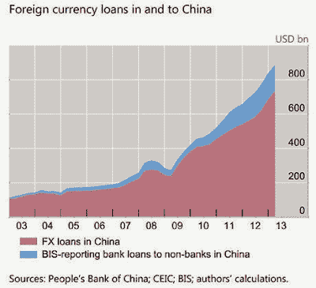

<!--yml
category: 未分类
date: 2024-05-18 03:46:35
-->

# Humble Student of the Markets: What a Chinese hard-landing might look like

> 来源：[https://humblestudentofthemarkets.blogspot.com/2013/11/what-chinese-hard-landing-might-look.html#0001-01-01](https://humblestudentofthemarkets.blogspot.com/2013/11/what-chinese-hard-landing-might-look.html#0001-01-01)

Further to my last post on China (see

[Where's the short-term pain in China?](http://humblestudentofthemarkets.blogspot.com/2013/11/wheres-short-term-pain-in-china.html)

), I am turning to the view that a hard landing is a rising possibility for a number of reasons.

First of all, the reforms announced in the wake of the Third Plenum are all right steps in the right direction. Open up the economy to more market forces as a way of reducing the domination of the SOEs on the economy and to end the financial repression of the household sector; rural land reform and the ending of the one-child policy as a way to squeeze more out of the labor force; and political and administrative reform to reduce the effects of corruption and crony capitalism. These steps are all to be lauded, but in the context of a growing investment and credit bubble, they may be too little too late.

In effect, the government is trying to

[sail between Scylla and Charybdis](http://en.wikipedia.org/wiki/Between_Scylla_and_Charybdis)

. Its stated goal is to re-focus economic growth from a quantity strategy to a quality strategy, from infrastructure-led growth to consumer-led growth. To re-balance and re-focus its growth, Chinese growth would have to slow. But a policy induced slowdown has its constraints. The constraints on government policy is seen in the twin infrastructure and credit bubbles created by years of financial repression, which was described in my previous post (

[Where's the short-term pain in China?](http://humblestudentofthemarkets.blogspot.com/2013/11/wheres-short-term-pain-in-china.html)

) that I won't repeat.

One example of the constraints that the authorities operate under is shown by Premier Li Keqiang's

[recent statement](http://www.reuters.com/article/2013/11/05/us-china-economy-idUSBRE9A403L20131105)

that 7.2% GDP growth rate represented the "stall speed" for the economy:

> In one of the few occasions when a top official has specified the minimum level of growth needed for employment, Li said calculations show China's economy must grow 7.2 percent annually to create 10 million jobs a year.
> 
> That would cap the urban unemployment rate at around 4 percent, he said.
> 
> "We want to stabilize economic growth because we need to guarantee employment essentially," Li was quoted by the Workers' Daily as saying on Monday. His remarks were made at a union meeting two weeks ago but were only published in full this week, just days before a pivotal Communist Party plenum to set policy opens.

7.2%? That doesn't give much room for growth to slow. In the past, whenever growth has slowed to levels the authorities deemed to unacceptable, the policy has been to stimulate using the same-old-same-old tactic of infrastructure growth, fueled by credit extension.

Indeed, Benn Steil and Dinah Walker asked

[Is a “Decisive Role” for Market Forces in China Compatible with a 7 Percent Growth Target?](http://blogs.cfr.org/geographics/2013/11/20/7percent/)

> The communique released following the recent Third Plenum of the Chinese Communist Party included the much-heralded statement that [market forces should play a “decisive role”](http://news.xinhuanet.com/english/china/2013-11/12/c_132882172.htm) in allocating resources going forward, but this is likely to be difficult to reconcile with a 7% growth floor. Many, ourselves included, have [argued that China’s recent growth has been driven by unsustainable overinvestment](http://blogs.cfr.org/geographics/2012/12/05/laborchina/). Since growth in recent years has slowed virtually to match the 7.5% target that had been set for 2012 and 2013, we doubt that a 7% target can be met over the coming several years without the government steering lending and investment even more aggressively towards manufacturing and construction, where the bubble-evidence is most compelling.

These circumstances are highly suggestive that the risks of a

[Minsky Moment](http://en.wikipedia.org/wiki/Minsky_moment)

style hard landing are growing.

**Mapping out hard landing scenarios**

In that case, what might a hard landing in China look like? In addition, I have been asked what the effects of a hard landing might have on the United States.

Here's where it gets tricky. I can outline a bull case and a bear case for America.

If a hard landing were to occur, the first-order effect would be a collapse in infrastructure spending which would lead to falling would commodity demand. Global commodity prices would crater under such a scenario.

Here's the super-bull case: If the government stays the course and continue to re-focus growth to the Chinese consumer, relative wages would remain sticky upwards and Chinese labor would become less competitive compared to its global counterparts. Such a scenario would be incredibly bullish for the American economy. With commodity prices falling, which imply lower input prices and higher profit margins, and more competitive labor rates, which imply more onshoring of production and a boost for the US consumer, a Chinese hard landing could conceivably spark an American Renaissance.

A more moderately bullish scenario for America would occur if Chinese labor rates fall because of mass unemployment and falling consumer inflation rates and make Chinese production more competitive. In that case, American corporate bottom lines would be boosted by lower input costs from commodity prices, but the tailwind from onshoring, though Chinese goods at the likes of WalMart, etc. would be cheaper for the US consumer.

**Financial contagion effects**

What about the financial contagion effects? That's the wildcard that can't be forecast.

A collapse in infrastructure spending and property prices would mean a banking crisis in China as bad loans to property developers and local authorities become an enormous black hole in the balance sheets of Chinese banks. Arguably, the global financial contagion effect could be limited because the Chinese owe money to themselves. As long as the losses are socialized, foreign banks would have limited exposure and the integrity of the global financial system would remain intact.

While that school of thought has its merits, there are a number of problems with that analysis.

[The Telegraph](http://www.telegraph.co.uk/finance/china-business/10407625/BIS-sees-risk-of-1998-style-Asian-crisis-as-Chinese-dollar-debt-soars.html)

reported that the BIS is increasingly concerned about foreign currency loans, which are typically denominated in USD, to China, which has skyrocketed since the Lehman Crisis:

> Foreign loans to companies and banks in China have tripled over the last five years to almost $900bn and may now be large enough to set off financial tremors in the West, and above all Britain, the world’s banking watchdog has warned.
> 
> “Dollar and foreign currency loans have been growing very rapidly,” said the Bank for International Settlements in a new report.
> 
> “They have more than tripled in four years, rising from $270 billion to a conservatively estimated $880 billion in March 2013\. Foreign currency credit may give rise to substantial financial stability risks associated with dollar funding,” it said. China’s reserve body SAFE said 81pc of foreign debt under its supervision is in dollars, 6pc in euros, and 6pc in yen.

Notwithstanding the foreign currency loans, I am concerned about the opaqueness of large Too-Big-To-Fail financial institutions. We will never know, until it becomes a problem, whether some TBTF bank has some oversized exposure to Chinese paper. Recall that the public had no inkling about problems at Barings until we woke up one morning and the venerable British bank's balance sheet had evaporated.

Even if western TBTF financial institutions were to be relatively insulated from a collapse in the Chinese economy and financial system, another impossible to forecast effect is how risk premiums would be affected in the wake of such a crisis. We saw in the May-September period when the emerging market economies caught a case of "Taperitis", risk premiums on EM bonds surged and several EM countries were on the verge of a currency crisis. Should China experience a hard landing, what would happen to EM risk premiums? If they were to skyrocket, can we be assured that no TBTF bank isn't exposed to EM bond markets and currencies in a way that would cause a Lehman-like panic?

The chart below of the EM bond ETF (EMB) relative to US junk bond ETF (HYG), which is a measure of low-quality paper against low-quality paper, shows that EM bond market anxieties haven't really recovered from the Fed tapering scare. What happens if China experiences a hard landing?

To summarize, I want to make it clear that I am not forecasting a Chinese hard landing, only that the hard landing scenario is more likely. Even if such a scenario were to come to pass, I have no idea of what the timing is.

The global effects of a hard landing in China is highly depending on how well contained the financial contagion effects are. I can sketch out scenarios where it could be incredibly bullish for America, or scenarios where we could see another Lehman or Credit Anstalt style banking crisis whose effects reverberate around the world.

If a Chinese hard landing were to occur, keep these scenarios in mind in order to be prepared for the eventualities.

*Cam Hui is a portfolio manager at [Qwest Investment Fund Management Ltd](http://www.qwestfunds.com/). (“Qwest”). The opinions and any recommendations expressed in the blog are those of the author and do not reflect the opinions and recommendations of Qwest. Qwest reviews Mr. Hui’s blog to ensure it is connected with Mr. Hui’s obligation to deal fairly, honestly and in good faith with the blog’s readers.”**None of the information or opinions expressed in this blog constitutes a solicitation for the purchase or sale of any security or other instrument. Nothing in this blog constitutes investment advice and any recommendations that may be contained herein have not been based upon a consideration of the investment objectives, financial situation or particular needs of any specific recipient. Any purchase or sale activity in any securities or other instrument should be based upon your own analysis and conclusions. Past performance is not indicative of future results. Either Qwest or I may hold or control long or short positions in the securities or instruments mentioned.*