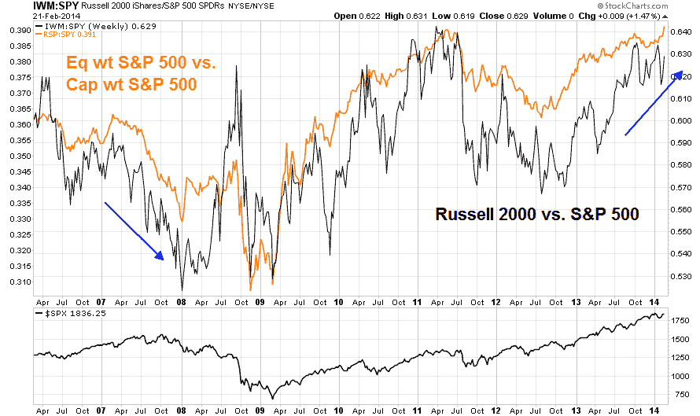
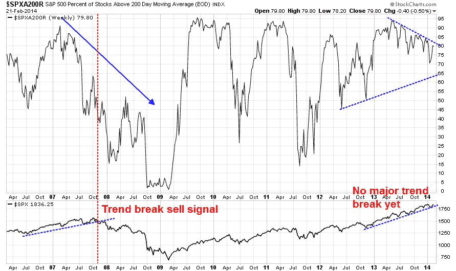

<!--yml
category: 未分类
date: 2024-05-18 03:43:30
-->

# Humble Student of the Markets: What bad breadth?

> 来源：[https://humblestudentofthemarkets.blogspot.com/2014/02/what-bad-breadth.html#0001-01-01](https://humblestudentofthemarkets.blogspot.com/2014/02/what-bad-breadth.html#0001-01-01)

When I was a young pup and learning technical analysis, I was told to think of the stock market as an army. To discern the direction of the market, you should watch the way the bulk of the army is moving. Maturing bull markets, it is said, typically have narrowing leadership of large cap stocks. When the major averages like the Dow may continue to advance and achieve new highs but the rest of the market fail to show similar levels of strength, it becomes a case of the generals leading but the troops refuse to follow - a warning sign for stock prices.

Breadth indicators are the way technical analysts measure the direction of the "army".

I have read a number of concerns expressed on blogs and message boards about the general breadth deterioration in US equities. I have voice similar concerns myself about the downtrend in the number of stocks trading above the 200 day moving average (see 

[Is the correction over?](http://humblestudentofthemarkets.blogspot.com/2014/02/is-correction-over.html)

) .

Breadth can be measured in a number of ways. Instead of just expressing an opinion about what this indicator or that indicator is doing, I thought I would conduct a survey of different popular breadth measures, along with their behavior in the last major market decline in 2007-2008.

**Advance-Decline line**

One of the classic breadth measures is the cumulative advance-decline line. The chart below of the SP 1500 advance-decline line is showing a case of continue strength. The bull is still charging, according to this measure.

This indicator is showing an unambiguous bullish signal.

**Small vs. large caps**

Another way of measuring the difference in behavior between the "generals" and the "troops" is to watch the performance of small caps compared to large caps. The chart below shows three lines. The black line in the top panel shows the relative ratio of the small cap Russell 2000 Index (IWM) against the large cap SP 500 (SPY). The orange line is the relative return of the equal weighted SP 500 (RSP) against the cap weighted SP 500 (SPY). This relative ratio measures the relative of small caps "troops" against the large cap "generals" in a slightly different way than a simple Russell 2000 to SP 500 ratio. The equal weight SP 500 gives an equal weight to the heavyweights in the index such as Apple, GE and ExxonMobil, shows the movements of the individual stocks in the index in a more "democratic" (1 stock, 1 vote) fashion. The the third line in the chart in bottom panel shows the SP 500.

Here are a number of observations from this chart. First of all, the RSP/SPY ratio appears to be more stable and less volatile compared to the IWM/SPY ratio, though they are well correlated with each other. In 2007-2008 bear market episode, both of the RSP/SPY and IWM/SPY breadth indicators topped out a few months before the final top in 2007 and deteriorated significantly afterwards. During the budget impasse and eurozone crisis scare of 2011, breadth deterioration was roughly coincidental with the market. Today, these breadth indicators are either flat or trending upwards and show few indications of a major top developing.

Call these indicator neutral to slightly bullish.

**New highs - lows**

A more subtle way of measuring breadth is to watch how market internals are behaving. The chart below of SP 500 Highs - Lows show only minor weakness, compared to a pattern of major deterioration during the 2007-2008 episode. This indicator seems to be very noisy. I would hesitate about using this indicator to call a top without a prolonged pattern lower lows and lower highs.

Score this indicator as neutral.

**% with Point and Figure buy signals**

Another aggregate way of analyzing market internals is to watch the percentage of stocks in the SP 500 that are showing point and figure buy signals. Here the signals are a bit more mixed. At one level, we are seeing some breadth deterioration as there is a pattern of lower lows and lower highs. However, this kind of downtrend has thrown off false warnings in the past. On the other hand, this index has not fallen to levels (shaded in yellow) where major declines have occurred in the past.

The signal from this indicator is neutral to slightly bearish.

**% above 200 dma**

My last breadth indicator, the percentage of stocks in the SP 500 trading their 200 day moving average, is telling a story of caution. As the chart below shows, this indicator has been deteriorating in a pattern of lower lows and lower highs for about a year. During the 2007-2008 episode, this indicator topped out several months ahead of the actual top. One logical way of using this indicator is use the deterioration as a warning sign, but don't sell until the actual trend break in the SP 500 itself, which is marked by the vertical red line. Today, we had a minor trend break in the SP 500 when the market dipped below its 50 day moving average in its most recent decline. However, it was only a brief and minor violation of the uptrend. While it does serve as a warning sign, I cannot call the event a definitive sell signal for the market in light of the strength of the other breadth indicators.

The signal from this breadth indicator can be categorized as somewhat cautious, but not unambiguously bearish.

**Too early to call a top**

In summary, the weight of the evidence my survey of breadth indicators and their behavior in the past eight years indicate that the market isn't showing a case of bad breadth yet. Breadth indicators, while mixed overall, are tilted slightly bullishly. While some stock market weakness may be around the corner, it is probably too early to call a top in the stock market. These reading suggest that further new highs in the major indices are possible and the next 5% move is more like to be up than down.

Remember that market tops are processes that generally develop slowly and they are accompanied by warning signs of technical deterioration. Getting bearish today seems to be overly premature. The current technical picture is still consistent with my base case scenario of a stock market top later this year (see

[My plan for 2014](http://humblestudentofthemarkets.blogspot.com/2013/12/my-plan-for-2014.html)

).

*Cam Hui is a portfolio manager at [Qwest Investment Fund Management Ltd.](http://www.qwestfunds.com/) (“Qwest”). The opinions and any recommendations expressed in the blog are those of the author and do not reflect the opinions and recommendations of Qwest. Qwest reviews Mr. Hui’s blog to ensure it is connected with Mr. Hui’s obligation to deal fairly, honestly and in good faith with the blog’s readers.”

None of the information or opinions expressed in this blog constitutes a solicitation for the purchase or sale of any security or other instrument. Nothing in this blog constitutes investment advice and any recommendations that may be contained herein have not been based upon a consideration of the investment objectives, financial situation or particular needs of any specific recipient. Any purchase or sale activity in any securities or other instrument should be based upon your own analysis and conclusions. Past performance is not indicative of future results. Either Qwest or I may hold or control long or short positions in the securities or instruments mentioned.*